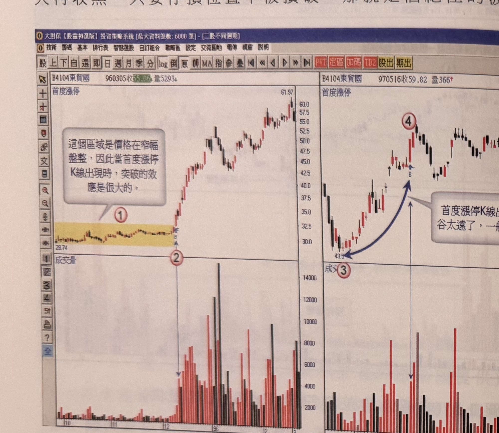
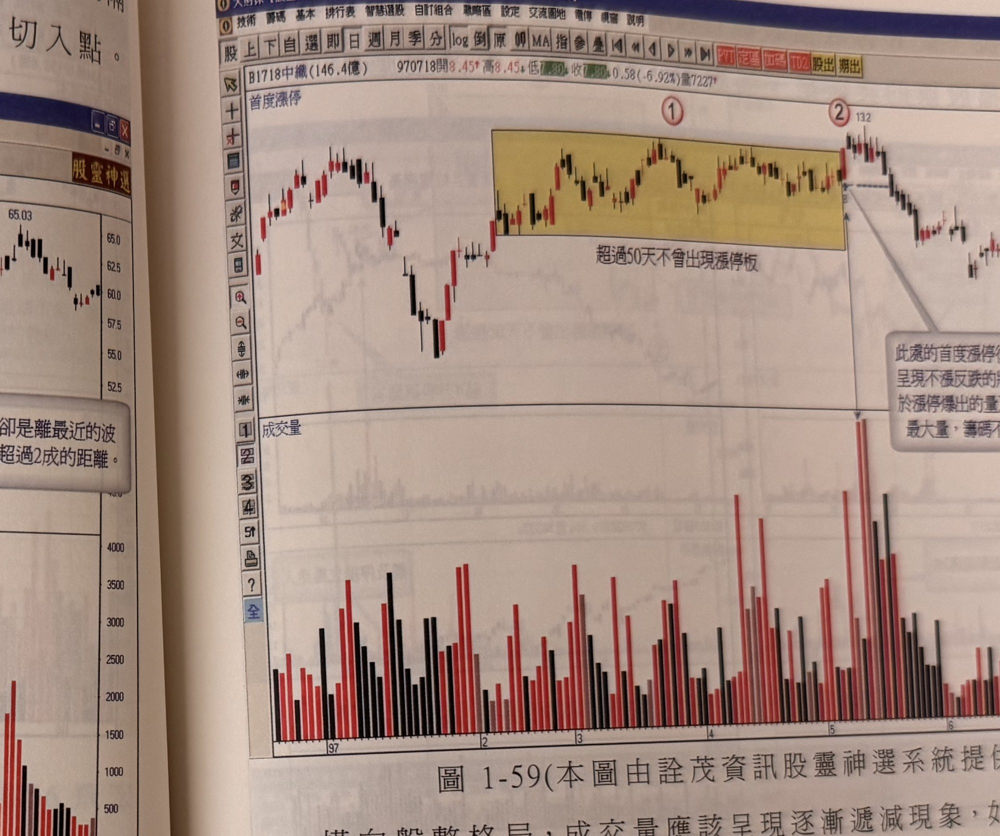

## p.56

也說明了跌勢結束，最直接的跡象就是價格輕易地鎖漲停，即使隔天再收黑，只要停損位置不被摜破，那就是個絕佳的波段切入點。

**圖 1-58(本圖由詮茂資訊股靈神選系統提供)**

> 圖說（figure notes）：兩張軟體截圖並列（同一檔股票東貿國(4104)的兩段走勢），共同標為圖1-58。左半圖報價列「B4104東貿國 960305收55.06 量5293」，K線圖左側標示「首度漲停」，起點28.74附近，黃色區塊①內為一段窄幅盤整走勢並有文字方塊「這個區域是價格在窄幅盤整，因此當首度漲停K線出現時，突破的效應是很大的。」區塊右緣標示②，緊接出現一根首度漲停K線（標「B」），此後價格急速上攻，最高達61.97。下方成交量圖對應標示②之後出現多根明顯放大的紅黑量柱（12000～14000水準），相較區塊①期間量能極低。右半圖報價列「B4104東貿國 970516收59.82 量366」，K線走勢左側標示③（低點43.5），價格自此止跌反彈，中途以藍色箭頭指向標示④（首度漲停K線「B」出現處），並有文字方塊「首度漲停K線出現，卻是離最近的波谷太遠了，一般不宜超過2成的距離。」標示④之後價格續呈上下震盪走勢。

前面提過首度漲停不宜離波谷低點過遠，這樣會減弱後市攻勢效果，如圖 1-58 右半圖東貿(4104)在 97 年 3 月出現首度漲停 K 線(標示 4 位置)，但距離標示 3 波谷低點超過 20% 以上，進入自波谷低點彈升以來的獲利回吐位置，此時切入買進，容易在行情獲利回吐中，觸及停損位置，應該避免這種狀況下買進首度漲停；最佳的情況是左半圖的窄幅盤整末端出現首度漲停訊號，爆量水準並沒有超越最近一年的最大量 1.5 倍以上，其實在此處價的突破比量的重要，因為突破本身是挑戰三年來的最高點，因此爆量是必然發生。

## p.57

**圖 1-59(本圖由詮茂資訊股靈神選系統提供)**

> 圖說（figure notes）：軟體截圖，報價列「B1718中織(146.4億) 970718開8.45 高8.45 低7.80 收7.80 0.58(-6.92%)量7227」。K線圖左側標示「首度漲停」，黃色區塊①內文字「超過50天不曾出現漲停板」，涵蓋一段先漲後緩步下跌整理、末端小幅反彈的走勢；區塊右緣標示②(價位13.2)，緊接出現一根首度漲停K線，並以虛線指向右側文字方塊「此處的首度漲停後的行情，呈現不漲反跌的狀況，原因在於漲停爆出的量乃數個月來的最大量，籌碼不穩定所致。」此後價格反轉下跌。下方成交量圖顯示標示②當日出現全圖最高的一根紅色量柱（遠高於區塊①期間的量能水準），隔日又出現一根近乎同高的黑色量柱。

横向盤整格局，成交量應該呈現逐漸遞減現象，如果並非如此，而是呈現量形如山谷交迭，表示主力或者做手，在盤整區間仍一直在攪動籌碼，推升到區間上限就出量調節，造成短套籌碼卡在上檔，製造解套賣壓埋伏，這也說明主力操盤手不是有意營造好看的線形，即使後市發展突破區間盤整的上限，通常會爆量後，即停止再攻，主力便利用型態的突破，吸引帽客追進來以達到其出貨的企圖，如圖 1-59 中纖(1718)在 97 年 1 月底開始出現頭部反轉後的反彈行情，當標示 1 區間超過 50 天沒有不曾出現漲停 K 線，但卻是爆量的狀況，而且在標示 1 的區位置產生了首度漲停 K 線，正常的橫向區間內，成交量並沒有逐漸收歛，衝到區間上限就有量，但在圖 1-59 的例子卻反其道而行，顯然其間有鬼，當後市行情發展在漲停 K 線之後，
