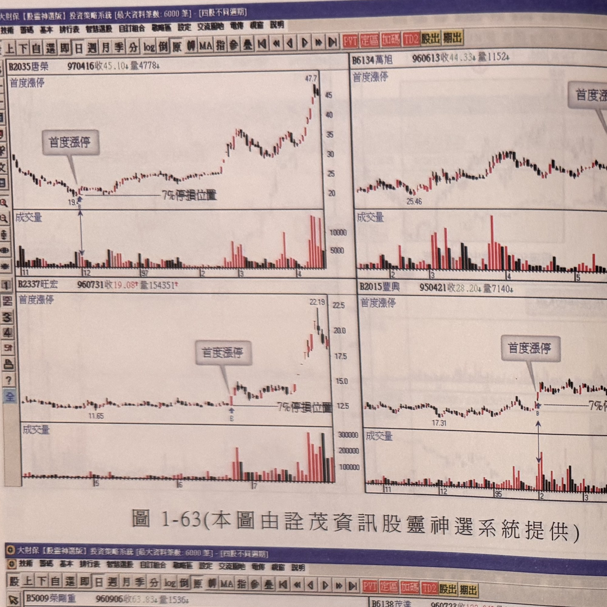
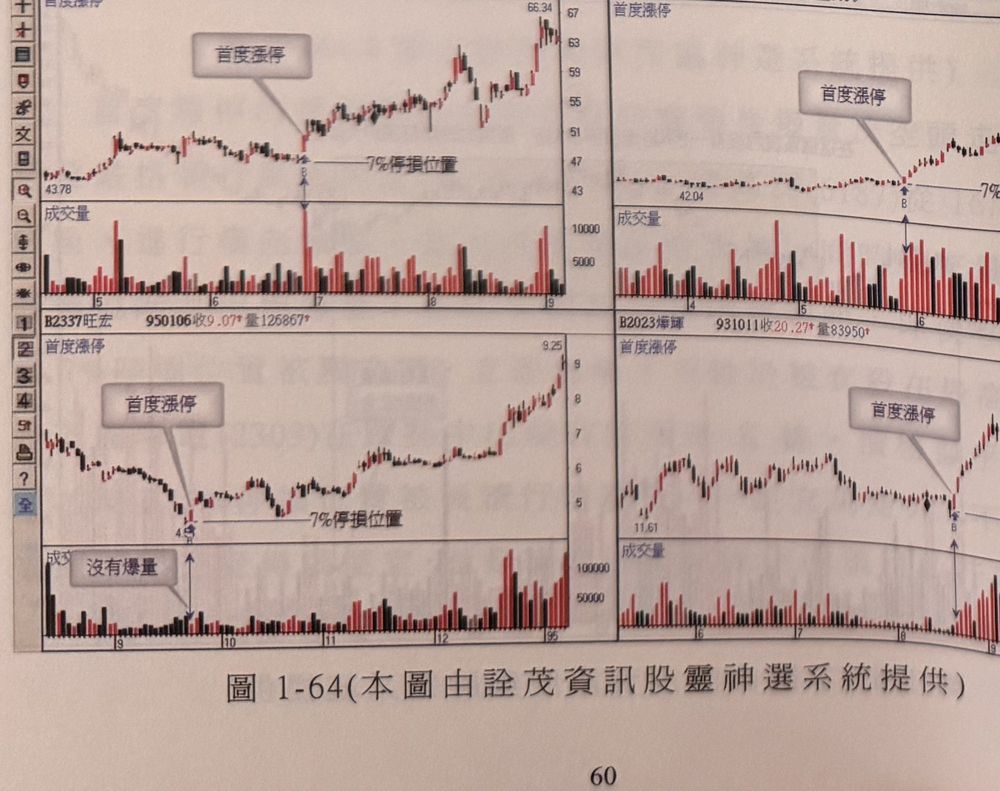
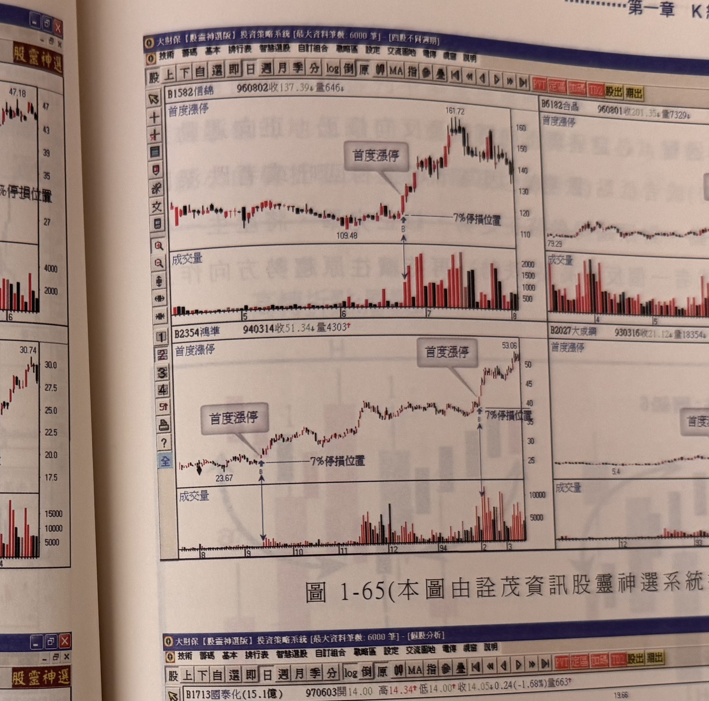
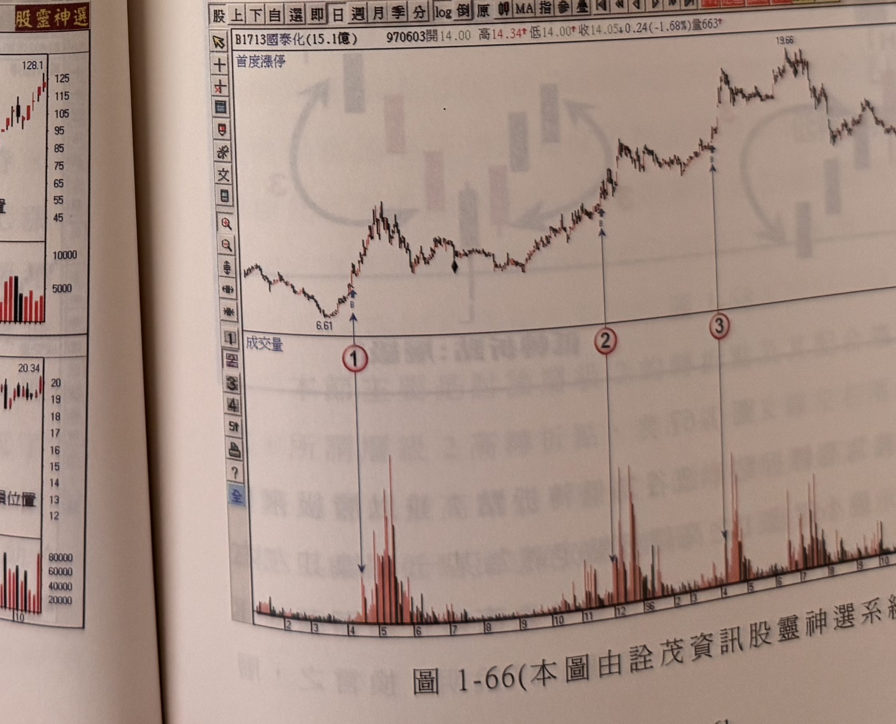

## p.60

[本頁全頁僅為圖表，無正文段落，延續前頁「以下各圖請讀者自行參閱」的四格範例圖]

**圖 1-63(本圖由詮茂資訊股靈神選系統提供)**

> 圖說（figure notes）：軟體截圖，四格並列同標圖1-63。左上：唐榮(2035)，970416收45.10；起漲點19，標「首度漲停」，此後急漲至47.7，成交量於後段明顯放大。右上：萬旭(6134)，960613收44.33；起漲點25.46，標「首度漲停」（價格47.18附近），此後續漲。左下：旺宏(2337)，960731收19.08；起漲點11.65，標「首度漲停」，此後急漲至22.19。右下：豐興(2015)，950421收28.20；起漲點17.31，標「首度漲停」，此後續漲至30.74。四圖右側皆繪有「7%停損位置」水平虛線，下方成交量圖對應各首度漲停日均出現明顯放大量柱。

**圖 1-64(本圖由詮茂資訊股靈神選系統提供)**

> 圖說（figure notes）：軟體截圖，四格並列同標圖1-64。左上：榮剛重(5009)，960906收63.83；起漲點43.78，標「首度漲停」，此後急漲至66.34。右上：茂達(6138)，960723收122.94；起漲點42.04，標「首度漲停」，此後續漲至128.1。左下：旺宏(2337)，950106收9.07；起漲點4，標「首度漲停」及「沒有爆量」文字方塊，此後續漲至9.25。右下：燁輝(2023)，931011收20.27；起漲點11.61，標「首度漲停」，此後續漲至20.34。四圖右側皆繪「7%停損位置」虛線，下方成交量圖對應標示。

## p.61

[本頁全頁僅為圖表，無正文段落]

**圖 1-65(本圖由詮茂資訊股靈神選系統提供)**

> 圖說（figure notes）：軟體截圖，四格並列同標圖1-65。左上：信錦(1582)，960802收137.39；起漲點109.48，標「首度漲停」，此後急漲至161.72。右上：合晶(6182)，960801收201.35；起漲點79.29，標「首度漲停」，此後續漲至239.75。左下：鴻準(2354)，940314收51.34；圖中出現兩次「首度漲停」標示（起漲點23.67及後續一次），最終價位53.06。右下：大成鋼(2027)，930316收21.12；起漲點5.4，標「首度漲停」，此後續漲至24.23。四圖皆繪「7%停損位置」虛線及對應放大成交量。

**圖 1-66(本圖由詮茂資訊股靈神選系統提供)**

> 圖說（figure notes）：軟體截圖，報價列「B1713國泰化(15.1億) 970603開14.00 高14.34 低14.00 收14.05 0.24(-1.68%)量663」。K線圖左側標示「首度漲停」，走勢自低點6.61起漲（標①），中途經歷數段整理與再上攻，分別於②、③位置再度出現波段起漲，最終最高點達19.66，圖右緣另標④於高檔區。下方成交量圖對應標①②③④各處皆出現明顯放大的紅色量柱高峰，其餘期間量能平緩偏低。
