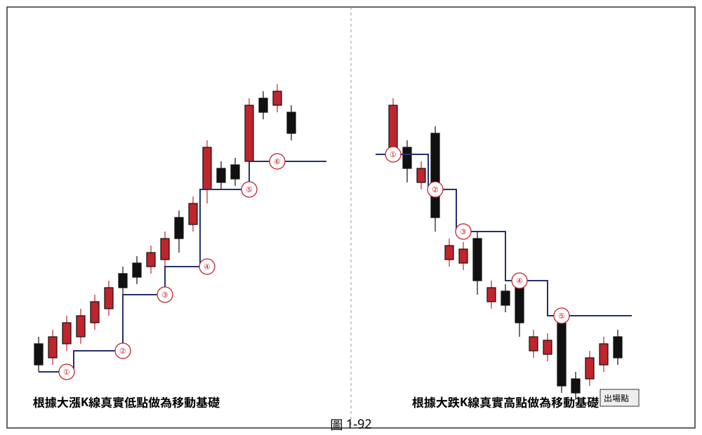

## p.84

則在進行的，不要奢想有完美的方法，也不要寄望某些股市名嘴的看法，一切都得自己來架構進出的模式，來管理自己人性上的弱點。一般人認為若被停損出場後，價格又上去，豈不是多此一舉，其實停損是練就操作的決斷力，停損的執行，有二種結果，一種是價格真的下跌了，一種是價格又漲上去了；真的下跌，好慶幸賣出，又漲上去，覺得停損好笨。沒有人可以神準地預測股價波動，即使美國股神華倫巴菲特也會預測錯誤，但不損其盛名，為啥呢？錯誤就停損而已，所以，操作只在於觀察對的時候怎麼停利出場，和錯誤的時候怎麼處理，減少損失而已。

怎麼設停損呢？如果停損讓你倍感焦慮，或讓你痛得要命，那表示操作的規模讓你不安，應該縮小投入金額，對於停損所造成的損失，應該不痛不癢，控制在承受得起的範圍；因此，資金的投入應該合適自己的損失承受，畢竟操作是長長久久的事情，不是一次決勝負，也不是為了彰顯你的硬氣，是為了取勝的謀略。設停損可以依固定金額停損，或依一定百分比停損，或依切入點的狀況制定停損點，在一個上漲趨勢中，價格運動會呈現高點不斷創高，低點也隨之不斷墊高的現象；因此，如果是採取拉回走勢時承接股票的方式，那麼你無法準確知道它何時止穩在什麼價位上，此時若要定術指標進場買進股票，應該根據進場 K 線的大小或幅度設停損，例如進場 K 線是一根大陽線，那麼停損設在大陽線最低點下方一檔的位置；如果進場 K 線離最近拉回行情最低谷點很近，那麼可以將停損設在最近的谷點位置；如果進場是採取突破型態頸線為依據，有二種狀況要注意，一是突破型態頸線前，價格呈現關前整理格局，那麼關前整理區間的最低點，停損設於此即可，二是突破型態頸線是直接過頸線的方式，那麼停損設在過頸線的 K 線最低點，以防止

## p.85

它過關立即做拉回，或呈現突破逆轉的現象，停損的移動方式，在此列舉四種模式，作簡單說明。

**圖 1-92**

> 圖說（figure notes）：schematic示意圖，兩組樓梯狀（階梯）K線示意圖並列。左半「根據大漲K線真實低點做為移動基礎」：一系列紅黑K線沿藍色階梯狀折線由左下向右上攀升，每當出現一根大漲K線（漲幅超過4%），即以其真實低點（K線最低點與前一天收盤價孰低）畫出新的階梯，依序標記紅色圓圈數字①至⑥，階梯隨大漲K線出現逐級墊高。右半「根據大跌K線真實高點做為移動基礎」：一系列K線沿藍色階梯狀折線由左上向右下滑落，每當出現一根大跌K線（跌幅超過4%），即以其真實高點畫出新的階梯，依序標記①至⑤，末端以文字方塊「出場點」標示停損出場位置，階梯隨大跌K線出現逐級下移。

### 一、根據大 K 線之真實高低點為停損基礎

個股價格移動過程，可以根據大漲 K 線或者大跌 K 線做為移動停損位置設置的依據，藉以取得高於系統原有的移動停利位置的基礎，例如當買進訊號出現後，停損的設置以大漲 K 線(超過 4%)之真實低點(K 線最低點與前一天收盤價孰低)做為停損停利位置，隨著行情的推升過程，出現新的大漲 K 線即移動新的停損位置，如圖 1-92 左半圖所示，一直持有至價格跌破移動停損線出場為止。反之，在跌勢做空，並以大跌 K 線(跌幅超過 4%)之真實高點(K 線最高點與前一天 K 線收盤兩者取其高)為停損位置，只要跌勢的發展，出現新的大跌 K 線即將停損向下移動，直到 K 線收盤突破移動停損位置出場。大漲 K 線在漲勢中，代表多方集結攻擊的成果，防守大漲 K 線的最低點便是多方防守底線，一旦被空方攻破，多頭氣勢自然
