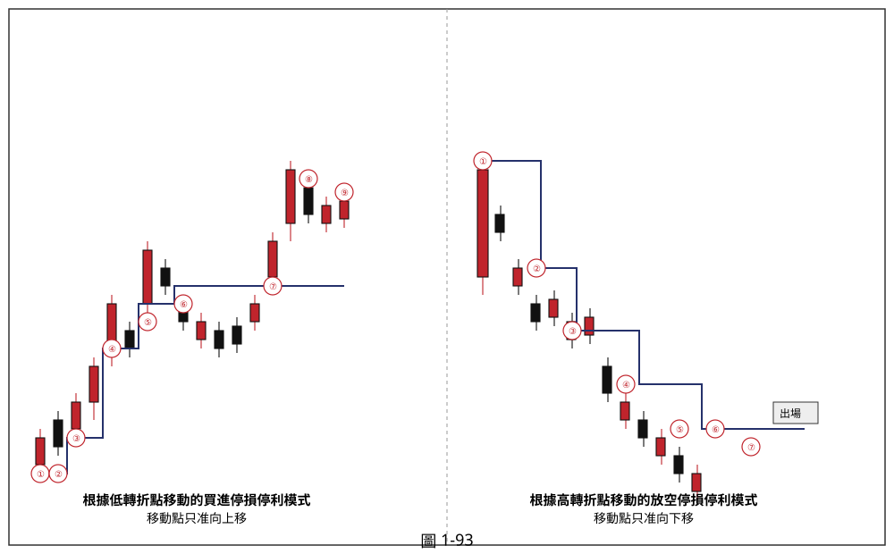
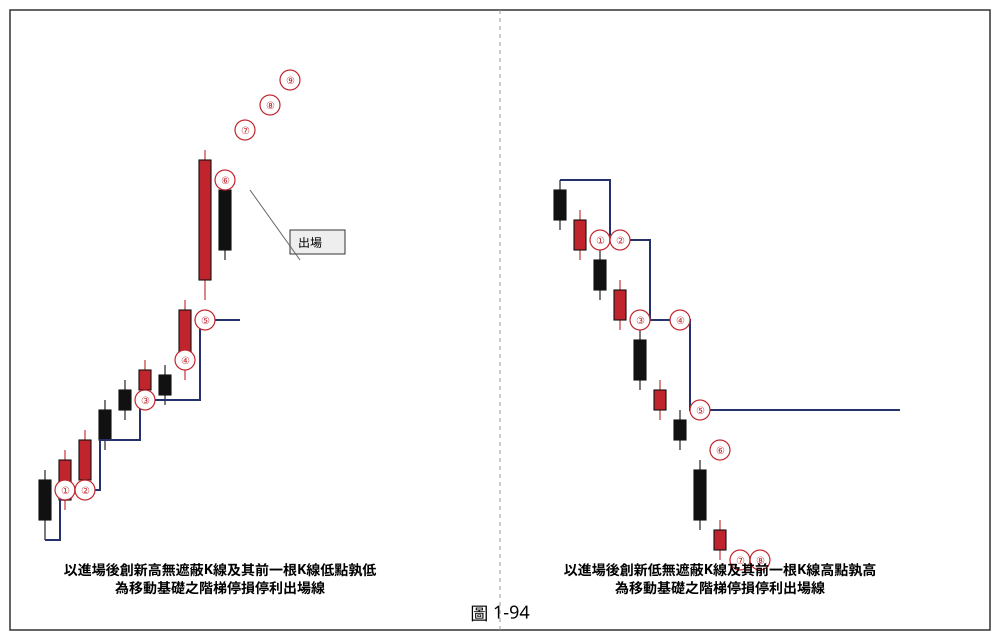

## p.86

受挫，將可能走拉回整理，相對的，在跌勢中大跌 K 線意調空方氣盛不斷地壓著多方打，使多頭一直退守，如果多方反擊攻過大跌 K 線真實高點，那麼放空操作宜先回補。

**圖 1-93**

> 圖說（figure notes）：schematic示意圖，兩組樓梯狀K線示意圖並列。左半「根據低轉折點移動的買進停損停利模式，移動點只准向上移」：一系列K線沿藍色階梯狀折線震盪走高，每當出現新的、較高的低轉折點，即向上調整一次階梯，依序標記①至⑨（其中④⑤兩點低轉折點相近，階梯延用不下修）。右半「根據高轉折點移動的放空停損停利模式，移動點只准向下移」：K線沿藍色階梯狀折線震盪走低，每當出現新的、較低的高轉折點，即向下調整一次階梯，依序標記①至⑦，末端以文字方塊「出場」標示。

### 二、根據高低轉折點為移動基礎之停損停利模式

漲勢結構的慣性是回檔不破前波低點，而跌勢結構的慣性則是反彈不過前波高點，基於價格的慣性，可以採取高低轉折點做為波峰波谷的位置判斷，如圖 1-93 所示，是採取層級 2 的高低轉折點，若操作買進部位，以各個遞升的低轉折點為波谷，做為移動基礎，換言之，價格回檔後產生新的低轉折點，如左半圖的球碼，依序從標示 1 逐步隨價格推升而做移動調整，而調整原則是只能調高而不調低，即新的低轉折點若低於前一個低轉折點，則仍然延用前一個低轉折點，直到價格跌破低轉折點出場；右半圖為跌勢中的運用，

## p.87

根據反彈後產生高轉折點做為移動放空停損停利的基礎，同樣移動原則只能調低不能調高，如標示 6 的轉折點比標示 5 之高轉折點高，但不必將停損位置提高至標示 6，而是延用標示 5 的轉折點做為出場判斷依據，直到價格突破標示 7 的高轉折點，才結束放空操作。

**圖 1-94**

> 圖說（figure notes）：schematic示意圖，兩組樓梯狀K線示意圖並列。左半「以進場後創新高無遮蔽K線及其前一根K線低點孰低為移動基礎之階梯停損停利出場線」：K線沿藍色階梯狀折線震盪走高，依序標記①至⑨，每當出現一根創新高且無遮蔽的K線，即以該K線及其前一根K線兩者最低點孰低畫出新階梯，末端以文字方塊「出場」標示停利出場位置。右半「以進場後創新低無遮蔽K線及其前一根K線高點孰高為移動基礎之階梯停損停利出場線」：K線沿藍色階梯狀折線震盪走低，依序標記①至⑧，每當出現一根創新低且無遮蔽的K線，即以該K線及其前一根K線兩者最高點孰高畫出新階梯，末端以文字方塊「出場」標示。

### 三、以二根 K 線區間之最高最低點為移動基礎之停損停利模式

在多頭買進部位後，根據當根 K 線及其前一天 K 線兩者之最低價中取其低，做為初始停損點，當價格出現創新高之收盤價時，將創新高之 K 線最低點及其前一天 K 線最低點比較，取其低者，將初始停損位置移動至此，如圖 1-94 左半圖所示，號碼球為創新高之 K 線，其具有收盤創新高且無遮蔽的特徵，隨著創新高的情形，移動
