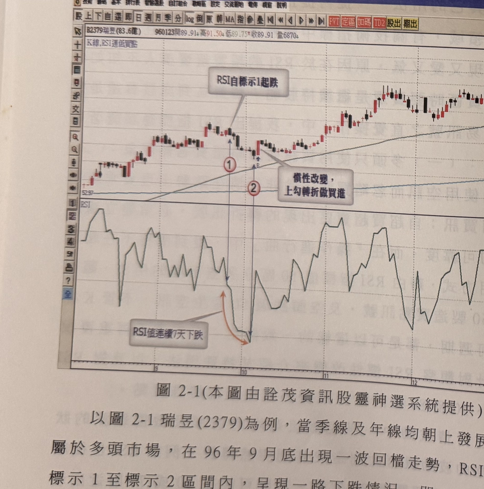
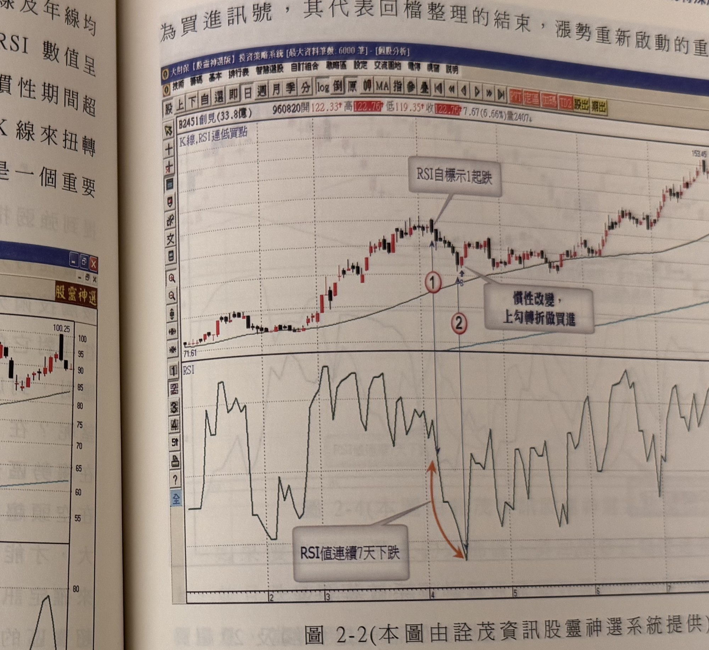

## p.92

返現象，不容易沒有停頓地抵達目標區，假如在一個季線及年線均朝向發展的多頭市場，自某波峰開始做修正性的回檔，RSI 數值呈現連續性下跌，即低於前值的慣性一直持續，如果這種慣性期間超過了 6 天(含)以上，當價格的波動，呈現反漲 3% 以上之 K 線來扭轉 RSI 值反轉向上時，意謂 RSI 值遞減的慣性被破壞，將是一個重要的反轉訊號，可以利用這個特性做為切入買點的參考。

**圖 2-1(本圖由詮茂資訊股靈神選系統提供)**

> 圖說（figure notes）：軟體截圖，報價列「B2379瑞昱(83.6億) 960123開89.91 高91.50 低89.75 收89.91 量6870」，上方標題「K線,RSI連低買點」。K線圖走勢自左段起漲，呈震盪走高型態；文字方塊「RSI自標示1起跌」以線條指向標示①處（高檔轉折點），此後價格小幅拉回整理，於標示②處止穩（藍色箭頭標示「B」買進點），文字方塊「慣性改變，上勾轉折做買進」指向該處；其後價格持續走高。下方 RSI 圖中，對應標示①處為高點，其後連續下跌至對應標示②處低點，文字方塊「RSI值連續7天下跌」以橘色箭頭標示此段連續下跌區間，箭頭末端在②處出現上勾反轉；此後 RSI 於中高檔區間反覆震盪。

以圖 2-1 瑞昱(2379)為例，當季線及年線均朝上發展，屬於多頭市場，在 96 年 9 月底出現一波回檔走勢，RSI 標示 1 至標示 2 區間內，呈現一路下跌情況，即

## p.93

為買進訊號，其代表回檔整理的結束，漲勢重新啟動的重要線索。

**圖 2-2(本圖由詮茂資訊股靈神選系統提供)**

> 圖說（figure notes）：軟體截圖，報價列「B2451創見(33.8億) 960820開122.33 高122.76 低119.35 收122.76 7.67(6.66%)量2407」，上方標題「K線,RSI連低買點」。K線圖走勢自低點71.61緩步墊高，中段一度急漲後拉回，文字方塊「RSI自標示1起跌」指向標示①處高點，此後價格拉回整理至標示②處（藍色箭頭「B」買進點），文字方塊「慣性改變，上勾轉折做買進」指向該處；其後價格持續墊高至最高點153.45。下方 RSI 圖中，對應標示①處為高點，其後連續下跌至對應標示②處低點，文字方塊「RSI值連續7天下跌」以橘色箭頭標示此段連續下跌區間；此後 RSI 於中高檔區間反覆大幅震盪。

多頭走勢在行進過程，大部份的回檔並不容易造成 RSI 值拉回至超賣區，尤其在強勢推升的個股，其 RSI 值拉回的低點往往在 50 至 30 之間，顯然可知，當 RSI 值殺到 20 以下代表回檔的時間及幅度較大，乃屬於回檔較深的修正，但若自頂峰回檔超過 20% 以上的幅度，那麼頂峰為行情頭部的機會就大為增加，如果自頂峰回檔修正正在 20% 以內，其整理結束後的攻勢，越過前波峰頂的機會相對較大，如圖 2-2 創見(2451)為例，在標示 1 自峰頂回檔修正，到標示 2，RSI 數值出現連續 7 天下跌，隔天出現大漲 K 線，是為買進訊號，可視為波段行情的訊號。
