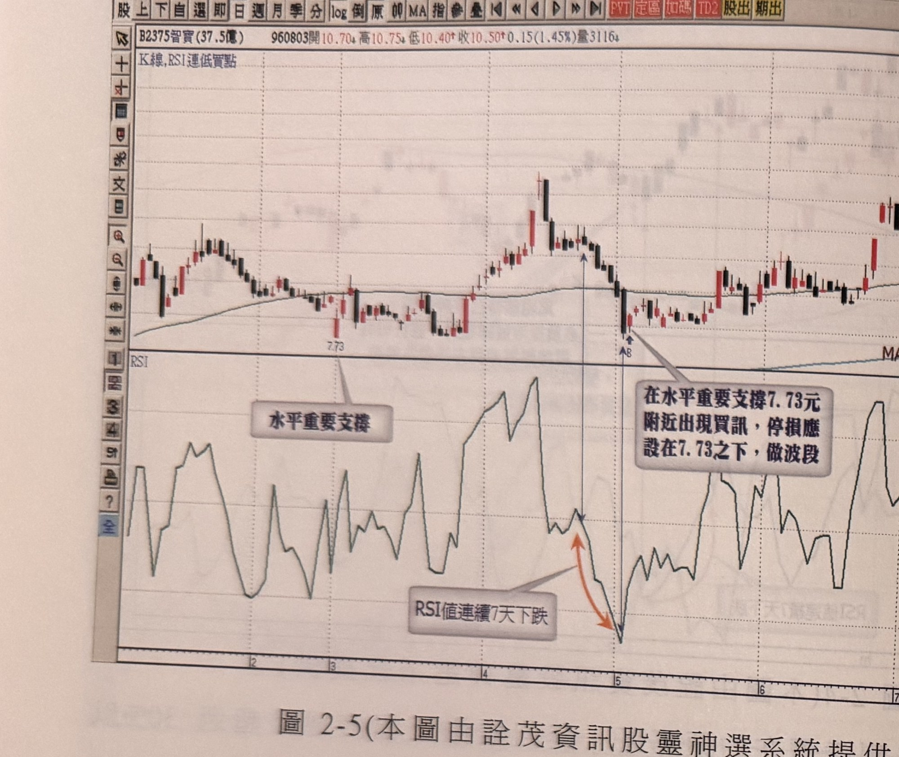
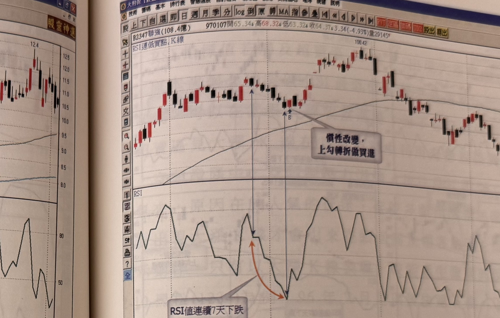
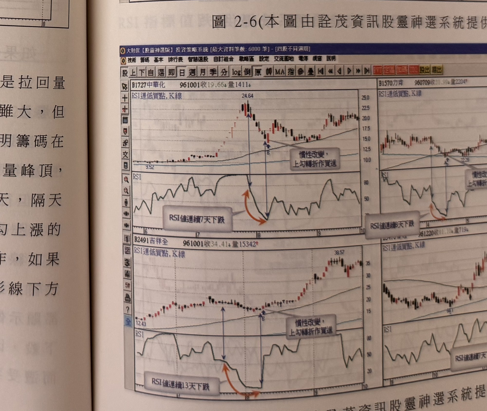

## p.96

**圖 2-5(本圖由詮茂資訊股靈神選系統提供)**

> 圖說（figure notes）：軟體截圖，報價列「B2375智寶(37.5億) 960803開10.70 高10.75 低10.40 收10.50 0.15(1.45%)量3116」，上方標題「K線,RSI連低買點」。K線圖走勢震盪，標示水平價位「7.73」處，文字方塊「水平重要支撐」指向此低點；此後價格上攻拉回，於接近7.73之上再度止穩（藍色箭頭「B」），文字方塊「在水平重要支撐7.73元附近出現買訊，停損應設在7.73之下，做波段」指向該處；其後價格續呈區間震盪走勢，末段再度走高。下方 RSI 圖中，文字方塊「RSI值連續7天下跌」以橘色箭頭標示一段自高點連續下跌至低點的區間，對應K線圖之「B」買訊位置。

上例提到頭部的特徵是爆量，但是頭部另一個特色就是拉回量不萎縮，代表籌碼凌亂的事實，如果爆量在先，拉回幅度雖大，但量卻不斷地萎縮，並且在前一波重要的低點得到支撐，說明籌碼在收攏呈現安定的企圖，以圖 2-5 智寶(2375)在 96 年 4 月見爆量峰頂，下殺至前一波低點 7.73 元之上，RSI 指標呈現連續下跌 7 天，隔天反漲，在重要的水平支撐位置，出現 RSI 連續下跌後，反勾上漲的 K 線，可以過去水平重要支撐最低點下方為停損，進場操作，如果 K 線下影線曾跌破水平支撐，但收盤卻未跌破，則以其下影線下方一檔為停損，進場操作買進動作。

以下各圖請自行參考之。

## p.97

**圖 2-6(本圖由詮茂資訊股靈神選系統提供)**

> 圖說（figure notes）：軟體截圖，報價列「B2347聯強(108.4億) 970107開65.34 高68.32 低63.32 收64.37 3.34(-4.93%)量29145」，上方標題「RSI連低買點,K線」。K線圖走勢自左段震盪走高至一高點，文字方塊「慣性改變，上勾轉折做買進」指向一處低檔轉折點（藍色箭頭「B」），此後價格續呈上攻，最高達100.42，末段拉回震盪。下方 RSI 圖中，文字方塊「RSI值連續7天下跌」以橘色箭頭標示一段自高點連續下跌至低點的區間，對應K線圖之「B」買訊位置；其後 RSI 大幅攀升至高檔區間反覆震盪。

**圖 2-7(本圖由詮茂資訊股靈神選系統提供)**

> 圖說（figure notes）：軟體截圖，四格並列同標圖2-7，標題皆為「RSI連低買點,K線」。左上：中華化(1727)，961001收19.66，量1411；最高點24.64後下跌，文字方塊「慣性改變，上勾轉折做買進」指向低檔轉折點（「B」），下方RSI圖文字方塊「RSI值連續7天下跌」標示對應下跌區間，其後價格反彈走高。右上：力肯(1570)，960709收31.99，量2204；文字方塊「慣性改變，上勾轉折做買進」指向轉折點，RSI圖文字方塊「RSI值連續8天下跌」標示對應區間。左下：吉祥全(2491)，961001收34.41，量15342；最高點38.57，文字方塊「慣性改變，上勾轉折做買進」指向轉折點（「B」），RSI圖文字方塊「RSI值連續13天下跌」標示對應區間，此為四圖中連續下跌天數最長者。右下：另一檔個股（960...961220收，量719），同樣標示「RSI連低買點,K線」及「RSI值連續…天下跌」文字方塊與對應轉折點。
