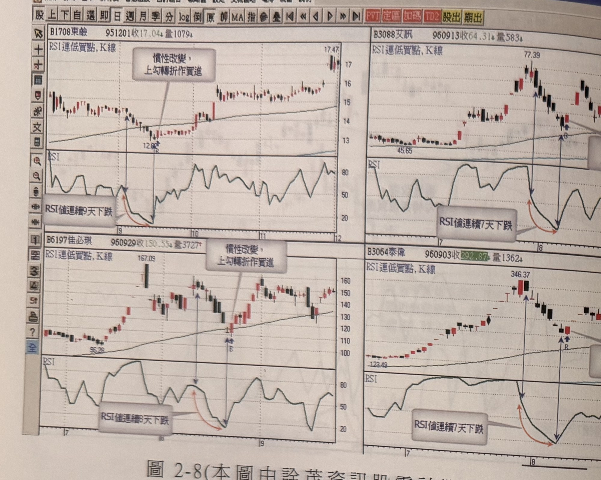
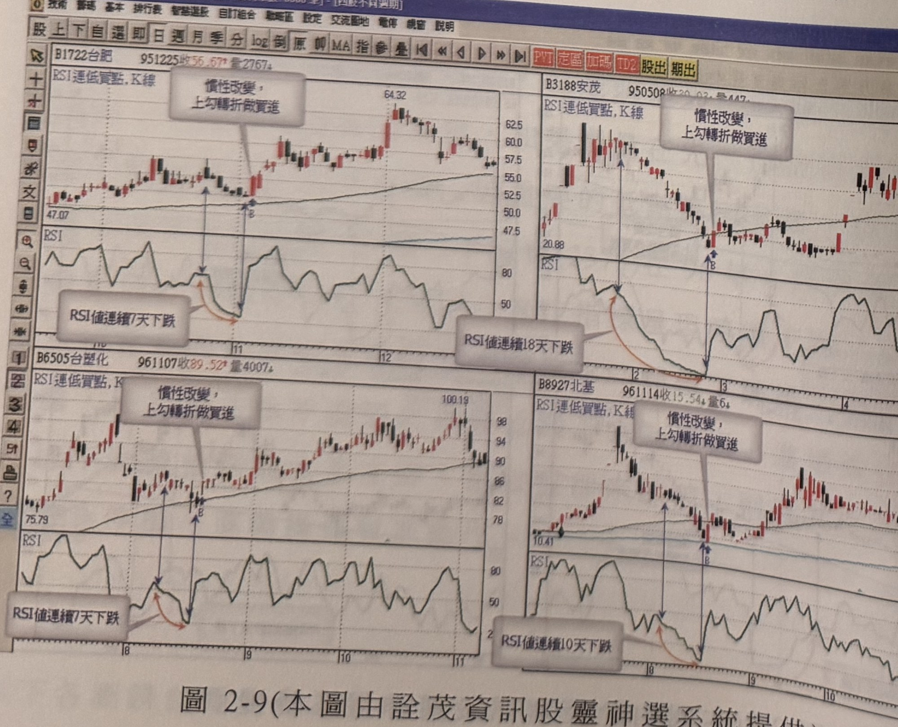

## p.98

[本頁全頁僅為圖表，無正文段落，延續前頁「以下各圖請自行參考之」]

**圖 2-8(本圖由詮茂資訊股靈神選系統提供)**

> 圖說（figure notes）：軟體截圖，四格並列同標圖2-8，標題皆為「RSI連低買點,K線」。左上：東鹼(1708)，951201收17.04，量1079；文字方塊「慣性改變，上勾轉折作買進」指向轉折點（「B」，價位12.8附近），RSI圖文字方塊「RSI值連續9天下跌」標示對應區間，其後價格漲至17.47。右上：艾訊(3088)，960913收64.31，量583；最高點77.39，文字方塊「慣性改變，上勾轉折作買進」指向轉折點（「B」），RSI圖文字方塊「RSI值連續7天下跌」。左下：佳必琪(6197)，960929收150.55，量3727；最高點167.09，文字方塊「慣性改變，上勾轉折作買進」指向轉折點（「B」），RSI圖文字方塊「RSI值連續8天下跌」。右下：泰偉(3064)，960903收292.87，量1362；最高點346.37，文字方塊「慣性改變，上勾轉折作買進」指向轉折點（「B」），RSI圖文字方塊「RSI值連續7天下跌」。

**圖 2-9(本圖由詮茂資訊股靈神選系統提供)**

> 圖說（figure notes）：軟體截圖，四格並列同標圖2-9，標題皆為「RSI連低買點,K線」。左上：台肥(1722)，951225收56.67，量2767；最高點64.32，文字方塊「慣性改變，上勾轉折做買進」指向轉折點（「B」），RSI圖文字方塊「RSI值連續7天下跌」。右上：安茂(3188)，950508收…量447；文字方塊「慣性改變，上勾轉折做買進」指向轉折點（「B」），RSI圖文字方塊「RSI值連續18天下跌」，為圖中連續下跌天數最長者。左下：台塑化(6505)，961107收89.52，量4007；最高點100.19，文字方塊「慣性改變，上勾轉折做買進」指向轉折點（「B」），RSI圖文字方塊「RSI值連續7天下跌」。右下：北基(8927)，961114收15.54，量6；文字方塊「慣性改變，上勾轉折做買進」指向轉折點（「B」），RSI圖文字方塊「RSI值連續10天下跌」。

## p.99

### 第二節　RSI 低值買點及背離買點

RSI 指標值若觸及超賣區 20 以下，出現大漲超過 5% 水準的紅 K 線，原本濾網必須突破 RSI 最低值 K 線之最高點，但若為大漲 K 線的狀況，可以在當根 K 線收盤進場，而不必受到先前濾網限制，這種超賣區見大漲 K 線在空頭走勢中利用來搶短線買進，可靠度極高，空頭發展中，空頭制壓力道強，往往見紅即空，壓得多方喘不過氣來，原因在於人氣的低迷，促使多頭作價無法匯集買氣突圍，只有出現大漲 K 線才會引來空頭回補及帽客助陣；每個波段低點的宣示動作，只有以大漲 K 線表現，較能產生像樣的反彈行情，如圖 2-10 黑松(1234)為例，96 年 7 月見頂後快速下殺，下跌期間只有出現零星小漲紅 K 線，不足以造成較大的反彈行情，直到標示 1 位置 RSI 指標值跌至 20 以下，配合出現漲停紅 K 線，一改過去小漲 K 線的慣性，產生近一個半月的反彈走勢。

**圖 2-10(本圖由詮茂資訊股靈神選系統提供)**

> 圖說（figure notes）：軟體截圖，標題「RSI低值買點&背離買點」，報價列「B1234黑松(53.6億) 970423開19.23 高19.62 低18.93 收18.93 0.20(-1.05%)量5193」。K線圖走勢自左段高檔下殺至標示①處低點（藍色「B」，文字方塊「配合大漲K線」指向此處，下方另繪虛線「7%停損位置」），此後反彈走高至標示②處（文字方塊「非大漲K線」），續跌至標示③（「非大漲K線」）、④（「非大漲K線」）處低點，再續跌至標示⑤處（「配合大漲K線」，價位10.85附近），此後價格持續反彈走高。下方 RSI 圖中，對應①②③④⑤各處分別出現低點波動，其中①、⑤處（配合大漲K線者）RSI觸及最深的超賣區，②③④處（非大漲K線者）RSI低點相對較淺；其後 RSI 隨價格反彈於中高檔區間反覆震盪走高。
