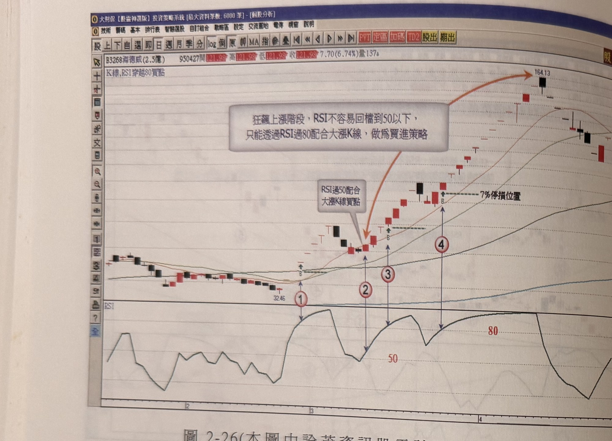

## p.114

**圖 2-26** (本圖由詮茂資訊股靈神選系統提供)

> 圖說（figure notes）：個股 B3268海德威分時走勢圖，左上角報價列標示「B3268海德威(2.5億) 950427開121.98高121.98低121.98收121.98 7.70(6.74%)量137」，並標示「K線,RSI穿越80買點」。圖中以橙色箭頭弧線及白底文字方塊標示「狂飆上漲階段，RSI不容易回檔到50以下，只能透過RSI過80配合大漲K線，做為買進策略」，弧線起自另一白底文字方塊「RSI過50配合大漲K線買點」（以橙色箭頭指向K線圖中一根紅K，旁註「32.46」），該處對應紅色圓圈數字「1」。K 線走勢自此起漲點盤堅上攻，中途標示「7%停損位置」（水平虛線），對應紅色圓圈數字「2」「3」「4」，最終上攻至最高點（價位標示 164.13）附近，弧線終點標示該價位。下方 RSI 圖中，紅色水平線分別標示「50」與「80」，對應「1」至「4」處的 RSI 高點依序墊高並多次穿越 80。

再如圖 2-26 海德威(3268)的例子，從 95 年 2 月底突然連續飆出 7 根漲停板，市場驚呼不已，但這期間天天開盤漲停，一般投資人要跳進第四根以上之漲停板位置，必定忐忑不安，尤其若追到第 7 根漲停位置，隔天立刻殺二根跌停收盤，更是臉色發青；通常天天開盤拉漲停之個股，不會一波做完，因為連拉漲停過程，成交量被惜售而萎縮，即使想出貨不見得能順利完成，因此主力第一次猛烈甩轎，只是要讓籌碼得到換手的機會，而非出貨，重新整頓後，必然再推高引入大量買盤，可以利用 RSI 值下殺破 50 後，重上 50 配合大漲 K 線做切入買進，如標示 2 位置，形成最佳切入買點，這個買點若錯過，只有利用 RSI 穿越 80 大漲的機會，如標示 3 及標示 4 位置，以一根停板為停損來做為加入超飆行情的門票，是值得嘗試的機會。[本頁下方邊緣可見極淡且左右鏡像反轉的殘餘字跡，應為紙張背面透印所致，依規範略過不予轉錄]

## p.115

### 第四節　KD買賣點分布介紹

KD 指標是一般投資人常用的基本指標，它係透過 K 值與 D 值的金叉(交叉向上)來顯示買進訊號，而以 K 值與 D 值的死叉(交叉向下)為賣出訊號，KD 值與 RSI 指標一樣，都是介於 0～100 之間擺盪，同樣以 80 以上為超買區，傳統解釋為市場過熱，隨時可能拉回，而 20 以下為超賣區域，代表市場低迷，但隨時有反彈出現，這樣的解說，會讓人以為 KD 值在 20 以下形成金叉是難得的買點，而一到 80 以上出現 KD 值死叉，又會心生隨時回檔的陰影，然而任何強勢上漲的股票，卻都是 KD 值進入超買區域，啟動速度最快的上漲行情，稱之為指標鈍化；更糟的是，當市場轉為熊市走勢，一見到 KD 值金叉，以為行情即將反彈而搶入作買，卻無端遭受套牢的結果，如同在 RSI 指標用法裡所陳述，指標的買賣訊號取捨應依趨勢做決定，在牛市指標用法只看買訊，而熊市指標用法只看賣訊，這樣區分，就不致於覺得指標在騙人。

KD 值的金叉到底出現在那個數值是比較妥當的買點，通常我們會認為 K 值觸及 20 再與 D 值形成金叉最好，但是一支強勢股在上升過程，KD 值並不容易拉回至 20 附近，總不能苦苦等候，如同 RSI 指標，在牛市要下探至超賣區，不見得等得到。透過趨勢方向的判定後，再運用 KD 值的多頭金叉及空頭死叉的選擇，就能使 KD 值成為好用的操作工具。當 D 值降至 65 以下，所形成的 KD 交叉向上(金叉)即可以把它當做買點看待，但有一種狀況除外，若 KD 值呈現金叉之前，價格已經從某個谷點彈升數日，漲幅也大的情況下，KD 值金叉出現，反而不是好的買點位置；因此，一個好的買點位置，離波谷最低點不應超過 3 天，即最低點起算(不含最低點 K 線)3 天內形成金叉狀況，超過 3 天以上，要小心評估為宜；波谷最低點[下接 p.116]
