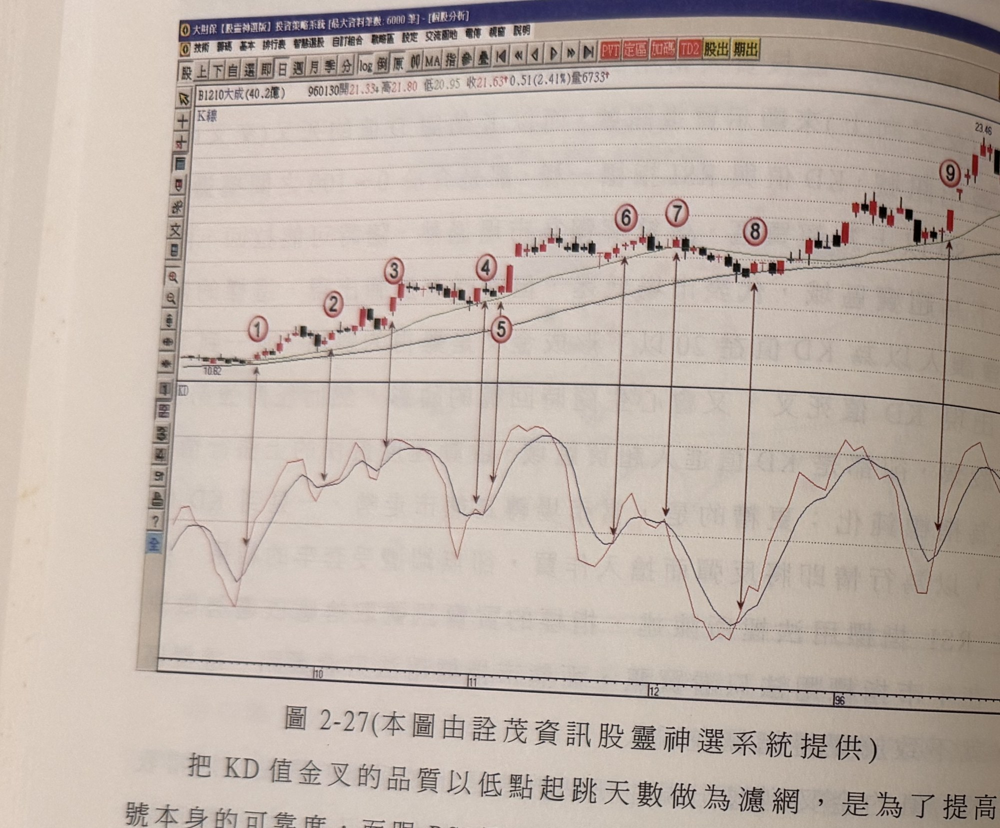
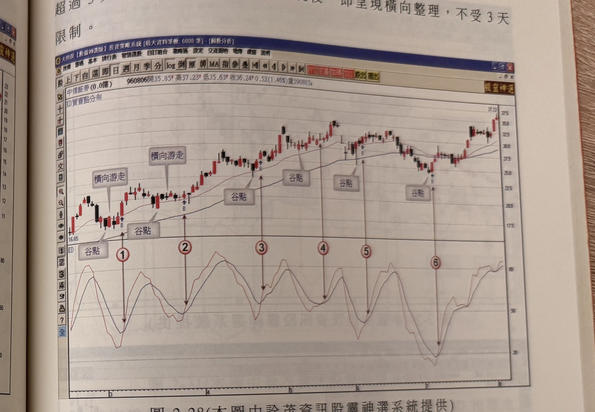

## p.116

出現若行情呈現在谷點震盪(橫向游走)，則不受 3 天限制。

**圖 2-27** (本圖由詮茂資訊股靈神選系統提供)

> 圖說（figure notes）：個股 B1210大成分時走勢圖，左上角報價列標示「B1210大成(40.2億) 960130開21.33高21.80低20.95收21.63 0.51(2.41%)量6733」，並標示「K線」。K 線走勢自左段低點（價位標示 10.82）緩步盤堅走高，並繪有一條均線，途中對應紅色圓圈數字「1」至「9」，各數字皆以箭頭指向下方 KD 圖中對應的谷點或高點；後段價格持續走高至最高點（價位標示 23.46）附近。下方 KD 圖中（黑線為 K 值，紅線為 D 值），對應「1」至「9」處的谷點與高點交錯出現，用以標示 KD 金叉訊號與其距谷點的天數關係。

把 KD 值金叉的品質以低點起跳天數做為濾網，是為了提高訊號本身的可靠度，而跟 RSI 買賣點分布裡的限制一樣，同一個位階的訊號只取第一個操作即可，除非第一個訊號停損出場，再取第個同位階訊號操作，如圖 2-27 大成(1210)為例，標示 3～5 位置的買訊都位在 13～14 元之間，認定為同一位階訊號，只須在標示 3 買進即可，標示 4 及 5 的買訊選擇忽略，標示 1 的買訊，離最低點 10.82 元超過 3 天，但自谷點 10.82 元出現後，行情呈現橫向游走，不受 3 天限制，標示 2 買訊離最近的小波谷只有 2 天，標示 4 一樣距離小波谷亦是 2 天，因此都符合濾網要求；標示 6 及 7 點距離波谷低點 2 天，符合濾網要求，而標示 9 買訊距離波谷 4 天，[下接 p.117]

## p.117

[承 p.116]超過 3 天限制，但其波谷低點出現後，即呈現橫向整理，不受 3 天限制。

**圖 2-28** (本圖由詮茂資訊股靈神選系統提供)

> 圖說（figure notes）：個股中信證券分時走勢圖，左上角報價列標示「中信証券(0.0億) 960806開35.85高37.23低35.63收36.24 0.52(1.46%)量390803」，並標示「KD買賣點分布」。K 線走勢自左段低點（價位標示 16.65）一路盤堅走高，並繪有一條均線，圖中兩處標示灰底文字方塊「橫向游走」，五處標示「谷點」，對應紅色圓圈數字「1」至「6」，最終在圖右側高點（價位標示 37.23）附近收尾。下方 KD 圖（黑線 K 值，紅線 D 值）中，對應「1」至「6」處各出現一個谷點，用以標示各次 KD 金叉訊號的位置與其距谷點的天數關係。

從圖 2-28 陸股中信證券的走勢中，可以看出在一個牛市走勢推升過程，KD 指標要到達超賣區並不常見，在圖上七個月時間裡，只有一次 KD 指標下探至超賣區(如標示 6 位置)，其餘都是 K 值回檔至 30～50 之間即打住，重新恢復漲勢，因此在漲勢中，透過指標尋找買點，只須留意指標是否通過濾網結構的要求即可，標示 1 及 2 買訊都是谷點產生後，行情呈現橫盤游走，不受濾網 3 天限制，標示 3 買訊距離谷點 2 天，符合濾網要求；標示 4 位置之買訊距離谷點超過 3 天限制，而且當根 K 線為倒 T 線，訊號的品質不佳，不宜做買進動作；標示 5 買訊距離谷點 2 天，標示 6 距離谷點 1 天時間，所以都符合濾網結構要求。

請讀者自行參閱以下二圖。
