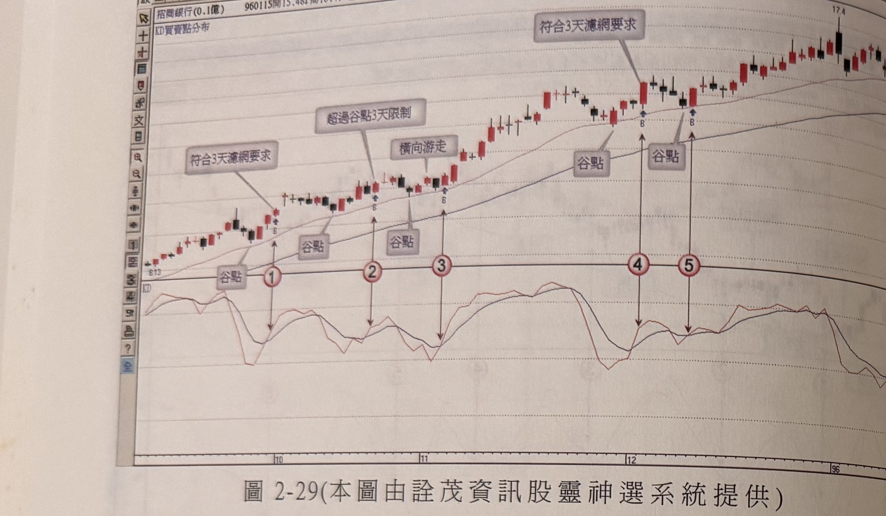
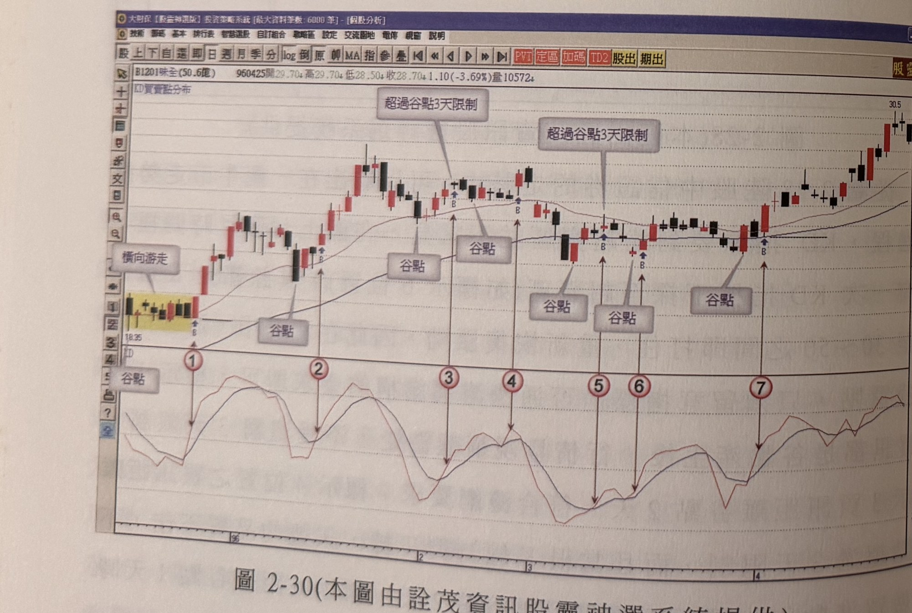
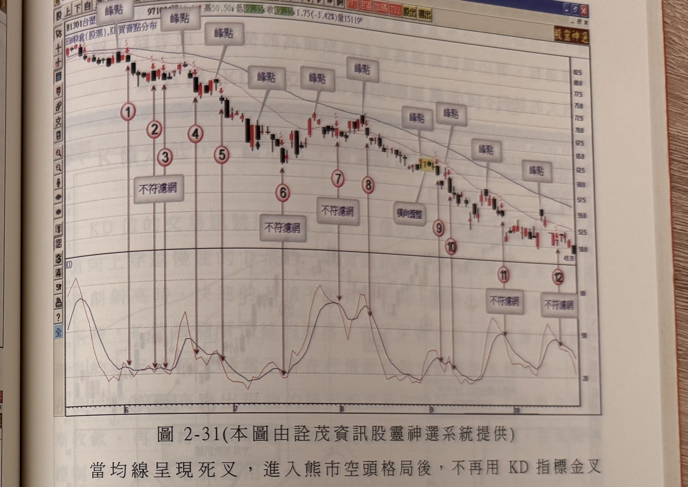

## p.118

**圖 2-29** (本圖由詮茂資訊股靈神選系統提供)

> 圖說（figure notes）：個股招商銀行分時走勢圖，左上角報價列標示「招商銀行(0.1億) 960115開15.48高16.40...」，並標示「KD買賣點分布」。K 線走勢自左段低點（價位標示 8.13）一路盤堅走高，並繪有一條均線，圖中兩處標示「符合3天濾網要求」、一處標示「超過谷點3天限制」、一處標示「橫向游走」、三處標示「谷點」，對應紅色圓圈數字「1」至「5」，最終在圖右側高點（價位標示 17.4）附近收尾。下方 KD 圖（黑線 K 值，紅線 D 值）中，對應「1」至「5」處分別出現谷點，用以說明各買訊距谷點天數是否符合濾網要求。

**圖 2-30** (本圖由詮茂資訊股靈神選系統提供)

> 圖說（figure notes）：個股味全分時走勢圖，左上角報價列標示「B1201味全(50.6億) 960425開29.70高29.70低28.50收28.70 1.10(-3.69%)量10572」，並標示「KD買賣點分布」。K 線走勢自左段低檔（黃底標示一段「橫向游走」區間，價位標示 18.35）一路盤堅走高，並繪有一條均線，圖中兩處標示「超過谷點3天限制」、四處標示「谷點」，對應紅色圓圈數字「1」至「7」，最終在圖右側高點（價位標示 30.5）附近收尾。下方 KD 圖（黑線 K 值，紅線 D 值）中，對應「1」至「7」處分別出現谷點與高點交錯走勢。

[本頁無其他正文段落]

## p.119

**圖 2-31** (本圖由詮茂資訊股靈神選系統提供)

> 圖說（figure notes）：個股 B1301台塑分時走勢圖，左上角報價列標示「B1301台塑(股票),KD買賣點分布 971006開50.5...高50.50低...收...1.75(-3.42%)量15119」。K 線走勢自左段高點一路下滑，途中多處以灰底文字方塊「峰點」標示（共八處），另有三處標示「不符濾網」、一處標示「橫向盤整」，對應紅色圓圈數字「1」至「12」，最終於圖右下方低點（價位約 49.75）附近收尾。下方 KD 圖（黑線 K 值，紅線 D 值）中，對應「1」至「12」處分別出現高點與低點交錯走勢，其中「11」「12」處另標示「不符濾網」，用以說明各賣訊距峰點天數是否符合濾網要求。

當均線呈現死叉，進入熊市空頭格局後，不再用 KD 指標金叉找買點，轉變為根據 KD 死叉做賣出放空動作，而 KD 值死叉出現在 K 值觸及 80 之上，再與 D 值形成死叉最好，但是除非熊市當中出現時間較長的反彈，否則 KD 值並不容易拉升至 80 附近，只要 K 值在 20 以上，所形成的 KD 交叉向下(死叉)即可以把它當做賣點看待，但要特別注意，若 KD 值呈現死叉之前，價格已經從某個峰點下挫數日，跌幅也大的情況下，KD 值死叉出現，反而不是好的放空位置；因此一個好的空點位置，離波峰最高點不應超過 3 天，即峰點起算(不含峰點K線)3天內形成死叉狀況，超過3天以上，要小心評估為宜；波峰最高點出現後若行情呈現在峰點附近震盪(橫向游走)，則不受3天限制。如圖 2-31 台塑(1301)在標示 2、3、6、7、11、12 等賣訊位置，離峰點超過 3 天以上，不是好的賣訊；而標示 6 及[下接 p.120]
