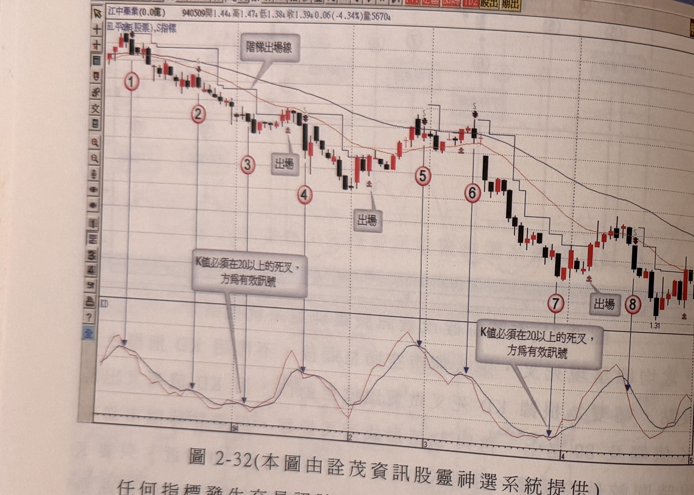

## p.120

[承前頁]12 的 KD 死亡交叉出現時，訊號 K 線卻是紅 K 線，這也不符 K 線品質，空方勝出必以黑 K 線且下影線不長為佳。峰點的判斷，至少在反彈過程，需出現低點提高或者高點續高的情形，或者跳上跳下幅度很大的狀況，才能稱為峰點位置。

**圖 2-32** (本圖由詮茂資訊股靈神選系統提供)

> 圖說（figure notes）：個股江中藥業分時走勢圖，左上角報價列標示「江中藥業(0.0億) 940509開1.44高1.47低1.38收1.39 0.06(-4.34%)量5670」，並標示「叫平衡(股票),S指標」。K 線走勢自左段高點一路下滑，圖上以藍色階梯狀折線標示「階梯出場線」，並繪有兩條均線，途中兩處標示「出場」，對應紅色圓圈數字「1」至「8」，最終在圖右下方低點（價位標示 1.31）附近收尾。下方指標圖（黑線與紅線）中，兩處以灰底文字方塊標示「K值必須在20以上的死叉，方為有效訊號」，以箭頭指向對應的死叉位置。

任何指標發生交易訊號時，K 線的品質若不夠明確，有必要再進一步確認，如圖 2-32 陸股江中藥業(600750)走勢之標示 5 賣訊，K 值觸及超買區 80 後出現死叉之賣出訊號，但是訊號 K 線卻是一根小陽線，這在熊市裡不是理想的賣出訊號，宜以陰線表達賣方的決心；當訊號出現並進場做賣出放空的操作，可以單純設定某一固定百分比為停損，例如 5% 或 7% 等，也可以波峰最高點上方一檔的位置作為停損位置，也可以根據長黑 K 線的最高點漸次向下移動出場停損停利點，若以訊號 K 線當根最高點為停損的狀況，K 線本身是[下接 p.121]

## p.121

[承 p.120]小陰線，長度太小被掃停損的機會較大，所以遇到小陰線的訊號 K 線，宜將停損位置設在固定百分比的停損位置。

### 第五節　KD 值交易訊號提前反應的可行性

#### 一、K 值走低，K 線收紅，過高買進

KD 值的交易訊號採取 K 值與 D 值的快慢速率比較，當快速的 K 值向上穿越慢速的 D 值時，為買進訊號；而行情彈升至某個程度不再創新高時，快速的 K 值不再有動力向上推升，但慢速的 D 值跟上來時，K 值將隨著價格的滑落，向下穿破 D 值，形成賣出訊號，兩者的金叉或死叉通常不會在行情最低點或最高點 K 線形成，而是在最低點或最高點出現後的隔天或更長的時間出現，K 值與 D 值逐漸收斂，再進行交叉狀態，如果能讓訊號本身提前確認，在風險能控制下，值得嘗試運用。

訊號的提早呈現，必須在 K 值與 D 值進行收斂過程產生，但必要完全符合特定條件下成立，才能提前進場操作；條件一、均線呈現牛市排列，即短天期均線在上，長天期均線在下的前提下，換言之，行情屬於牛市多頭行情方可運用本模式；條件二、K 值下探至 50 以下，出現反漲的陽線，但 K 值還是向下，形成背離現象，隔天 K 線收盤突破陽線最高點，為提前買訊產生。

提前在 KD 金叉前做買進動作，停損的設定最為要緊，若情況不對，應立刻出場，停損位置設在進場 K 線的真實低點下方一檔位置，如果進場後，價格仍呈現下滑走勢，表示 K 值將繼續下探，價格也會向下續尋止跌點，觸及停損位置立刻作出場動作，再重新觀察另一個進場買點；操作只要對訊號錯誤的交易做好風險管理。
