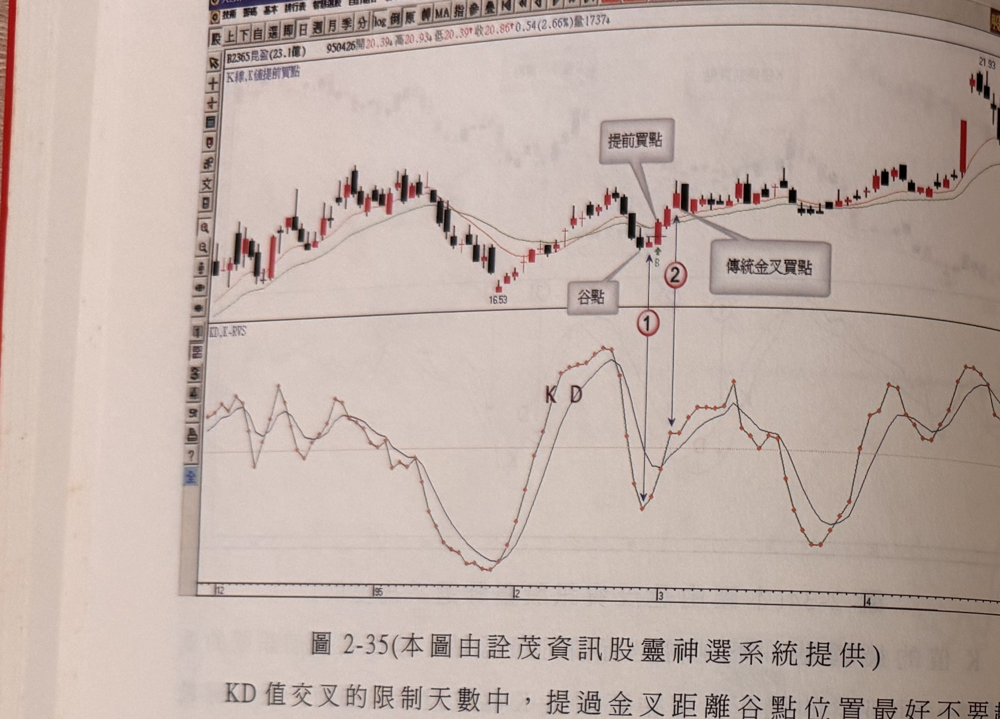
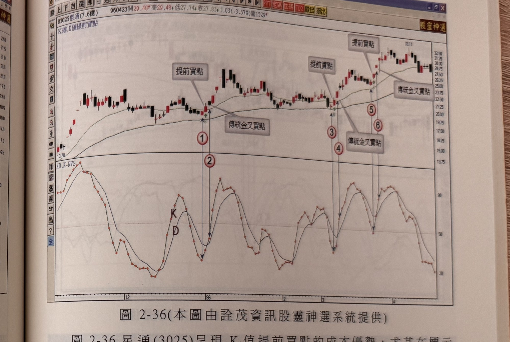

## p.124

**圖 2-35** (本圖由詮茂資訊股靈神選系統提供)

> 圖說（figure notes）：個股 B2365昆盈分時走勢圖，左上角報價列標示「B2365昆盈(23.1億) 950426開20.39高20.93低20.39收20.86 0.54(2.66%)量1737」，並標示「K線,K值提前買點」。K 線走勢自左段震盪整理後回落至低點（價位標示 16.53），白底文字方塊「谷點」標示該低點，其後止跌反彈一根紅K，白底文字方塊「提前買點」以線條指向該處，對應紅色圓圈數字「1」；緊鄰右側另一根紅K以白底文字方塊「傳統金叉買點」標示，對應紅色圓圈數字「2」；此後價格持續走高，最終在圖右側高點（價位標示 21.93）附近收尾。下方 KD 指標圖（標示字母 K、D）中，對應「1」處 K 值先觸底，「2」處為 KD 形成金叉，較「1」略晚。

KD 值交叉的限制天數中，提過金叉距離谷點位置最好不要超過 3 天，這個濾網限制是為了不使金叉前，價格離谷點太遠，造成金叉後，立刻出現拉回，如圖 2-35 昆盈(2365)為例，標示 1 是反漲 K 線，隔天 K 線收盤突破了標示 1 最高點，形成一個提前買訊，若依傳統 KD 值金叉買進(如標示 2)，離谷點已經 4 天時間，超過了濾網限制，其金叉後，價格立刻出現陰線拉回，如果停損係以買進 K 線之最低點為停損，照傳統的 KD 值金叉買進的標示 2 買進，其最低點將被隨後的陰線掃到停損，而提前買訊則不致被停損的狀況出現。

## p.125

**圖 2-36** (本圖由詮茂資訊股靈神選系統提供)

> 圖說（figure notes）：個股 B3025星通分時走勢圖，左上角報價列標示「B3025星通(7.6億) 960423開29.48高29.48低27.74收27.83 1.03(-3.57%)量1529」，並標示「K線,K值提前買點」。K 線走勢自左段低點（價位標示 13.78）一路盤堅走高，並繪有一條均線，圖中三處標示「提前買點」、三處標示「傳統金叉買點」，對應紅色圓圈數字「1」至「6」（1、2 為第一組，3、4 為第二組，5、6 為第三組），最終在圖右側高點（價位標示 33.11）附近收尾。下方 KD 指標圖（標示字母 K、D）中，三組數字分別對應 K 值先觸底、D 值隨後形成金叉的走勢型態。

圖 2-36 星通(3025)呈現 K 值提前買點的成本優勢，尤其在標示 4 及標示 6 位置，傳統 KD 指標以黃金交叉做為買進訊號，往往切入點已經脫離谷點位置超過一成以上距離，如果波段行情各段推升幅度均大時，傳統金叉買入模式，尚有上檔表現空間，若切入的行情在橫向狹幅盤整格局中，難免有買到區間上限的風險，但利用提前買進的模式，則有效降低買點價位，使得區間震盪中不致被掃到停損。運用 K 值提前買進模式，宜注意所選個股所在位階的高低，成交量拉回量縮的格局，顯然籌碼仍屬安定沈澱，那麼在 KD 值尚未金叉所採取的提前進場，可行性極高，但若價格自峰位拉回過程，成交量沒有漸次萎縮至前波谷點量附近水準，那麼要小心提前買進訊號出現後，仍然續破低走勢出現，不管何種狀況出現，以其 K 線真實低點，或設定一個最大 7% 的停損位置絕對必要。
