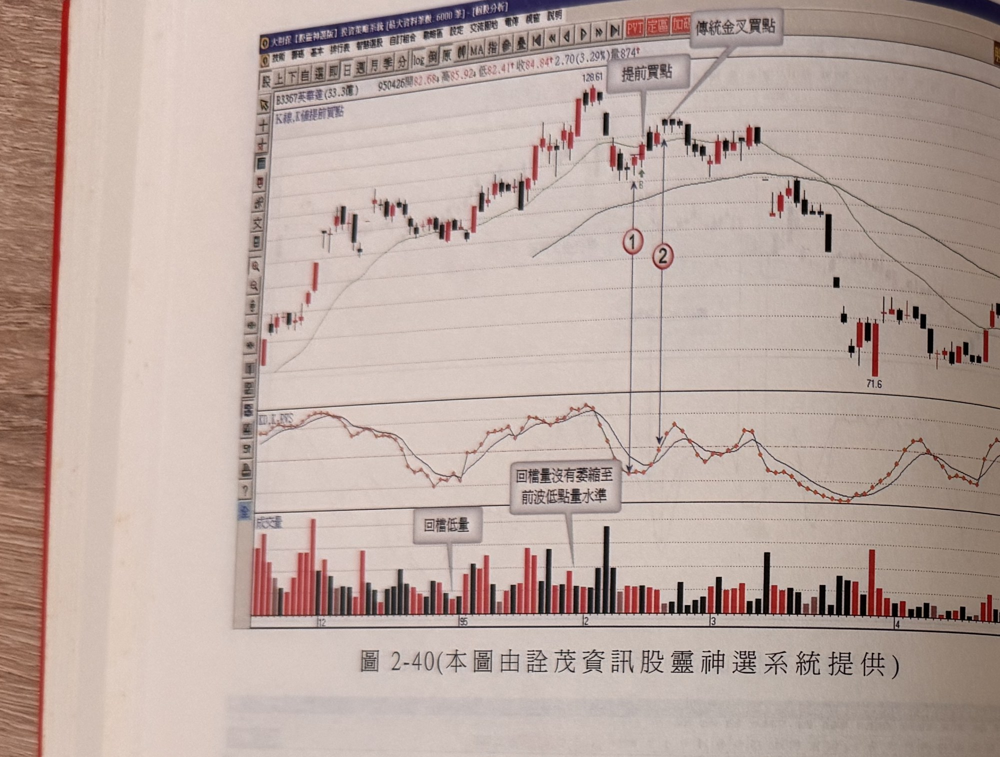

## p.128

**圖 2-40** (本圖由詮茂資訊股靈神選系統提供)

> 圖說（figure notes）：個股 B3367英瑞達分時走勢圖，左上角報價列標示「B3367英瑞達(33.3億) 950426開82.68高85.92低82.41收84.84 2.70(3.29%)量874」，並標示「K線,K值提前買點」。K 線走勢自左段低點一路盤堅走高至高點（價位標示 128.61），中段回檔整理，白底文字方塊「提前買點」以線條指向回檔止跌處一根紅K，對應紅色圓圈數字「1」；緊鄰右側另一根紅K以白底文字方塊「傳統金叉買點」標示，對應紅色圓圈數字「2」；此後價格再度上攻小幅走高後反轉下跌，最終於圖右下方低點（價位標示 71.6）附近收尾。下方 KD 指標圖中對應「1」「2」處分別為 K 值先觸底與隨後的金叉。下方成交量圖中，兩處以灰底文字方塊標示「回檔低量」與「回檔量沒有萎縮至前波低點量水準」，說明回檔階段量能未見縮量的警訊。

[本頁下半部另有預留空白，僅見極淡且左右鏡像反轉的殘餘字跡，應為紙張背面透印所致，依規範略過不予轉錄]

### 二、均線多排，K值走低，K值轉折向上，收陽線買進

[本節內容接續於 p.129]

## p.129

[承 p.128 標題]另一種 KD 值提前買進方式為均線呈現多排，KD 指標的 K 值下滑，破 50 中值，出現 K 值向上轉折，K 線收陽線上漲，是為提前買進訊號參考。如果價格 K 線大漲，K 值向上轉折時，可能同時形成 KD 值金叉情況，那麼提前買訊與傳統 KD 金叉會同步出現買進訊號的；而 K 值若在 50 之上形成向上轉折，並不適合做這樣的提前買進選擇，根據提前買進訊號進場後，可以把停損位置設在進場當根 K 線的真實低點位置，若距離谷點幅度不大，可以在谷點下方一檔設為停損位置。

**圖 2-34**（本圖由詮茂資訊股靈神選系統提供；**原書此圖重複沿用「圖2-34」編號，與 p.123 圖2-34（喬山）重複，疑為印刷編號錯誤，依原文照錄**）

> 圖說（figure notes）：個股白云机場分時走勢圖，左上角報價列標示「白云机場(0.0億) 960322開11.84高12.17低11.79收11.86 0.01(0.08%)量64136」，並標示「熟買點」。K 線走勢自左段低點（價位標示 6.09）緩步盤堅走高，圖中四處標示「提前買訊」、兩處標示「與傳統KD金叉同步出現買訊」，對應紅色圓圈數字「1」至「5」，最終在圖右側高點（價位標示 12.87）附近收尾。下方 KD 指標圖中，五處標示「K值低轉折」，分別對應「1」至「5」處的 K 值低點。

例如圖 2-34 為滬市白雲機場(60004)在 2006 年 11 月初進行拉回整理，K 值向下跌至 50 以下，在標示 2 位置 K 值出現低轉折向上，在其均線排列短天期均線高於長天期均線，屬於多頭趨勢，因此，當 K 值呈現低轉折時，可以作為提前買訊參考，並以標示 2 之 K 線[下接 p.130]
