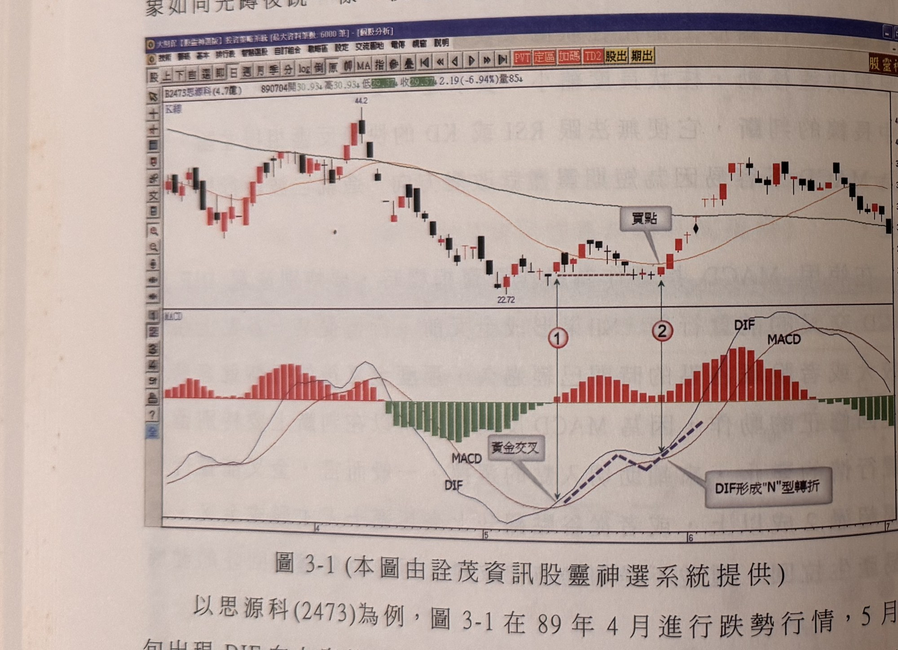
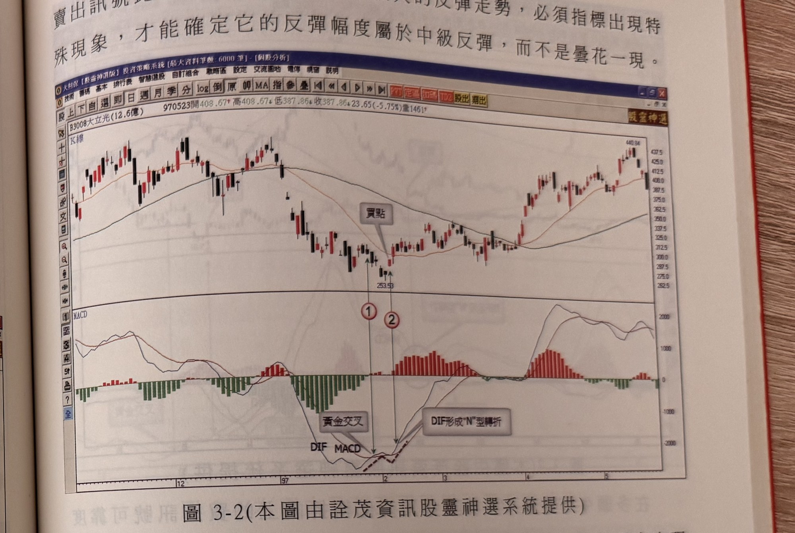

## p.136

[承 p.135]二種特殊的模式將提供給操作者可靠的訊號。

### 第一節　金叉後低轉折買點

當 DIF 與 MACD 形成金叉後，DIF 呈現 N 形轉折，即 DIF 出現向下彎，不出幾天又重新向上，而 DIF 向下彎的過程，並沒有跌破 MACD，稱之為金叉後低轉折，這種訊號的可靠性相當高，這種現象如同先蹲後跳一樣，後市發展傾向快速推升。

**圖 3-1** (本圖由詮茂資訊股靈神選系統提供)

> 圖說（figure notes）：個股 B2473思源科分時走勢圖，左上角報價列標示「B2473思源科(4.7億) 890704開30.93高30.93低29.37收29.37 2.19(-6.94%)量85」。上方為 K 線圖，K 線走勢自左段高點（價位標示 44.2）一路下滑至低點（價位標示 22.72），其後止跌整理，白底文字方塊「買點」以線條指向整理區右側一根紅K，對應紅色圓圈數字「1」與「2」（1 為金叉點，2 為 DIF 低轉折點，兩者以水平虛線相連標示同一低點價位），其後價格反轉走高。下方 MACD 指標圖（DIF、MACD 兩條曲線與紅綠柱狀圖）中，白底文字方塊「黃金交叉」以線條指向 DIF 與 MACD 交叉處（對應「1」），白底文字方塊「DIF形成"N"型轉折」以線條指向 DIF 曲線於低檔小幅下彎又向上勾起的位置（對應「2」，以藍色虛線標示 N 形走勢），其後 DIF、MACD 皆同步上揚，柱狀圖由綠轉紅且長度持續放大。

以思源科(2473)為例，圖 3-1 在 89 年 4 月進行跌勢行情，5 月中旬出現 DIF 向上穿越 MACD 的金叉情況，如標示 1 位置，但是行情並未出現推升快漲，金叉後不久即呈現拉回走勢，DIF 出現向下彎，看似又要重啟跌勢，但下彎四天後，DIF 出現上勾，如標示 2 位置，如同 "N" 形轉折朝上，行情重新挺升上漲。跌勢發展中，指標金叉的買進訊號是比較受到質疑，因為畢竟在空頭跌勢裡，應該是找[下接 p.137]

## p.137

[承 p.136]賣出訊號比較可靠，但是要出現較大的反彈走勢，必須指標出現特殊現象，才能確定它的反彈幅度屬於中級反彈，而不是曇花一現。

**圖 3-2** (本圖由詮茂資訊股靈神選系統提供)

> 圖說（figure notes）：個股 B3008大立光分時走勢圖，左上角報價列標示「B3008大立光(12.6億) 970523開408.67高408.67低387.86收387.86 23.65(-5.75%)量146」。上方為 K 線圖，K 線走勢自左段高點一路下滑至低點（價位標示 253.53），白底文字方塊「買點」以線條指向止跌處一根紅K，對應紅色圓圈數字「1」與「2」，其後價格止跌反彈走高，最終在圖右側高點（價位標示 440.94）附近震盪收尾。下方 MACD 指標圖中，白底文字方塊「黃金交叉」以線條指向 DIF 與 MACD 交叉處（對應「1」），白底文字方塊「DIF形成"N"型轉折」以線條指向 DIF 曲線低檔向下小彎又勾起的位置（對應「2」，以黑色虛線標示 N 形走勢），其後柱狀圖由綠轉紅並持續放大。

再舉大立光(3008)在 97 年的例子說明，如圖 3-2，元月底出現了 DIF 與 MACD 的金叉，如標示 1 位置，金叉後價格卻往下走跌，摜破創新低點，DIF 隨之下彎，似要繼續走跌，但 DIF 並沒有跌破 MACD，在標示 2 出現金叉後 DIF 低轉折向上之買點訊號，當 DIF 下彎又有陰線下殺，的確讓多頭反彈捏把冷汗，但隨後 "N" 形轉折出現，便提高反彈續漲的可靠性，因此只要發現在跌勢出現 DIF 低轉折時，可以在控制停損的前提下進場操作，而停損位置應該控制在買進訊號出現的當根 K 線最低點下方一個跳動點的位置，或者以固定百分比的停損控制，或以階梯出場線做為控制風險，再者，要特別注意 K 線品質的判斷，DIF 金叉後低轉折買點，當根 K 線必須是陽線呈現，上影線不宜過長，如此過濾，可靠度當能有效提升。
