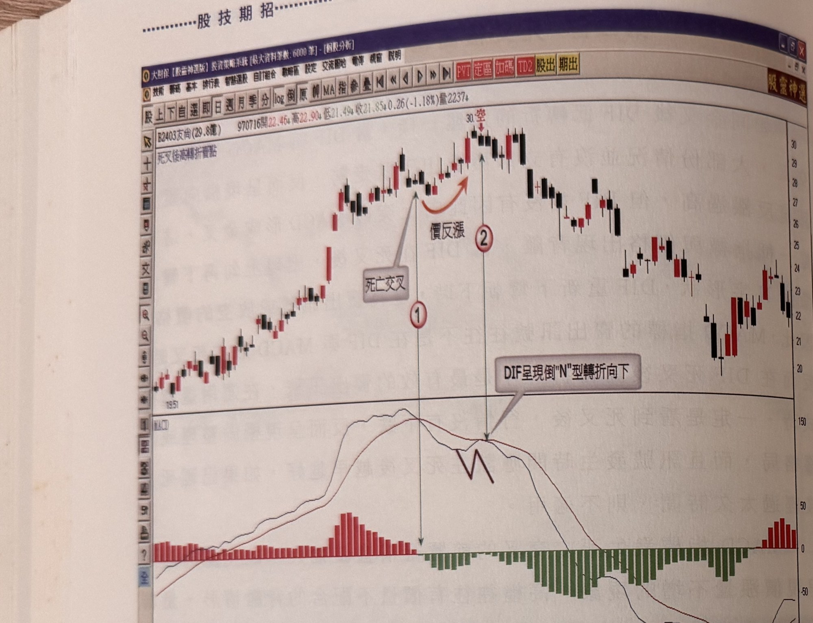
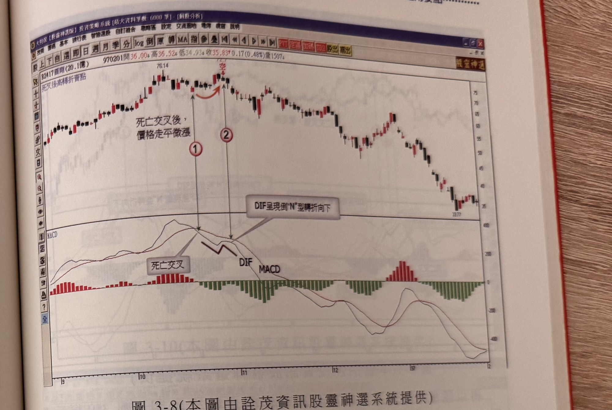

## p.142

**圖 3-7** (本圖由詮茂資訊股靈神選系統提供)

> 圖說（figure notes）：個股 B2403友尚分時走勢圖，左上角報價列標示「B2403友尚(29.8億) 970716開22.46高22.90低21.49收21.85 0.26(-1.18%)量2237」，並標示「死叉後高轉折賣點」。K 線走勢自左段低點（標示 1951）一路盤堅走高，白底文字方塊「死亡交叉」以線條指向對應紅色圓圈數字「1」處，其後價格短暫回檔後又反彈（橙色箭頭標示「價反漲」），漲抵最高點（價位標示 30，旁註紅字「空」）對應紅色圓圈數字「2」，白底文字方塊「DIF呈現倒"N"型轉折向下」以線條指向該處，其後價格反轉下跌。下方 MACD 指標圖中，DIF 與 MACD 於「1」處死亡交叉後，DIF 小幅上勾至「2」處又下彎，呈倒 N 字形，柱狀圖隨後由紅轉綠並持續放大。

以友尚(2403)為例，如圖 3-7 標示 1 位置是 DIF 與 MACD 死叉的位置，死叉形成後，行情並沒有快速發展成跌勢，而是呈現橫向整理後再漲的狀況，DIF 也因價格上漲而上勾，但 DIF 並未穿越 MACD，仍然在 MACD 之下，在標示 2 的位置，DIF 下彎成倒 N 字形狀，便是不錯的放空點或賣出訊號，自此價格才正式展開較快速的下跌走勢，在本例的峰頂距離放空訊號的位置很接近，因此，停損位置宜設在峰頂上方一檔的價位。

## p.143

**圖 3-8** (本圖由詮茂資訊股靈神選系統提供)

> 圖說（figure notes）：個股 B2417圓剛分時走勢圖，左上角報價列標示「B2417圓剛(20.1億) 970201開36.00高36.52低34.93收35.83 0.17(0.48%)量1507」，並標示「死叉後高轉折賣點」。K 線走勢自左段低點一路盤堅走高（高點標示 76.14），白底文字方塊「死亡交叉後，價格走平微漲」，對應紅色圓圈數字「1」指向 DIF 與 MACD 死叉處，其後價格橫向微幅上漲，漲抵次高點（價位標示 72.7，旁註紅字「空」）對應紅色圓圈數字「2」，白底文字方塊「DIF呈現倒"N"型轉折向下」以線條指向該處，其後價格持續下跌至最低點（價位標示 33.77）附近收尾。下方 MACD 指標圖中，DIF 與 MACD 於「1」處死亡交叉後，DIF 小幅上勾至「2」處又下彎呈倒 N 字形，柱狀圖隨後由紅轉綠並持續放大。

以圓剛(2417)為例，如圖 3-8 標示 1 是 DIF 與 MACD 死叉的位置，死叉形成後，行情並沒有發生下跌走勢，而是呈現反向上漲的狀況，DIF 也因價格上漲而上勾，但 DIF 並未穿越 MACD，仍然在 MACD 之下，在標示 2 的位置，DIF 下彎成倒 N 字形狀，正好是一個賣出訊號，試想如果在 DIF 與 MACD 死亡交叉時，就進行放空，之後行情不跌反漲，勢必造成放空者的心理焦慮，狐疑 MACD 指標的可靠度，如果以死亡交叉前的波段最高點為停損位置，當然在本例中不致被觸及，但是有很多情形，DIF 與 MACD 死叉後，一路反彈越過死叉前波段最高點後，被觸及停損時，才正式下跌，與其在 DIF 與 MACD 死叉時放空，不如採取死叉後 DIF 高轉折時，才進場操作放空動作，時機點與效率而言，採取本法較為可靠。
