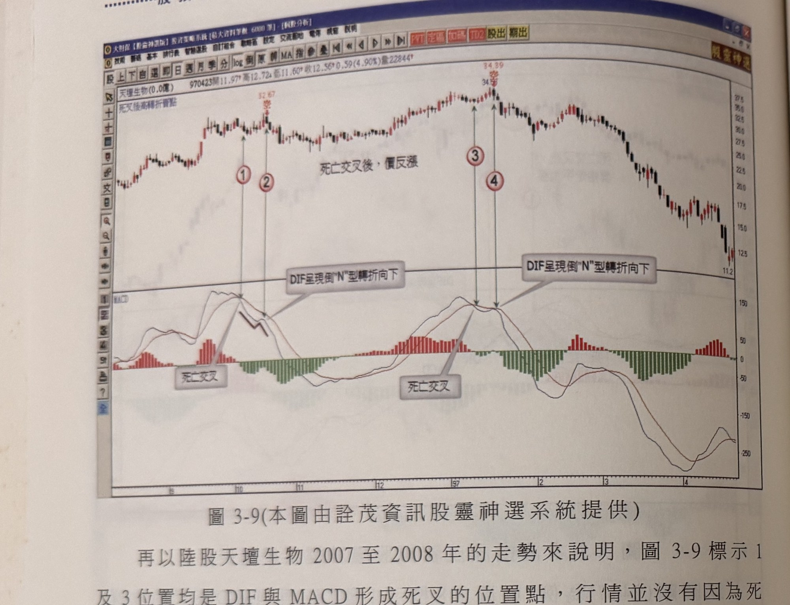
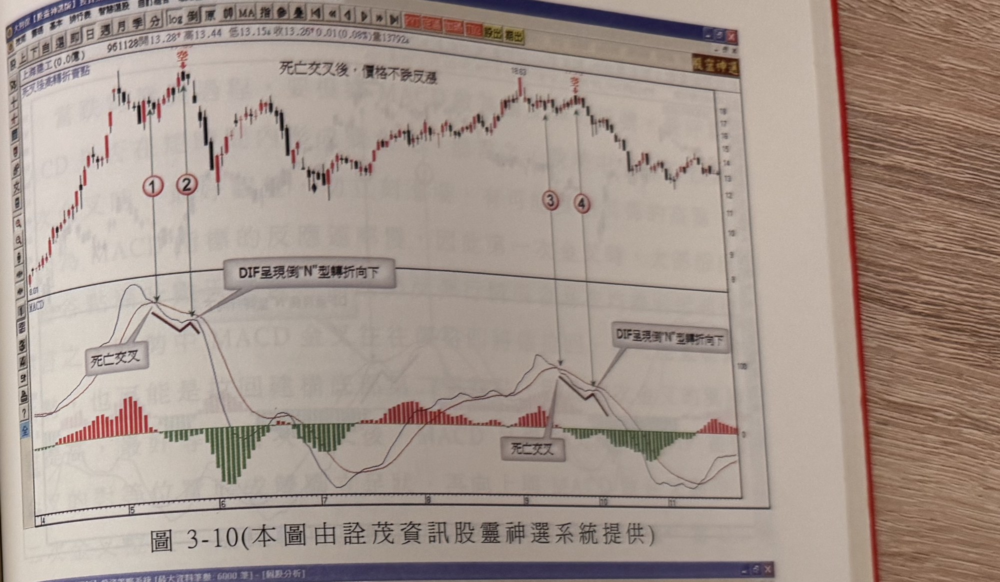
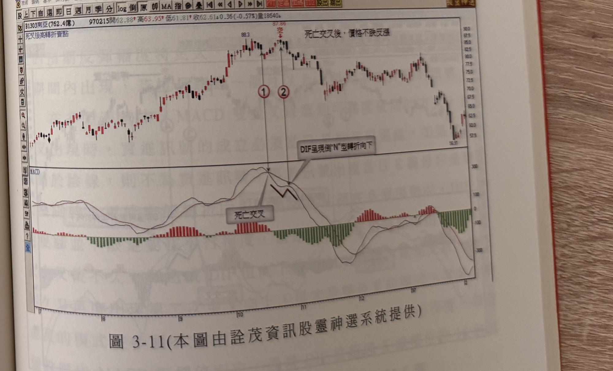

## p.144

**圖 3-9** (本圖由詮茂資訊股靈神選系統提供)

> 圖說（figure notes）：陸股天壇生物分時走勢圖，左上角報價列標示「天壇生物(0.0億) 970423開11.97高12.72低11.60收12.56 0.59(4.90%)量22844」，並標示「死叉後高轉折賣點」。K 線走勢自左段緩步走高，白底文字方塊「死亡交叉後，價反漲」標示第一次死叉後行情反漲的階段，對應紅色圓圈數字「1」（死叉點，旁註「32.67」，紅字「空」）與「2」，白底文字方塊「DIF呈現倒"N"型轉折向下」以線條指向該處 DIF 曲線；價格其後續漲至高點（價位標示 34.39，紅字「空」）對應紅色圓圈數字「3」與「4」，另一白底文字方塊「DIF呈現倒"N"型轉折向下」指向該處，其後價格反轉下跌。下方 MACD 指標圖中，兩處白底文字方塊「死亡交叉」分別指向「1」「3」處 DIF 與 MACD 交叉點，DIF 在「2」「4」處各呈現倒 N 字形下彎。

再以陸股天壇生物 2007 至 2008 年的走勢來說明，圖 3-9 標示 1 及 3 位置均是 DIF 與 MACD 形成死叉的位置點，行情並沒有因為死叉而造成反轉為跌勢，當 DIF 呈現倒 N 字形狀時，如標示 2 及標示 4 位置，才正式下跌，在本例中，標示 2 前的反漲走勢沒有創新高，但標示 4 便創新高點，因此，如果死叉放空，並以死叉前波段高點為停損，將遭受觸及停損的命運，而且要注意到這種死叉後高轉折賣點，必須發生在死叉後不久，拖延超過 20 天以上，都非有效訊號。

在本模式下，最重要的判斷重點在於 MACD 指標死亡交叉後，並沒有使價格隨著指標的方向走跌，反而呈現橫向震盪走高，反漲至死亡交叉前的高峰附近，甚至創新高的狀況出現，這個特徵務必注意。

### 以下各圖請讀者自行參閱。

## p.145

**圖 3-10** (本圖由詮茂資訊股靈神選系統提供)

> 圖說（figure notes）：陸股上海醫工分時走勢圖，左上角報價列標示「上海醫工(0.0億) 961128開13.28高13.44低13.15收13.26 0.01(0.08%)量13792」，並標示「死叉後高轉折賣點」。K 線走勢自左段低點（標示 8.01）一路盤堅走高，圖上方文字方塊說明「死亡交叉後，價格不漲反漲」。對應紅色圓圈數字「1」（紅字「空」）與「2」為第一次死叉及 DIF 倒 N 型轉折處，白底文字方塊「死亡交叉」與「DIF呈現倒"N"型轉折向下」分別以線條指向；價格其後盤整反彈至次高點（價位標示 18.63），對應紅色圓圈數字「3」（紅字「空」）與「4」，再度出現「死亡交叉」與「DIF呈現倒"N"型轉折向下」標示，其後價格持續下跌。下方 MACD 柱狀圖由紅轉綠、再轉紅、再轉綠，對應兩次死叉與 DIF 倒 N 轉折走勢。

**圖 3-11** (本圖由詮茂資訊股靈神選系統提供)

> 圖說（figure notes）：個股 B1303南亞分時走勢圖，左上角報價列標示「B1303南亞(762.4億) 970215開62.88高63.95低61.81收62.61 0.36(-0.57%)量18640」，並標示「死叉後高轉折賣點」。圖上方文字方塊說明「死亡交叉後，價格不漲反漲」。K 線走勢自左段低點一路盤堅走高至次高點（價位標示 88.3），對應紅色圓圈數字「1」，其後續漲至最高點（價位標示 87.86，紅字「空」）對應紅色圓圈數字「2」，白底文字方塊「死亡交叉」與「DIF呈現倒"N"型轉折向下」分別以線條指向 DIF 與 MACD 交叉處及其後倒 N 型轉折處，其後價格持續走低，最終於圖右下方低點（價位標示 56.35）附近收尾。下方 MACD 柱狀圖對應「1」至「2」區間由紅轉綠。

### 以下各圖請讀者自行參閱。
