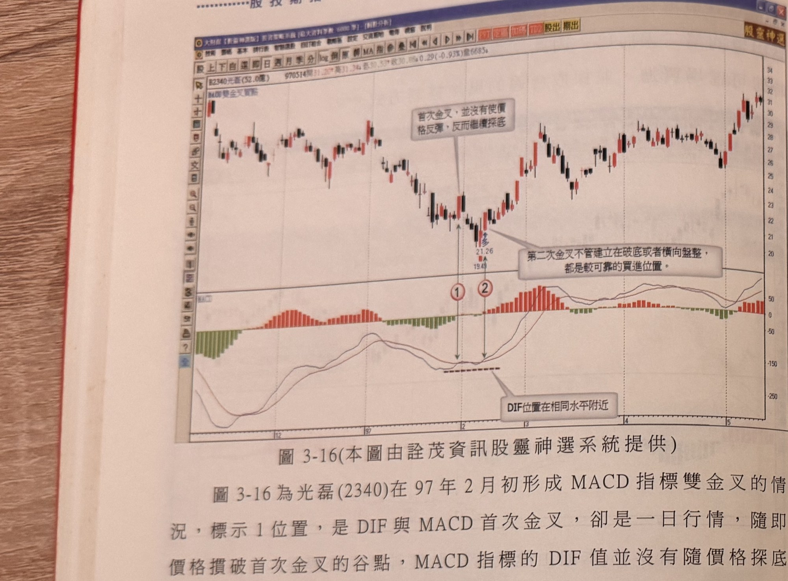
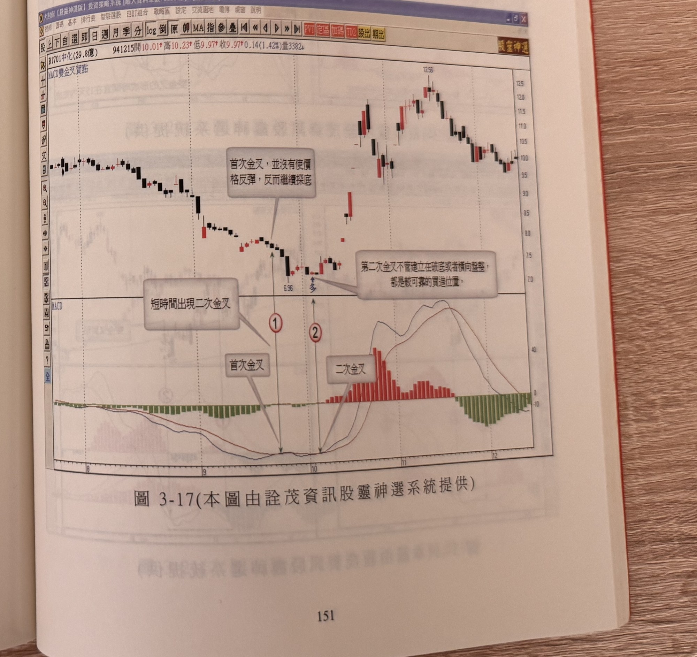

## p.150

**圖 3-16** (本圖由詮茂資訊股靈神選系統提供)

> 圖說（figure notes）：個股 B2340光磊分時走勢圖，左上角報價列標示「B2340光磊(52.0億) 970514開31.20高31.34低30.30收30.85 0.29(-0.93%)量6685」，並標示「MACD雙金叉買點」。K 線走勢自左段高點一路下滑至低點（價位標示 21.26，旁註 19.49），白底文字方塊「首次金叉，並沒有使價格反彈，反而繼續探底」以線條指向對應紅色圓圈數字「1」處，白底文字方塊「第二次金叉不管建立在破底或者橫向盤整，都是較可靠的買進位置。」以線條指向對應紅色圓圈數字「2」處，其後價格止跌反彈走高。下方 MACD 指標圖中，白底文字方塊「DIF位置在相同水平附近」以線條指向「1」「2」兩處 DIF 低點，兩者位置相近，柱狀圖由綠轉紅並持續放大。

圖 3-16 為光磊(2340)在 97 年 2 月初形成 MACD 指標雙金叉的情況，標示 1 位置，是 DIF 與 MACD 首次金叉，卻是一日行情，隨即價格摜破首次金叉的谷點，MACD 指標的 DIF 值並沒有隨價格探底而進一步出現新低值，形成背離現象，標示 2 位置 DIF 與 MACD 再次金叉，就有機會呈現搶反彈的買進訊號，尤其當日 K 線屬於大漲陽線，更能表態觸底反彈的決心；當 MACD 指標出現雙金叉狀況時，首次金叉大部份是出現在離最近谷點五天以上的時間，但第二次金叉時，通常距離谷點在五天以內發生，因此，第二次金叉具有買在最接近低點的效果，而且離谷點幅度不大，意謂若有較大的反彈行情，切入點正好在最低檔位置，便有較大反彈空間可供操作；若價格與指標呈現背離現象，則更有可能形成底部反轉機會，通常在絕對高點出現逆轉後，跌幅 50% 以上，出現這種現象，都有機會形成較大的反彈甚至反轉為多頭的機會。

## p.151

雙金叉買點訊號的用法，提供特別的買進參考，多頭格局中，遇到雙金叉的確是個難得的買進位置，但在空頭市頭中，要注意別在空頭反轉的初期使用，因為反轉型態剛形成，較難出現較大的反彈行情，換言之，價格所處的環境應該仔細考慮，在使用任何技術指標都應有如此認識，多頭市場中技術指標的買進訊號多參考，賣出訊號可以選擇忽略，在空頭市場賣出訊號可靠度高，但買進訊號要小心使用，跌幅不大或條件不符合，都不宜貿然操作。

### 以下各圖請讀者自行參閱：

**圖 3-17** (本圖由詮茂資訊股靈神選系統提供)

> 圖說（figure notes）：個股 B1701中化分時走勢圖，左上角報價列標示「B1701中化(29.8億) 941215開10.01高10.23低9.97收9.97 0.14(1.42%)量3382」，並標示「MACD雙金叉買點」。K 線走勢自左段高點一路下滑，白底文字方塊「短時間出現二次金叉」以線條指向對應紅色圓圈數字「1」與「2」處（兩者位置相近，「2」處旁註「6.96」及紅字「多」），白底文字方塊「第二次金叉不管建立在破底或者橫向盤整，都是較可靠的買進位置。」以線條指向「2」處，其後價格止跌反彈走高。下方 MACD 指標圖中，白底文字方塊「首次金叉」與「二次金叉」分別指向「1」「2」兩處 DIF 與 MACD 金叉點，柱狀圖其後由綠轉紅並大幅放大。
