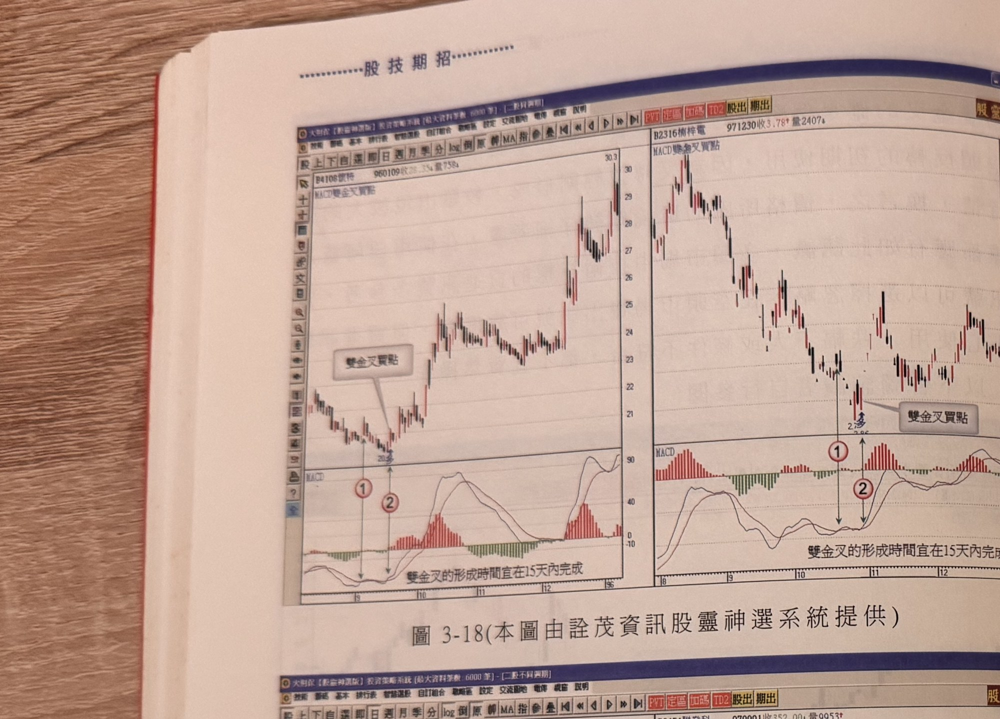
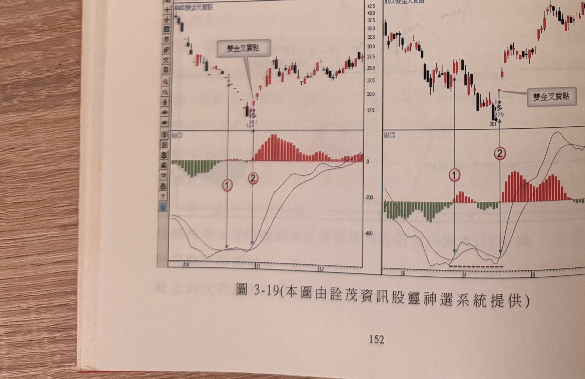
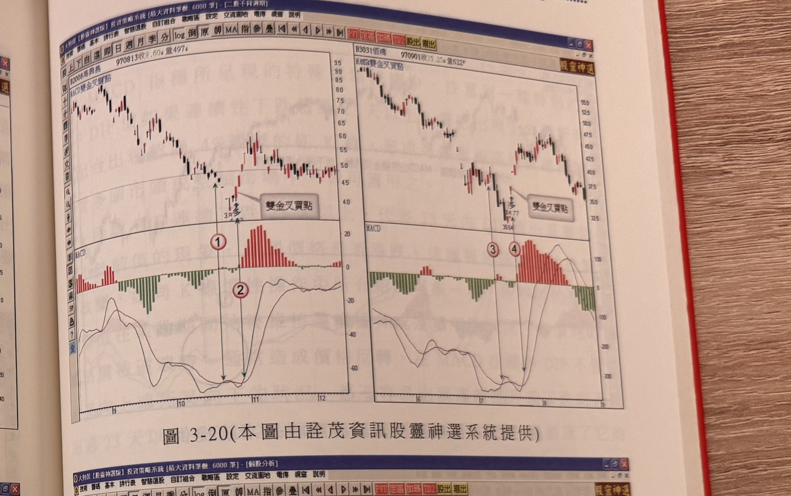
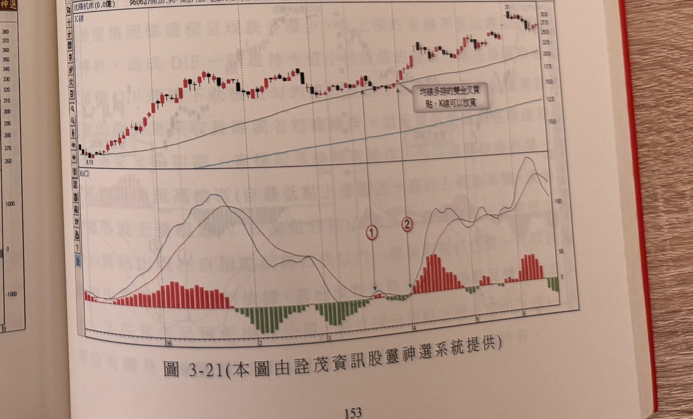

## p.152

[本頁全版為圖 3-18、圖 3-19 兩張組合圖（各由兩張個股分時走勢子圖構成），無正文段落]

**圖 3-18** (本圖由詮茂資訊股靈神選系統提供)

> 圖說（figure notes）：本圖由兩張個股分時走勢子圖組成，皆標示「MACD雙金叉買點」。左：個股 B4108懷特，報價列「B4108懷特 960109收28.34量758」，K 線走勢自左段高檔下滑至低點（標示 20多），白底文字方塊「雙金叉買點」以線條指向止跌處，對應紅色圓圈數字「1」「2」，其後價格反轉大漲。下方 MACD 圖中文字說明「雙金叉的形成時間宜在15天內完成」，對應「1」「2」兩處 DIF 與 MACD 金叉點時間相近。右：個股 B2316楠梓電，報價列「B2316楠梓電 971230收3.78量2407」，K 線走勢自左段高檔下滑至低點（標示 2多，旁註 3.96），白底文字方塊「雙金叉買點」以線條指向止跌處，對應紅色圓圈數字「1」「2」，其後價格反彈走高。下方 MACD 圖同樣標示「雙金叉的形成時間宜在15天內完成」。

**圖 3-19** (本圖由詮茂資訊股靈神選系統提供)

> 圖說（figure notes）：本圖由兩張個股分時走勢子圖組成。左：個股 B1708東雲，報價列「B1708東雲 971218收27.55量9094」，K 線走勢自左段高檔下滑至低點（標示 18.1，旁註 15.9多），白底文字方塊「雙金叉買點」以線條指向止跌處，對應紅色圓圈數字「1」「2」，其後價格反彈大漲。下方 MACD 柱狀圖由綠轉紅並大幅放大。右：個股 B2454聯發科，報價列「B2454聯發科 970901收352.00量9953」，K 線走勢自左段高檔下滑至低點（標示 261，旁註 279多），白底文字方塊「雙金叉買點」以線條指向止跌處，對應紅色圓圈數字「1」「2」，其後價格反彈走高。下方 MACD 柱狀圖同樣由綠轉紅並放大。

## p.153

[本頁全版為圖 3-20、圖 3-21 兩張組合圖，無正文段落]

**圖 3-20** (本圖由詮茂資訊股靈神選系統提供)

> 圖說（figure notes）：本圖由兩張個股分時走勢子圖組成。左：個股 B2008高興昌，報價列「B2008高興昌 970813收8.60量497」，K 線走勢自左段高檔下滑至低點（標示 3.8多，旁註 4.62），白底文字方塊「雙金叉買點」以線條指向止跌處，對應紅色圓圈數字「1」「2」，其後價格反彈走高。下方 MACD 柱狀圖由綠轉紅並大幅放大。右：個股 B3031佰鴻，報價列「B3031佰鴻 970901收35.25量522」，K 線走勢自左段高檔下滑至低點（標示 34.77多，旁註 30.54），白底文字方塊「雙金叉買點」以線條指向止跌處，對應紅色圓圈數字「3」「4」，其後價格反彈走高。下方 MACD 柱狀圖同樣由綠轉紅並放大。

**圖 3-21** (本圖由詮茂資訊股靈神選系統提供)

> 圖說（figure notes）：陸股沈陽机床分時走勢圖，左上角報價列標示「沈陽机床(0.0億) 960627開26.90高27.25低26.45收27.00 0.15(0.56%)量62726」，並標示「K線」。K 線走勢自左段低點（標示 8.19）一路盤堅走高，圖中兩處以箭頭對應紅色圓圈數字「1」「2」，白底文字方塊「均線多排的雙金叉買點，K線可以放寬」以線條指向該處，其後價格持續走高。下方 MACD 指標圖中，柱狀圖於「1」「2」處由綠轉紅並大幅放大，DIF 與 MACD 呈多頭排列走高。
