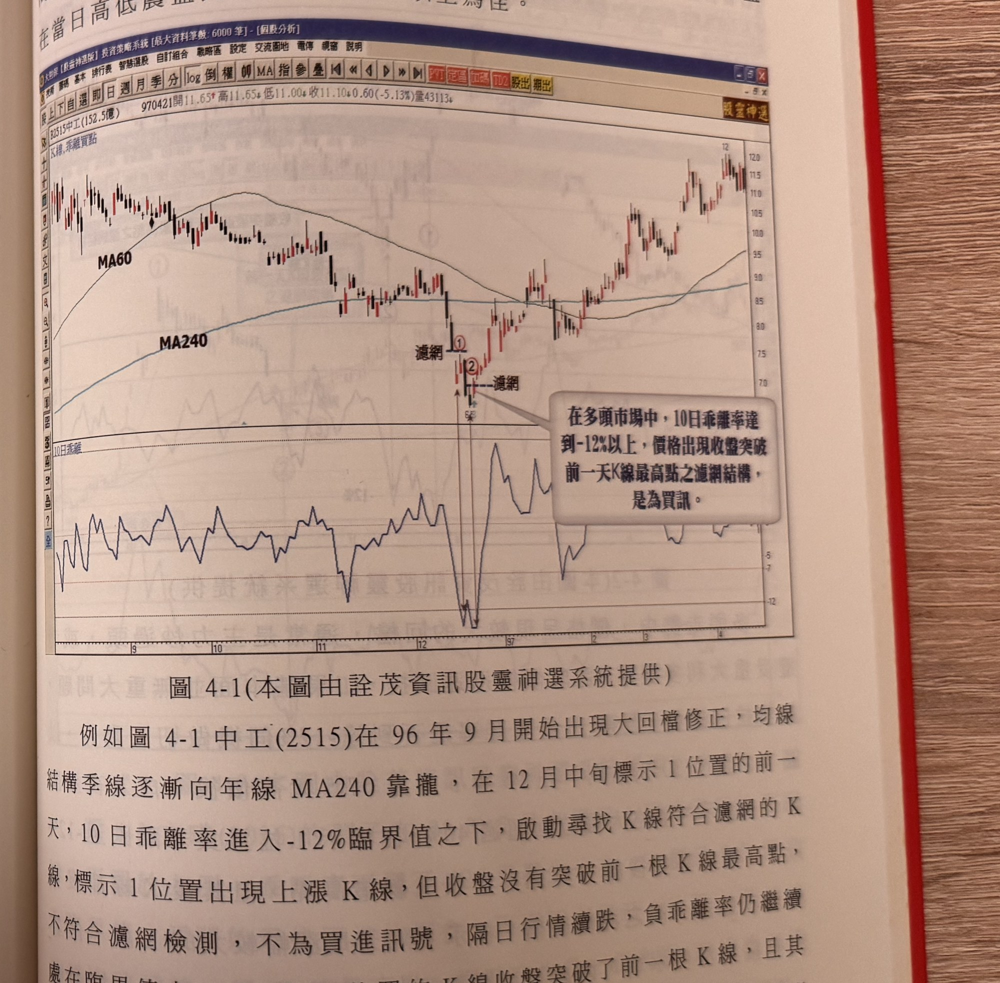

## p.166

### 第一節　乖離率買點分布

一般在研判行情是否過熱，或者價格跌幅是否過鉅，除了常用 RSI、KD 隨機指標或威廉指標外，也可以選用乖離率來測定價格是否到達反轉區域，乖離率表達價格收盤與均線之間的漲跌幅度，立論的基礎乃認為均線具有引力效果，當價格出現過大的漲幅而產生正乖離放大時，獲利回吐將促使價格往均線拉近；反之，價格跌幅過大所造成負乖離放大時，融券回補意願大增，使得價格反彈接近均線，換言之，價格依循特定均線產生正乖離過大，就會盛極而衰地拉回均線附近；反之，負乖離過大，也會否極泰來向上彈回均線附近，乖率離不似 KD 指標或 RSI 或威廉指標處在 0~100 之間震盪，不同個股價格波動，其乖離率的表現差異極大，例如年年穩定獲利的績優股，自波段拉回的程度，其 10 日乖離率大約在-7%會產生止跌效果，而較大的回檔約略在-12%附近做底機會大，而盈虧起伏大的個股價格拉回程度，10 日乖離率一般在-12%附近止跌反彈，而較深的回檔負乖離率可能達到-20%以上都不見得止跌。

股價上漲過程，通常 10 日乖離率到達 12%會產生獲利回吐的跡象，但不是絕對的觀念，而是歷史軌跡所得的概況，當價格乖離率到達上述的臨界值後，必須觀察價格有無通過濾網的檢測，來判定其相對高點產生的可能性或相對低點的參考，一般可以使用價格 K 線過前一天高點來檢定，而 K 線品質是重要的第二層濾網結構，當乖離率進入臨界值，在跌勢中 K 線出現過前一天 K 線最高點或者當日是一根接近漲停 K 線，則訊號符合買進濾網，因此買進訊號中出現兩種參考模式，其一是訊號 K 線前三天內出現負乖離率達到-12%(績優股在多頭可以採用-7%)開始尋找後續 K 線出現過前一天 K 線最高點為買進訊號，其二是訊號 K 線前三天內出現負乖離到達

## p.167

-12%，隔天出現接近漲停之 K 線為買進訊號，不必過前一天 K 線最高點。K 線品質同時要求上影線不宜超過實體長度，最好 K 線收盤在當日高低震盪長度的四分之三以上為佳。

**圖 4-1** (本圖由詮茂資訊股靈神選系統提供)

> 圖說（figure notes）：中工(2515) K 線圖，左上角報價列標示「B2515中工(152.5億) 970421開11.65↑高11.65↓低11.00↓收11.10↓0.60(-5.13%)量43113」。K 線圖標示 MA60、MA240 均線，均線走勢由高檔逐漸下彎後趨緩。價格下跌至標示紅色圓圈數字「①」處，文字方塊「濾網」標示於該根 K 線最高點旁；隔日續跌至標示紅色圓圈數字「②」處（價位標示 6.[?]），再標示一條「濾網」水平虛線於其上方。右下方文字方塊：「在多頭市場中，10日乖離率達到-12%以上，價格出現收盤突破前一天K線最高點之濾網結構，是為買訊。」下方為「10日乖離」指標圖，呈鋸齒狀波動，於標示 1、2 對應位置出現深 V 型探底（觸及 -12 下方），隨後快速反彈。K 線圖右側股價自谷底一路上漲，最高觸及 12.0 附近。

例如圖 4-1 中工(2515)在 96 年 9 月開始出現大回檔修正，均線結構季線逐漸向年線 MA240 靠攏，在 12 月中旬標示 1 位置的前一天，10 日乖離率進入-12%臨界值之下，啟動尋找 K 線符合濾網的 K 線，標示 1 位置出現上漲 K 線，但收盤沒有突破前一根 K 線最高點，不符合濾網檢測，不為買進訊號，隔日行情續跌，負乖離率仍繼續處在臨界值之下，標示 2 位置的 K 線收盤突破了前一根 K 線，且其 K 線上影線沒有超過實體長度，再者訊號 K 線最好能上漲超過 3% 以上漲幅，透過這樣的濾網所產生的訊號之可靠度自然提升，當然進場買進後，在跌勢中仍要預防價格再滑落的可能性，因此停損的
