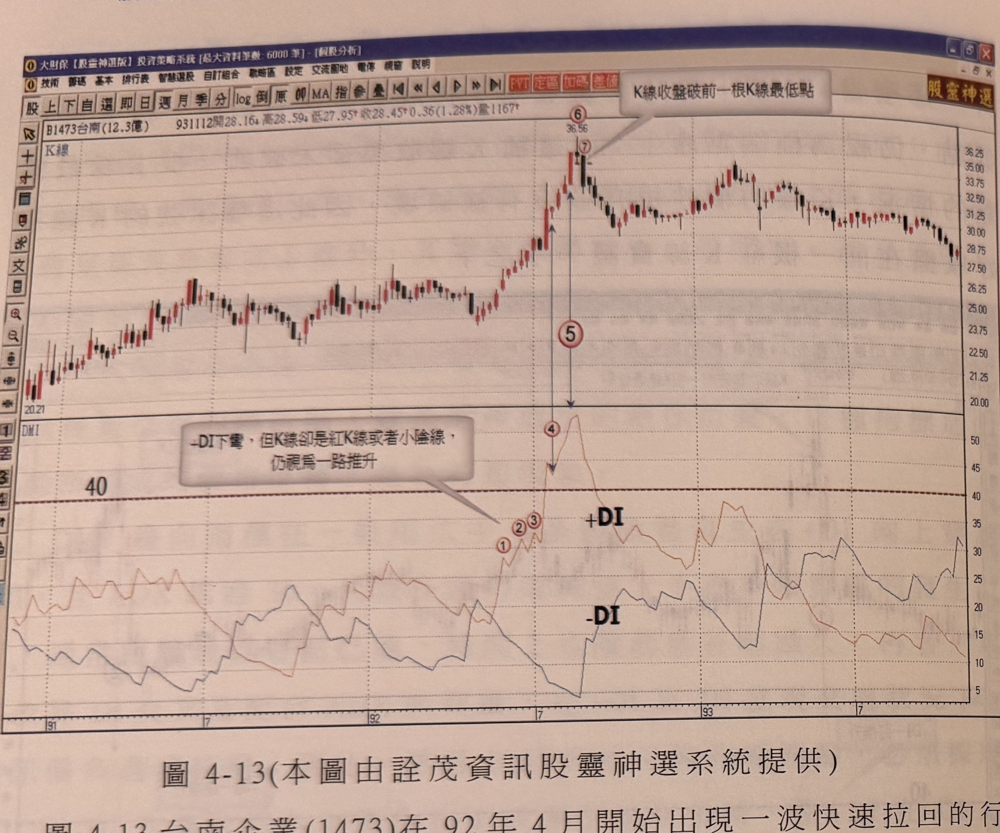
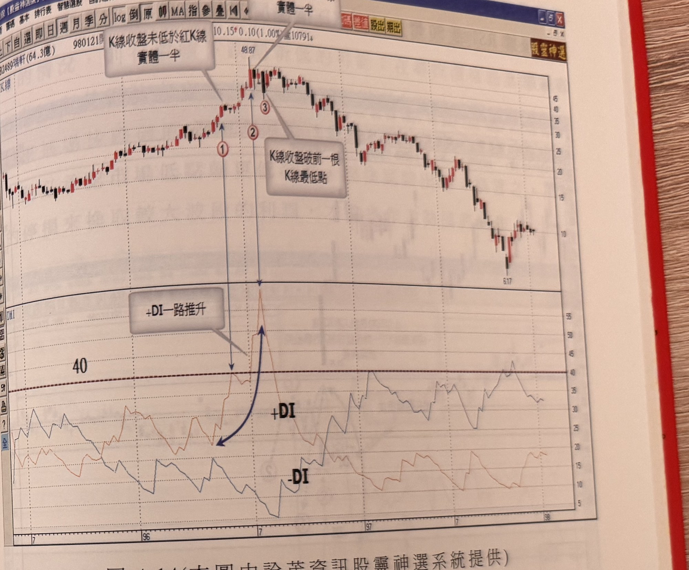

## p.178

**圖 4-13** (本圖由詮茂資訊股靈神選系統提供)

> 圖說（figure notes）：台南企業(1473) K 線圖，左上角報價列標示「B1473台南(12.3億) 931112開28.16↓高28.59↓低27.95↑收28.45↑0.36(1.28%)量1167」。K 線圖中價格自左側低點（20.21）緩步上漲至高點（標示 36.56，紅色圓圈數字「⑥」），文字方塊「K線收盤破前一根K線最低點」以箭頭指向該高點右側的黑 K 線（標示「⑦」）。標示紅色圓圈數字「5」以雙向箭頭連接高點與下方 DMI 圖對應位置。下方 DMI 圖繪有 +DI（紅色曲線）與 -DI（藍色曲線），標示水平參考線「40」。左下方文字方塊：「-DI下彎，但K線卻是紅K線或者小陰線，仍視為一路推升」以箭頭指向 +DI 曲線上標示紅色圓圈數字「①②③」處（三個小波動點，皆低於 40），其後 +DI 一路推升穿越 40，於標示「④」處達到高峰（約 50），對應 K 線圖的高點「⑥」。K 線圖右側股價自高點回落後於區間橫向整理，末端再度下跌。

圖 4-13 台南企業(1473)在 92 年 4 月開始出現一波快速拉回的行情，+DI 值從 25 以下呈現一路推升，其間在標示 1 至標示 4 位置出現+DI 下彎現象，但 K 線大多屬於紅 K 線，其中標示 3 雖出現黑 K 線，但+DI 值並未進入 40 臨界值，不屬於價格反轉區域，不必視為轉折的訊號；比較特別的是標示 6 位置，+DI 仍然在漲，卻是連五紅 K 後的首根黑 K 線，因為它屬於帶長上影之小黑 K 線，因此回檔或反轉的判斷要謹慎考量，如果它同時是爆量 K 線，則賣出訊號是可以成立，不必受到黑 K 線收盤低於前一根紅 K 線的實體一半的限制，在本例裡它實際並沒有爆出週最大量，因此，須等到標示 7 位置之 K 線收盤跌破前一根 K 線最低點才能確認賣出訊號。

## p.179

**圖 4-14** (本圖由詮茂資訊股靈神選系統提供)

> 圖說（figure notes）：瑞軒(2489) K 線圖，左上角報價列標示「B2489瑞軒(64.3億) 980121開...10.15↑0.10(1.00%)量10791」。K 線圖中價格自左側低點緩步上漲，於標示紅色圓圈數字「①」處以文字方塊「K線收盤未低於紅K線實體一半」標示，續漲至高點（標示 48.87），標示紅色圓圈數字「②」，再標示紅色圓圈數字「③」，並以文字方塊「K線收盤破前一根K線最低點」標示於高點右側黑 K 處。下方 DMI 圖繪有 +DI（紅色曲線）與 -DI（藍色曲線），標示水平參考線「40」，文字方塊「+DI一路推升」以箭頭指向 +DI 自標示 1 對應位置一路推升穿越 40、於標示 2、3 對應位置達到峰值後急速下彎（以深藍色弧線箭頭標示下彎走勢）。K 線圖右側股價自高點反轉下跌，最低觸及 6.17 附近後止跌。

從週線尋找較大回檔或反轉訊號，代表一個趨勢即將進入修正走勢，但並不一定是最佳放空價位，因為週 K 線若是大黑 K 線，通常隔週會在日線上做出反彈或者價格呈現橫向整理，因此從週線觀察出止漲位置，旨在偵測趨勢方向的改變。如圖 4-14 瑞軒(2489)週線在 96 年 5 月突破 25 元後，週線上漲速率加快，在標示 1 位置+DI 觸及 40 臨界值後，隔週收黑 K 線，但週收盤並沒有侵入標示 1 紅 K 線實體一半，尚無轉折向下疑慮，3 週的窄幅盤整後，繼續快速推升，在標示 2 隔週+DI 下彎，但收盤仍未跌破標示 2 紅 K 線實體一半，仍無明確轉折訊號，到了標示 3 位置黑 K 線收盤跌破前一根 K 線最低點，週線雖反轉意圖明顯，但隔週反彈
