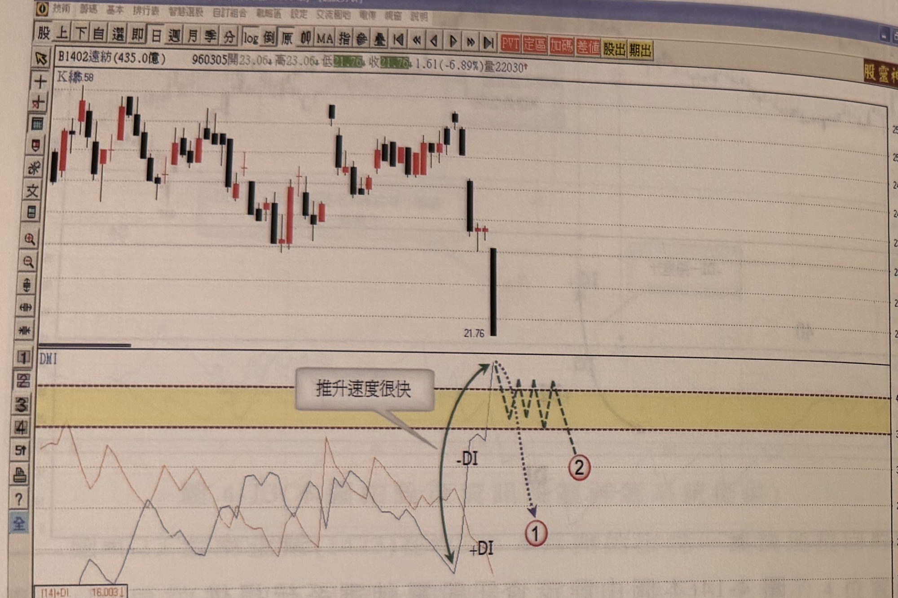
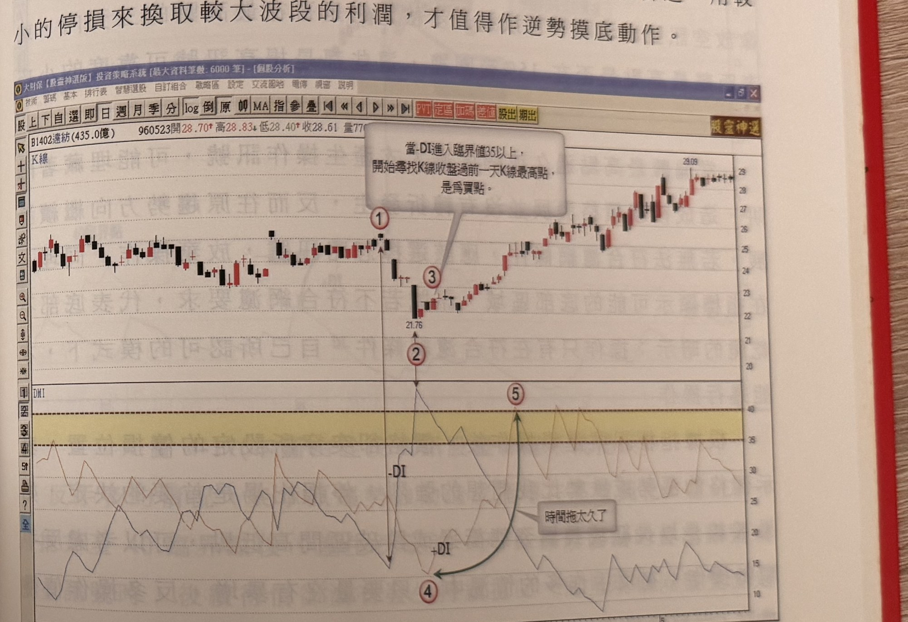

## p.180

通常是存在的，意在建構頭部，多頭欲做抵抗動作，這時在日線上，可以根據 RSI 過 80 彎頭或者 KD 指標反彈後的死亡交叉作為放空點的選擇。

**圖 4-15** (本圖由詮茂資訊股靈神選系統提供)

> 圖說（figure notes）：遠紡(1402) K 線圖，左上角報價列標示「B1402遠紡(435.0億) 960305開23.06↓高23.06↓低21.76↓收21.76↓1.61(-6.89%)量22030」。K 線圖顯示價格於區間橫向震盪後，最終出現一根跌破區間的長黑 K 線，收在 21.76。下方 DMI 圖繪有 -DI（標示於上）與 +DI（標示於下）曲線，黃色帶狀區標示臨界值區域。文字方塊「推升速度很快」以綠色弧線箭頭指向 -DI 快速上揚穿越黃色臨界帶的一段，其後以深綠色虛線箭頭延伸標示假設情境：紅色圓圈數字「①」（-DI 持續上升情境）與「②」（-DI 在臨界帶附近震盪的另一種情境）。

利用 DMI 尋找底部極端點，可以運用-DI 的石筍現象進行觀察，與漲勢找反轉點一樣，但臨界點採取 35 比較低的水準，同樣要求-DI 必須一路推升且速率要快，通常在行情運動過程，未來走勢是無法看到的，因此只能看到石筍形狀的左側，如圖 4-15 示意狀況，當遠紡(1402)日線結構在 96 年 2 月底開始出現價格急速滑落，-DI 值從 20 以下快速竄升越過 35 臨界點，開始觀察價格 K 線收盤突破前一根 K 線最高點的時機位置，在當下只能看到-DI 石筍形狀的左側，指標未來的發展，可能如標示 1 直線拉回，使得-DI 形成標示的石

## p.181

筍形狀，但也可能發展成標示 2 位置在臨界點附近震盪，情發展如標示 1 時，進場後價格會呈現快速上漲而獲利，如果是標示 2 的情況，則有繼續下跌創新低的可能；在尋找價格底部的逆勢操作點，有其風險存在，如果行情正確觸底大反轉，則獲利可觀，但如果進場後跌破固定幅度停損位置(如 7%)或者跌破此波最低點時，務必承認市場低點朝更低發展，趕快認賠出場；換言之，用較小的停損來換取較大波段的利潤，才值得作逆勢摸底動作。

**圖 4-16** (本圖由詮茂資訊股靈神選系統提供)

> 圖說（figure notes）：遠紡(1402) K 線圖，左上角報價列標示「B1402遠紡(435.0億) 960523開28.70↑高28.83↓低28.40↑收28.61 量770...」。圖上方文字方塊：「當-DI進入臨界值35以上，開始尋找K線收盤過前一天K線最高點，是為買點。」K 線圖中，標示紅色圓圈數字「①」於高點（緊接續圖 4-15 左側），價格急跌至標示紅色圓圈數字「②」（價位 21.76），隨後標示紅色圓圈數字「③」於止跌反彈 K 線處，股價持續走高至標示紅色圓圈數字「⑤」（價位 29.09）。下方 DMI 圖標示黃色臨界帶，文字方塊「時間拖太久了」以弧線箭頭指向 -DI／+DI 曲線於臨界帶下方盤整段，-DI 自標示 2 對應位置尖峰後下滑，+DI 隨後於標示 5 對應位置上揚穿越臨界帶。

當底部低點果然在-DI 過臨界點 35 之後產生止跌效應，過一高的買點也出現時，這個買進訊號離底部最低點位置不宜超過 3 天，幅度不宜超出底部最低點 15%的位置，時間或幅度離太久或太遠，可能出現過一高後折回現象，用雙重過濾的動作，可增加訊號的可靠度；圖 4-16 為遠紡(1402)的接續走勢，當價格從標示 1 位置起跌，
