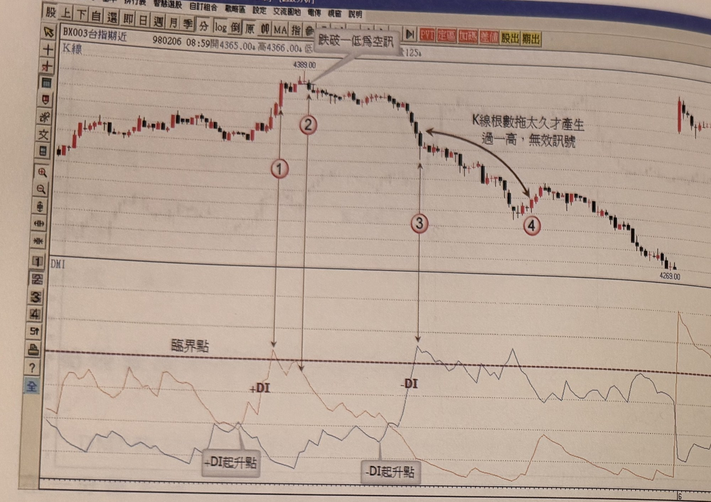
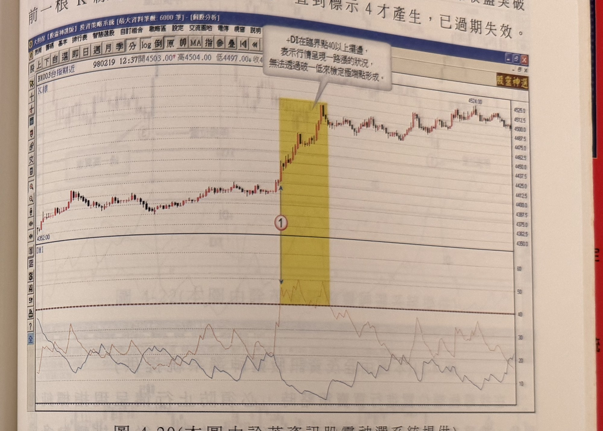

## p.186

**圖 4-19** (本圖由詮茂資訊股靈神選系統提供)

> 圖說（figure notes）：台指期近 1 分鐘 K 線圖，左上角報價列標示「BX003台指期近 980206 08:59開4365.00↓高4366.00↓低...量125」。K 線圖中價格上漲至高點（4389.00），文字方塊「跌破一低為空訊」標示於高點附近，其下標示紅色圓圈數字「①」「②」於高點兩側。價格續跌，文字方塊「K線根數拖太久才產生過一高，無效訊號」以弧線箭頭指向跌勢中一段止跌後的反彈K線，標示紅色圓圈數字「③」於下跌中段、「④」於反彈段末端。下方 DMI 圖標示水平虛線「臨界點」，繪有 +DI（於「+DI起升點」處標示上升起點）與 -DI（於「-DI起升點」處標示上升起點）曲線；+DI 於標示 1、2 對應位置攀升觸及臨界點後回落，-DI 於標示 3 對應位置攀升突破臨界點後於高檔震盪。K 線圖右側股價持續破底下跌，最低觸及 4269.00 附近，末端出現一根跳空長紅 K。

在運用 DMI 石筍現象時，不管+DI 或-DI 都必須呈現一路推升的情況下始適用，它的起升點一定自 25 以下發動，這樣可以確保遇到一路上漲或者一路下跌的趨勢行情，不會陷入一路漲卻一路做空或者一路下跌卻沿路做多；一路漲的行情，指標將呈現在高檔區鈍化現象，例如+DI 一直在 30～50 之間來回擺盪，在這種狀況下，+DI 便不符合從 25 以下向上推升的條件，因此從 25 做為觀察石筍現象所產生的買賣訊號，是非常重要的條件；再者，當指標進入臨界點後，到買賣訊號產生，不宜拖太久，一般最好在 10 根 K 線內完成，而且距離最高點不超過三根為佳。以圖 4-19 為例，98 年 2 月 5 日的一分鐘台指期走勢中，標示 1 位置是+DI 從 25 以下向上一路推升越過臨界點，開始尋找放空訊號，在標示 2 位置出現 K 線收盤跌破前一根 K 線最低點的放空訊號，剛好是最高點的次一根 K 線即產生訊

## p.187

號，符合濾網條件的要求，而在標示 3 位置，價格走跌致使-DI 從 25 以下向上竄升穿越臨界點 40，但卻一直沒出現價格 K 線收盤突破前一根 K 線最高點的買進訊號，直到標示 4 才產生，已過期失效。

**圖 4-20** (本圖由詮茂資訊股靈神選系統提供)

> 圖說（figure notes）：台指期近 1 分鐘 K 線圖，左上角報價列標示「BX003台指期近 980219 12:37開4503.00↑高4504.00 低4497.00↓收...」。左下方標示起點價位 4352.00。圖上方文字方塊：「+DI在臨界點40以上擺盪，表示行情呈現一路漲的狀況，無法透過破一低來檢定極端點形成。」K 線圖中黃色區域標示一段快速上漲區間，標示紅色圓圈數字「①」於黃色區間底部。價格持續上漲，最高觸及 4524.00 附近後於高檔區間震盪。下方 DMI 圖中 +DI 曲線自標示 1 對應位置急速攀升突破臨界線（40）後，持續在臨界線上方 30～60 之間來回擺盪，未明顯回落。

圖 4-20 為台指期一分鐘 K 線走勢圖，在 98 年 2 月 19 日盤中標示 1 位置，+DI 進入臨界點 40 以上，但並沒有快速產生折返 40 以下，形成鈍化現象，判斷行情極可能呈現一路上漲狀況，這種情形將無法透過+DI 抵達臨界點後，破一低的濾盤產生放空訊號，因此在黃色區域尾端雖有破一低發生，但不宜放空；另一種狀況是+DI 突破臨界點 40 後，產生破一低之放空訊號，但後續行情卻沒有呈現大幅拉回，只做橫向整理後，繼續突破新高點，+DI 則呈現在 30 以上來回擺盪，當行情突破新高，觸及放空所設之停損位置時，不僅要立刻出場，同時宜採取反多的動作。
