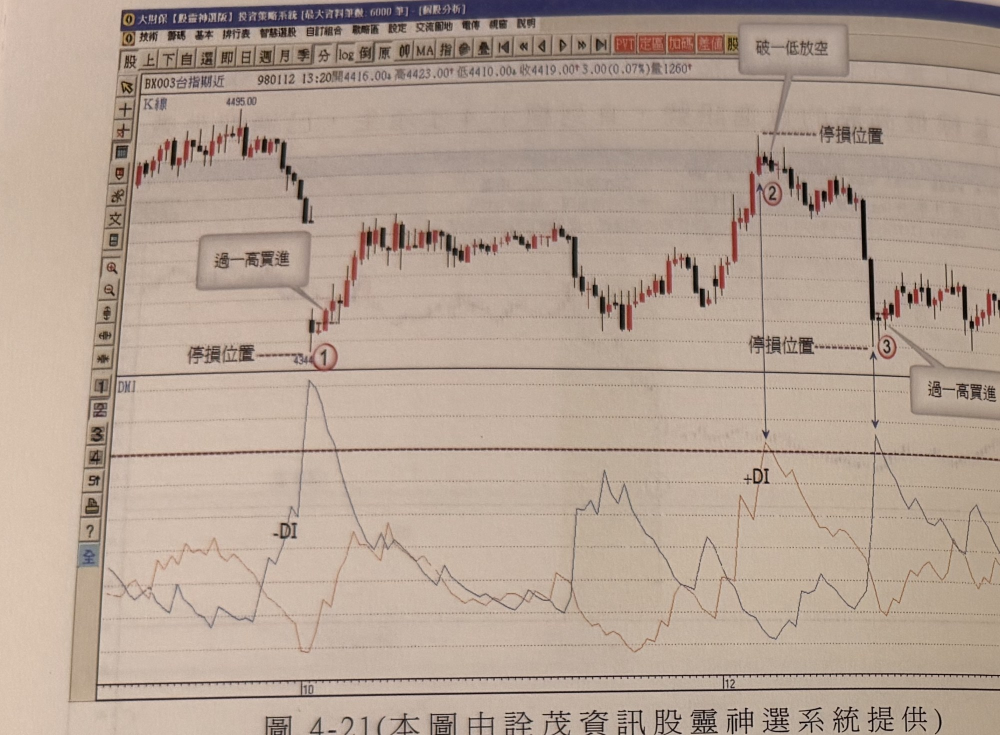
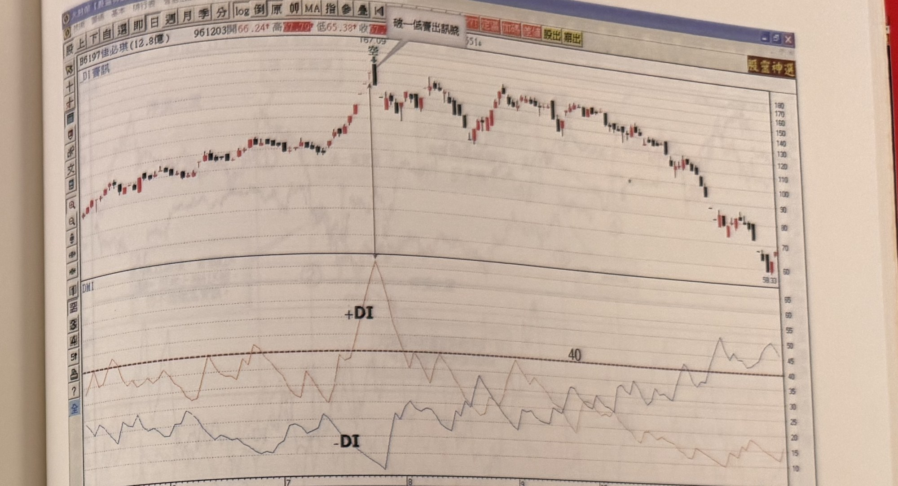
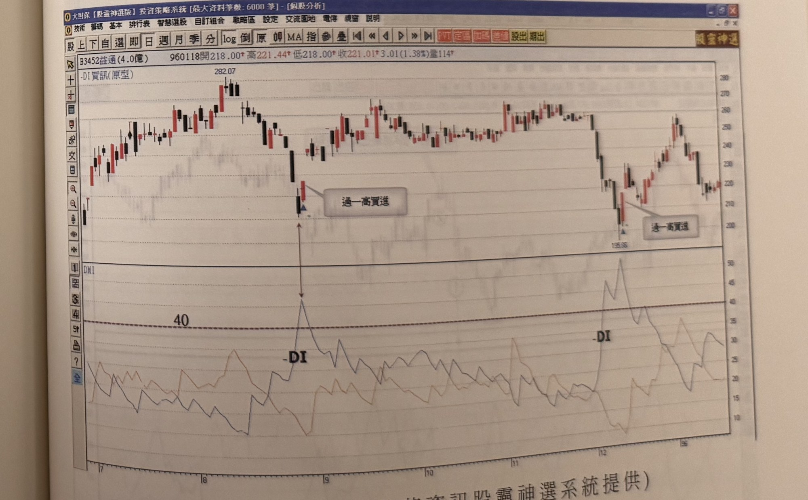

## p.188

**圖 4-21** (本圖由詮茂資訊股靈神選系統提供)

> 圖說（figure notes）：台指期近 5 分鐘 K 線圖，左上角報價列標示「BX003台指期近 980112 13:20開4416.00↓高4423.00↑低4410.00↓收4419.00↑3.00(0.07%)量1260」。K 線圖左側標示高點 4495.00，價格下跌至一低點，文字方塊「過一高買進」標示於止跌反彈 K 線處，其下另以虛線「停損位置」標示於價位 4344，並標示紅色圓圈數字「①」。價格其後上漲至高點，文字方塊「破一低放空」標示於高點右側，虛線「停損位置」標示其上方，並標示紅色圓圈數字「②」。價格續跌至另一低點，文字方塊「過一高買進」與虛線「停損位置」再次標示，並標示紅色圓圈數字「③」。下方 DMI 圖繪有 +DI、-DI 曲線及水平臨界線，-DI 於左側攀升觸及高點對應標示 1，+DI 於中段攀升觸及高點對應標示 2、3。K 線圖右側股價震盪走高。

在找尋極端位置進行買賣策略時，必須防止行情呈現指標鈍化現象，換言之，當突破型態發生，或者均線結構剛從空排轉為多排的初期或多排轉為空排的初期，指標在這些情況下，進入超買超賣區域時，最容易出現鈍化現象，與其在極端位置進行逆勢操作，不如順其勢操作；如果行情呈現橫向震盪，運用 DMI 趨向指標來尋找極端點操作則可行性高，尤其在分時 K 線圖上有其優勢；如圖 4-21 為台指期 5 分鐘 K 線圖，行情呈現震盪格局，則透過 DMI 的石筍現象，可以準確地偵察峰谷位置；因此，面對均線排列一致性的朝上或朝下發展，運用順勢操作為原則，若均線結構排列不一致時，表示行情屬震盪格局，則可使用逆勢尋找極端點操作。

以下各附圖請讀者參考演練。

**圖 4-22** (本圖由詮茂資訊股靈神選系統提供)

> 圖說（figure notes）：佳必琪(6197) K 線圖，左上角報價列標示「B6197佳必琪(12.8億) 961203開66.24↑高77.79↓低65.38↓收...量5316」。K 線圖中價格上漲至高點（167.09），文字方塊「破一低賣出訊號」標示於高點右側。下方 DMI 圖標示 +DI 於高點對應處攀升觸及約 55（超過 40 臨界線）後回落，-DI 則於右側多次上下震盪，圖右緣攀升穿越 40 臨界線。K 線圖右側股價自高點持續下跌，最低觸及 58.33 附近。

## p.189

**圖 4-23** (本圖由詮茂資訊股靈神選系統提供)

> 圖說（figure notes）：益通(3452) K 線圖，左上角報價列標示「B3452益通(4.0億) 960118開218.00↑高221.44↑低218.00↑收221.01↑3.01(1.38%)量114」。標題「-DI買訊(原型)」。K 線圖左側標示高點 282.07，價格下跌至低點，文字方塊「過一高買進」標示於止跌處。下方 DMI 圖中 -DI 於該處攀升觸及約 40 臨界線（雙向箭頭連接 K 線低點與 -DI 峰值），隨後股價反彈上漲後再度回落至另一低點（135.85），同樣標示文字方塊「過一高買進」，對應 -DI 再次攀升觸及臨界線上方（約 50）。K 線圖右側股價自低點反彈震盪走高。
