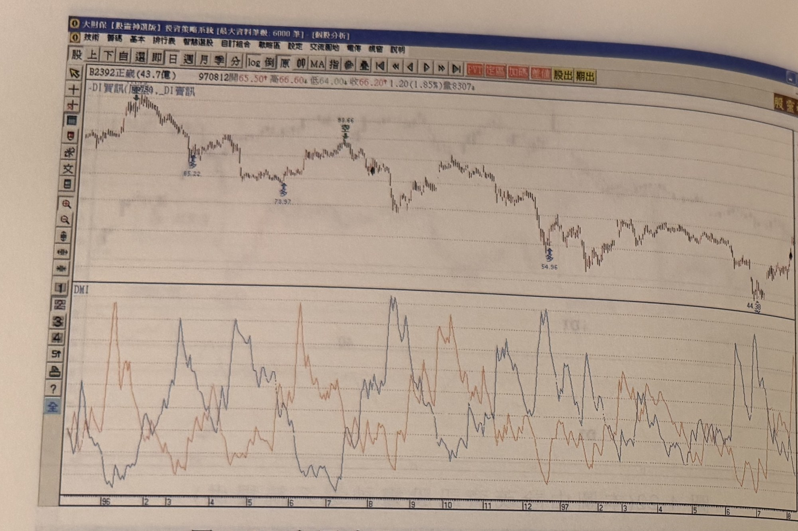
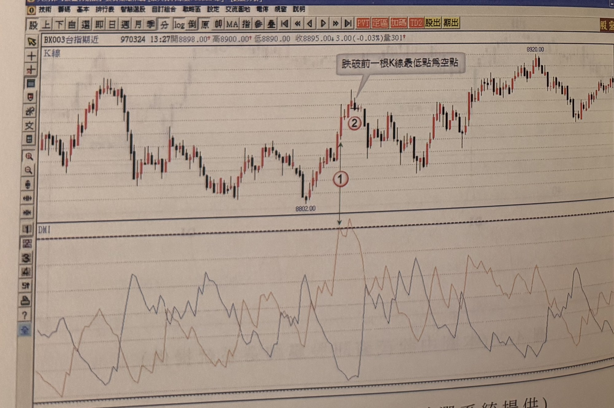
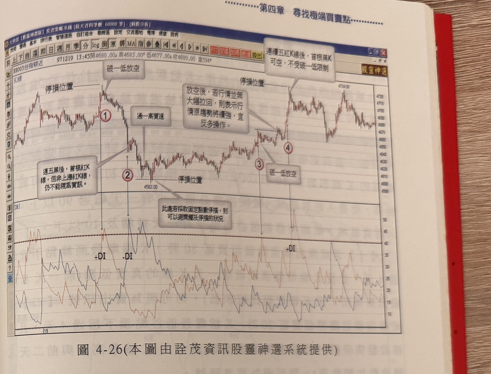

## p.190

**圖 4-24** (本圖由詮茂資訊股靈神選系統提供)

> 圖說（figure notes）：正崴(2392) K 線圖，左上角報價列標示「B2392正崴(43.7億) 970812開65.50↑高66.60↑低64.00↓收66.20↑1.20(1.85%)量8307」，副標「-DI買訊(原型)，-DI賣訊」。K 線圖中價格自高點下跌至一低點（85.22，標示「多」），續跌至更低點（78.97，標示「多」），其後上漲至高點（89.66，標示「空」），再度下跌至低點（54.96，標示「多」）。下方 DMI 圖繪有 +DI、-DI 曲線反覆震盪穿越交叉，未特別標示臨界線數值。K 線圖右側股價自低點（44.39 附近）反彈回升。

**圖 4-25** (本圖由詮茂資訊股靈神選系統提供)

> 圖說（figure notes）：台指期近 K 線圖，左上角報價列標示「BX003台指期近 970324 13:27開8898.00↑高8900.00↑低8890.00 收8895.00↓3.00(-0.03%)量301」。K 線圖左側標示低點 8802.00，標示紅色圓圈數字「①」，價格上漲至標示紅色圓圈數字「②」，文字方塊「跌破前一根K線最低點為空點」標示於其上方。下方 DMI 圖中曲線於標示 1 對應位置攀升觸及臨界線附近後回落。K 線圖右側股價持續上漲，最高觸及 8920.00 附近後於高檔區間震盪。

## p.191

**圖 4-26** (本圖由詮茂資訊股靈神選系統提供)

> 圖說（figure notes）：台指期近 K 線圖，左上角報價列標示「BX003台指期近 971219 13:45開4680.00↓高4683.00↑低4677.00↓收4680.00 量594」。K 線圖中，價格於高檔標示「停損位置」水平線，文字方塊「破一低放空」標示於高點右側下跌處，標示紅色圓圈數字「①」。價格續跌，文字方塊「連五黑後，首根紅K線，但非上漲紅K線，仍不能視為買訊。」以箭頭指向該處，續跌至標示紅色圓圈數字「②」（價位 4582.00），下方另標示「停損位置」與文字方塊「此處若採取固定點數停損，則可以避開觸及停損的狀況」。價格其後反彈上漲，文字方塊「過一高買進」標示。價格續漲後回落至標示紅色圓圈數字「③」，文字方塊「破一低放空」標示；再漲至標示紅色圓圈數字「④」（價位 4724.00），上方文字方塊「連續五紅K線後，首根黑K可空，不受破一低限制」，並以「停損位置」水平線標示，另有文字方塊「放空後，若行情並無大幅拉回，則表示行情原趨勢將續強，宜反多操作。」。下方 DMI 圖繪有 +DI（標示於標示 1、4 對應處）與 -DI（標示於標示 2 對應處）曲線，各自於對應位置攀升觸及約 40～50 附近的高點。K 線圖右側股價於高檔區間紅黑 K 交替震盪。
