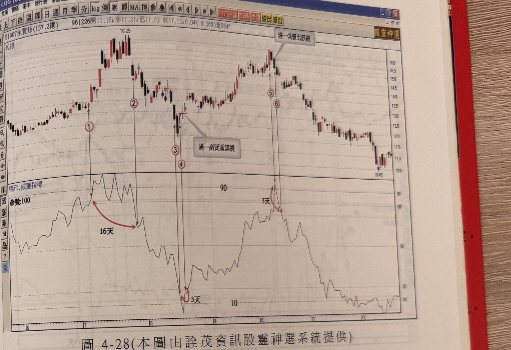

## p.194

指標值離開超買區停止計數，從進入到離開超買區，共計 6 天時間，在標示 2 位置的 K 線收盤跌破前一天 K 線真實低點，距離最高點位置只有 1 天，符合極端位置轉折的濾網條件，可以認定為賣出放空訊號；另一個極端位置則出現在 8 月底，標示 3 位置代表威廉指標值進入超買區的第一根 K 線，這次漲勢速度非常明快，同樣地，從進入超買區即進行停留時間的計數動作，直到標示 4 位置威廉指標值跌破超買區 80 分界點，停留期間曾觸及 100，而停留超買區也是 6 天時間；當 K 線收盤跌破前一天 K 線最低點，再檢視它距離最高點相距 2 天，未超過 4 天的時效限制，可以標示 4 位置做為賣出放空的訊號；當這種極端點訊號產生並進場操作後，以訊號發生前的波峰上方一檔為停損位置，亦可以固定 7%停損或使用者可承受範圍，停利方式可採用階段出場方式，或者採取 K 線慣性操作法介紹的跌破多少期間 K 線最低點做為停利出場。

威廉指標到達超買區，相對於價格表現應該呈現衝刺推高的狀態，才能透過買盤過熱失控的現象來檢定極端位置發生；威廉指標係以收盤位在參數期間高低點縱深的多少比值來表現行情的冷熱，例如威廉值 90 表示收盤價格在參數期間高低點縱深的百分之九十的位置，即接近區間最高點只有 10%的距離；某些狀況，價格橫向盤盤，威廉指標值卻也進入超買區域，那表示參數區間的最高點快速下移，造成目前的價格並無向上竄升，但價格在區間內的比值卻拉高，在這種情形下所產生的極端位置是假象，其所形成的放空訊號也不能採用，必須分辨清楚。

## p.195

**圖 4-28** (本圖由詮茂資訊股靈神選系統提供)

> 圖說（figure notes）：永豐餘(1907) K 線圖，左上角報價列標示「B1907永豐餘(157.2億) 961226開11.16↓高11.21↓低11.02 收11.12↓0.04(-0.36%)量684」。K 線圖中價格上漲至高點（16.25），標示紅色圓圈數字「①」，續跌至標示「②」，紅色弧線箭頭標示「16天」連接兩點。價格再跌至底部，標示紅色圓圈數字「③」「④」，紅色弧線箭頭標示「3天」，文字方塊「過一高買進訊號」標示於止跌反彈處。價格其後上漲至另一高點，標示紅色圓圈數字「⑤」「⑥」，文字方塊「破一低賣出訊號」標示於高點右側，紅色弧線箭頭標示「3天」。下方為「標示,威廉指標」圖，參數：100，標示水平參考線「90」「10」，指標曲線於各標示點對應處觸及高檔或低檔後轉折。K 線圖右側股價持續下跌，最低觸及 10.45 附近。

從進入超買區或超賣區域到離開區域的時間限制，是檢定價格進入超買熱度或超賣過冷的狀況是短時間效應，還是趨勢進行一路推升或一路走跌，造成指標鈍化呢？一般而言，進入超買超賣區域超過 10 天仍然未離開區域，走勢沿著趨勢發展的熱度就非一時的衝動，切勿執著於逆勢操作，宜順勢操作；在發掘可靠的操作訊號過程，重視可靠度的高低，但不代表絕對權威的模型，自然會有漏網之魚；例如在圖 4-28 永豐餘(1907)在 96 年 7 月，行情開始向上快速推升，威廉指標值在標示 1 位置進入超買區域，但離開區域時，經過 16 天就超過時效的限制，標示 2 的訊號在事後來檢視，它的確是不錯的放空訊號，但選擇剔除，原因在於這是少數例子的狀況，而非常態可信賴的訊號。標示 4 出現了急速下探超賣區域，威廉指標值觸及 10 以下，隨後即快速脫離超賣區，前後三天完成，距離最低
