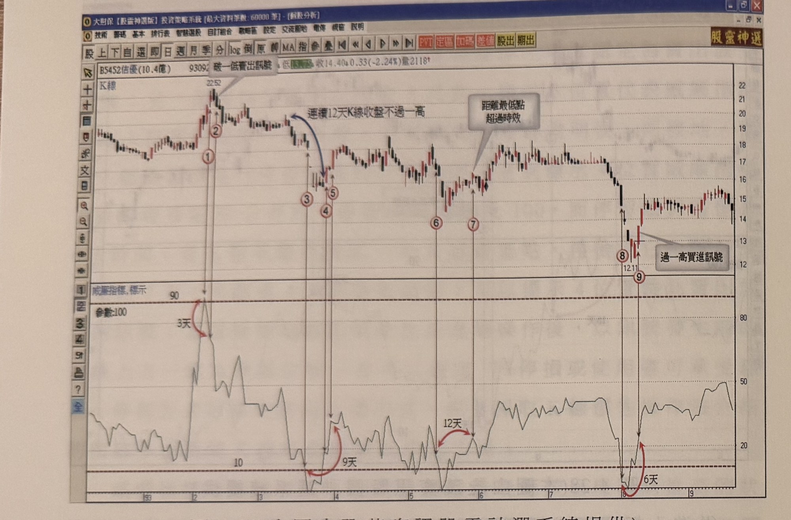
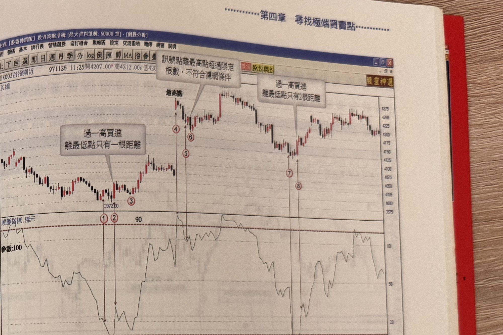

## p.196

點 2 天，皆符合濾網條件的要求，形成可靠度高的買進訊號。

**圖 4-29** (本圖由詮茂資訊股靈神選系統提供)

> 圖說（figure notes）：佶優(5452) K 線圖，左上角報價列標示「B5452佶優(10.4億) 93092...低13.79 收14.40↓0.33(-2.24%)量2118」，文字方塊「破一低賣出訊號」標示於高點（22.52）處，標示紅色圓圈數字「①」「②」。價格下跌，文字方塊「連續12天K線收盤不過一高」以藍色弧線箭頭指向下跌段，標示紅色圓圈數字「③」「④」「⑤」。價格橫向整理後再跌，標示紅色圓圈數字「⑥」「⑦」，文字方塊「距離最低點超過時效」標示。價格續跌至底部（12.11），標示紅色圓圈數字「⑧」「⑨」，文字方塊「過一高買進訊號」標示於止跌反彈處。下方為「威廉指標,標示」圖，參數：100，標示水平參考線「90」「10」，各標示點對應處以紅色弧線箭頭標示天數：「3天」「9天」「12天」「6天」。K 線圖右側股價自底部反彈後於區間震盪走高。

在圖 4-29 佶優(5452)在 93 年 2 月初威廉指標值進入超買區域到達 90 以上，如標示 1 位置，過了 3 天離開超買區域，K 線收盤跌破前一天最低點，距離波峰只有 1 天時間，符合極端點賣出的濾網要求，如標示 2 位置所示。在前文提過在未離開超買超賣區域前出現訊號提前的條件，在於有無出現 K 線慣性被破壞，如標示 3 位置威廉指標進入超賣區域，到了標示 5 離開超賣區，其間歷時 9 天，但脫離超賣區之前在標示 4 位置已出現突破一高的提前買訊，訊號出現之前呈現連續 12 天 K 線不過一高的慣性，因此在標示 4 位置首度突破一高，視為可接受的提前買點，如果前置行情沒有 K 線連續慣性，就不宜運用提前買訊。而標示 5 位置不為買進訊號，在於距離最低谷點超過 4 天時效限制。

## p.197

**圖 4-30** (本圖由詮茂資訊股靈神選系統提供)

> 圖說（figure notes）：台指期近 K 線圖，左上角報價列標示「BX003台指期近 971126 11:25開4207.00↑高4212.00↓低420...」。K 線圖左側標示低點（397200），文字方塊「過一高買進，離最低點只有一根距離」標示，標示紅色圓圈數字「③」。價格上漲至標示「最高點」，文字方塊「訊號點離最高點超過限定根數，不符合濾網條件」標示，標示紅色圓圈數字「④」「⑥」「⑤」（依序排列）。價格回檔後再上漲，文字方塊「過一高買進，離最低點只有2根距離」標示，標示紅色圓圈數字「⑦」「⑧」。下方為「威廉指標,標示」圖，參數：100，標示水平參考線「90」，指標曲線於各標示點對應處觸及高低檔。K 線圖右側股價於高檔區間紅黑 K 交替震盪。

而透過威廉指標尋找極端買賣點，使用在台指期分時圖的操作上，威廉指標的參數可調為 100 或 50 均可，以圖 30 台指期 5 分鐘 K 線圖為例，在 97 年 11 月 24 日標示 1 位置威廉指標值進入超賣區域，透過停留在超賣區域的 K 線數來檢定極端位置的可靠度，在標示 2 位置威廉指標值向上突破 20，K 線收盤同時也突破前一根 K 線最高點，距離最低谷點只有 1 根K線，進入到離開超賣區共費 5 根 K 線，停留期間威廉指標值曾觸及 10 以下，皆符合濾網條件，即可在標示 2 進場操作多單，並以最低谷點下方 1～3 檔做為停損位置，或者以固定點數停損；標示 3 位置威廉值未觸及 10 以下，因此不須進行觀察，11 月 25 日開盤跳高開出，標示 4 位置威廉指標值進入超買區域，並且在標示 5 離開超賣區，但 K 線收盤沒有出現跌破前一根 K線最低點，直到標示 6 位置 K 線收盤破一低，但距離最高峰點已超
