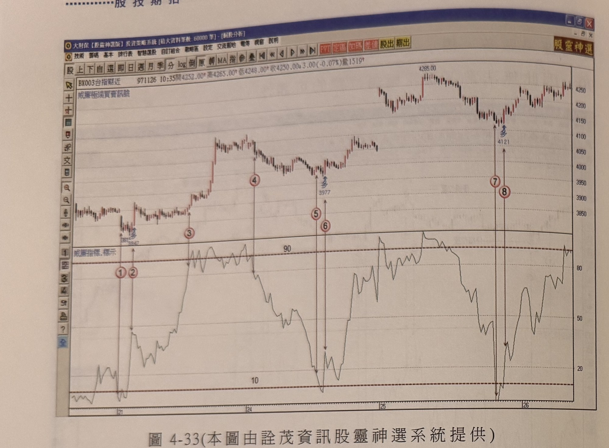
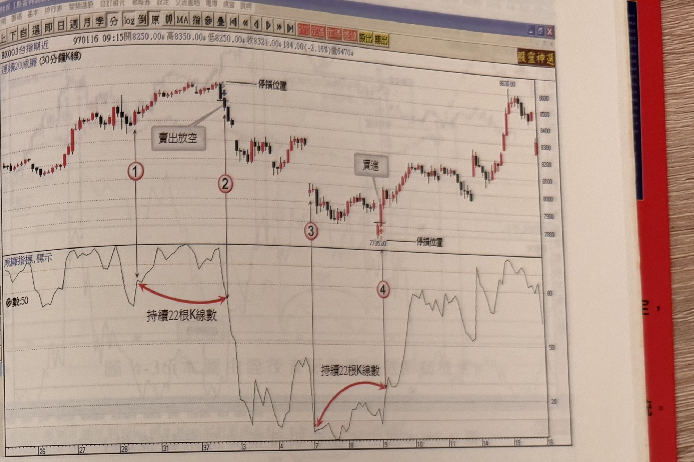

## p.200

線以上之走勢圖中。

**圖 4-33** (本圖由詮茂資訊股靈神選系統提供)

> 圖說（figure notes）：台指期近 K 線圖，左上角報價列標示「BX003台指期近 971126 10:35開4252.00↑高4265.00↑低4248.00↑收4250.00↓3.00(-0.07%)量1519」，標題「威廉極端買賣訊號」。K 線圖左側標示低點（3812/3847附近，標示「多」），標示紅色圓圈數字「①」「②」。價格上漲至高點，標示紅色圓圈數字「③」，續漲至更高點（4285.00），標示紅色圓圈數字「④」，回落至低點（3977，標示「多」），標示紅色圓圈數字「⑤」「⑥」。價格再漲後回落至低點（4121，標示「多」），標示紅色圓圈數字「⑦」「⑧」。下方為「威廉指標,標示」圖，標示水平參考線「90」「10」，指標值於標示 3～4 區間持續處於 80 以上震盪。K 線圖右側股價自低點反彈震盪走高，收在 4250 附近。

在圖 4-33 的台指期五分鐘走勢圖中，在標示 3 位置威廉指標值進入超買區域，行情不斷地推升，造成威廉指標值呈現在 80 以上震盪，在標示 4 位置以前，威廉指標值不曾跌破 80 的情形，期間超過 30 根 K 線以上，在標示 4 位置所呈現脫離超買區後的走勢，似乎表達另一種威廉指標值慣性改變亦可形成操作訊號；的確，如果威廉指標在超買超賣停留的期間不斷地延長，表示行情呈現直漲直落的趨勢行情正在進行中，那麼當威廉指標值首度脫離超買超賣區域時，應可從中發掘價格反向發展的徵兆；因此，當威廉指標值在超買超賣區域停留超過 20 根 K 線數以上，其間沒有任何一次威廉指標值離開區域，當它首度離開超買超賣區域時，K 線收盤符合突破一高或跌破一低，同時訊號位置離最高峰點或最低谷點，不超過 4 根 K 線數，可以當作操作訊號，但這種做法只適合運用在 30 分鐘 K

## p.201

**圖 4-34** (本圖由詮茂資訊股靈神選系統提供)

> 圖說（figure notes）：台指期近 30 分鐘 K 線圖，左上角報價列標示「BX003台指期近 970116 09:15開8250.00↓高8350.00↑低8250.00↓收8321.00↓184.00(-2.16%)量6470」，標題「連續20威廉(30分鐘K線)」。K 線圖中價格上漲至高點，文字方塊「賣出放空」標示並以虛線「停損位置」標示，標示紅色圓圈數字「①」「②」，紅色弧線箭頭標示「持續22根K線數」。價格下跌至低點（7735.00，虛線「停損位置」標示），標示紅色圓圈數字「③」「④」，文字方塊「買進」標示，紅色弧線箭頭標示「持續22根K線數」。下方為「威廉指標,標示」圖，參數：50。K 線圖右側股價自低點反彈持續上漲，最高觸及 8635.00 附近。

如圖 4-34 為台指期 30 分鐘 K 線圖，在 96 年 12 月 28 日標示 1 位置，威廉指標值再次進入超買區域，並在標示 2 位置離開超買區，其間停留超買區共計 22 根 K 線數，因此當指標值向下跌破 80 時，K 線收盤跌破一低，訊號點距離峰點 2 根 K 線數，皆符合濾網要求，可視為賣出放空訊號，進場後以最近波峰上方 1～3 點做為停損位置，或者固定點數停損。而在 97 年 1 月 7 日開盤跳低開出，促使威廉指標值下探至超賣區域，由此開始計數停留的 K 線數，當標示 4 位置威廉指標值向上脫離超賣區時，共歷時 22 根 K 線，換言之，在超賣區域共持續了 21 根 K 線，標示 4 位置 K 線收盤突破前一天最高點，距離最低谷點只 1 根 K 線數，皆符合濾網要求，可以進場買進，並以谷點下方為停損位置。
