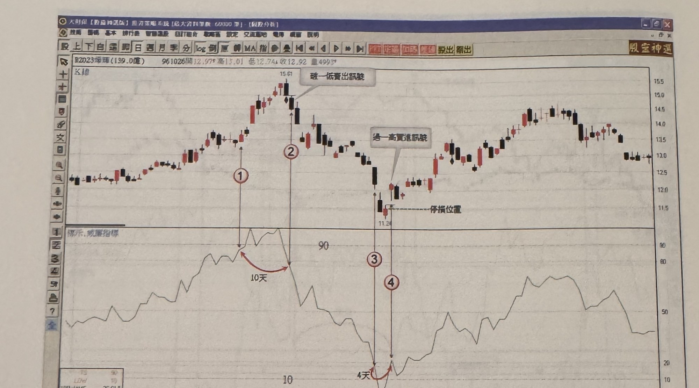
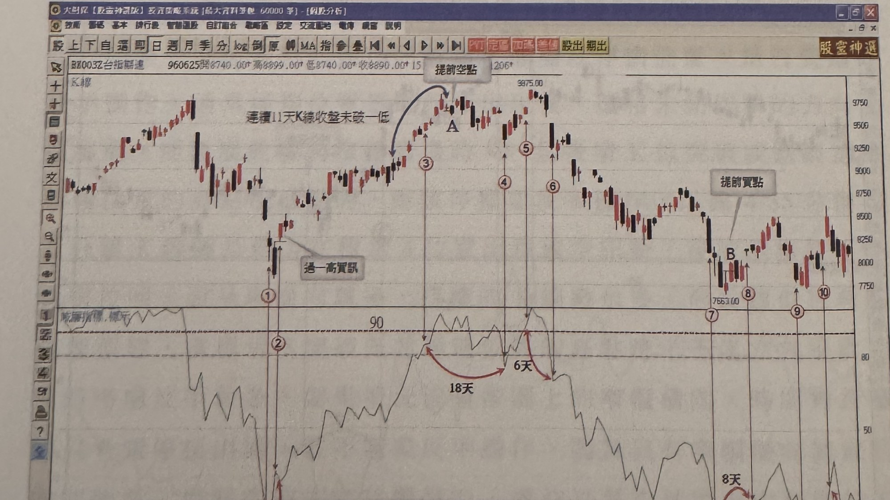

## p.204

**圖 4-38** (本圖由詮茂資訊股靈神選系統提供)

> 圖說（figure notes）：帆磁(2023) K 線圖，左上角報價列標示「B2023帆磁(139.0億) 961026開12.97↑高13.01 低12.74↓收12.92 量499」。K 線圖中價格上漲至高點（15.61），文字方塊「破一低賣出訊號」標示，標示紅色圓圈數字「①」「②」。價格下跌至低點（11.24），虛線「停損位置」標示，文字方塊「過一高買進訊號」標示於止跌反彈處，標示紅色圓圈數字「③」「④」。下方為「標示,威廉指標」圖，標示水平參考線「90」「10」，於標示 1、2 對應處以紅色弧線箭頭標示「10天」，於標示 3、4 對應處標示「4天」。K 線圖右側股價自低點反彈持續上漲，最高觸及約 14.5 附近後於高檔震盪。

**圖 4-39** (本圖由詮茂資訊股靈神選系統提供)

> 圖說（figure notes）：台指期近 K 線圖，左上角報價列標示「BX003台指期近 960625開8740.00↑高8899.00↑低8740.00↑收8890.00↑15...(2.06)量」。文字方塊「連續11天K線收盤未破一低」以箭頭指向一段上升段，標示紅色圓圈數字「①」「②」，文字方塊「過一高買訊」標示。價格續漲至高點「A」，文字方塊「提前空點」以弧線箭頭指向該處，標示紅色圓圈數字「③」。價格回落後再漲至更高點（3875.00），標示紅色圓圈數字「④」「⑤」「⑥」。價格持續下跌至低點（7663.00附近），標示紅色圓圈數字「⑦」「⑧」，文字方塊「提前買點」標示於反彈低點「B」處，標示紅色圓圈數字「⑨」「⑩」。下方為「威廉指標,標示」圖，標示水平參考線「90」，各標示點對應處以紅色弧線箭頭標示天數：「18天」「6天」「8天」「6天」。K 線圖右側股價於低檔區間紅黑 K 交替震盪。

（本頁右緣可見下一頁 p.205 的邊緣，標題以「後」字開頭（後記），屬相鄰頁面露出，非本頁內容，未予轉錄。）
