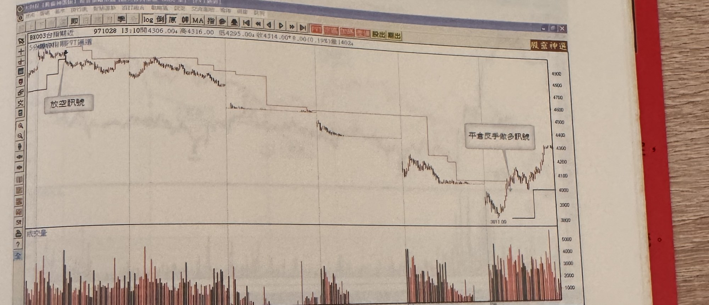
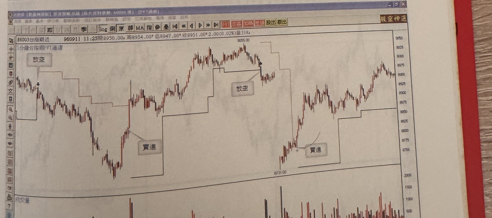

## p.209

> 頁碼依前後頁推定（頁碼字樣過於淡薄無法辨識，依前後頁連續性推定為 209）。

# 附錄：

介紹本人設計之程式指標，均須透過程式編寫，無法在一般市場簡易股票軟體呈現，故不予詳細解析：

**台指期五分鐘 PVT 通道操作系統**，透過波峰波谷定位，形成漲勢跌勢慣性模型，自動產生操作訊號。

> 圖說（figure notes）：（無圖號）台指期近 5 分鐘 K 線圖，左上角報價列標示「BX003台指期近 971028 13:10開4306.00↑高4316.00 低4295.00↓收4314.00↑8.00(0.19%)量1402」，標題「5分鐘台指期PVT通道」。K 線圖上疊加一條階梯狀通道線（PVT 通道），文字方塊「放空訊號」標示於左側高點附近通道線轉折處。價格沿階梯狀通道逐段下移，途中多次跌破通道線。至圖右側低點（3011.00附近）止跌，文字方塊「平倉反手做多訊號」以箭頭指向該處反彈段，通道線隨之轉為上升階梯。下方為成交量柱狀圖，紅黑柱交錯，右側量能明顯放大。K 線圖右側股價反彈上漲，突破通道線上緣。

> 圖說（figure notes）：（無圖號）台指期近 5 分鐘 K 線圖，左上角報價列標示「BX003台指期近 960911 11:25開8950.00↓高8954.00↑低8947.00↓收8951.00↑2.00(0.02%)量318」，標題「5分鐘台指期PVT通道」。K 線圖上疊加階梯狀 PVT 通道線，文字方塊「放空」標示於左側高點通道轉折處，價格下跌至低點，文字方塊「買進」標示於止跌反彈通道轉折處，價格上漲至高點（9055.00），文字方塊「放空」再次標示於此高點通道轉折處，價格回落至低點（8731.00），文字方塊「買進」再次標示於止跌反彈通道轉折處。下方為成交量柱狀圖，紅黑柱交錯。K 線圖右側股價自低點反彈持續走高。
