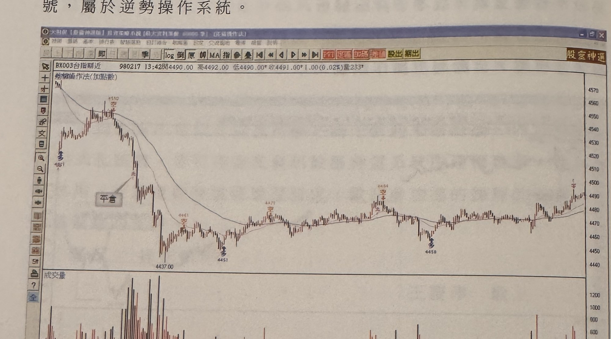
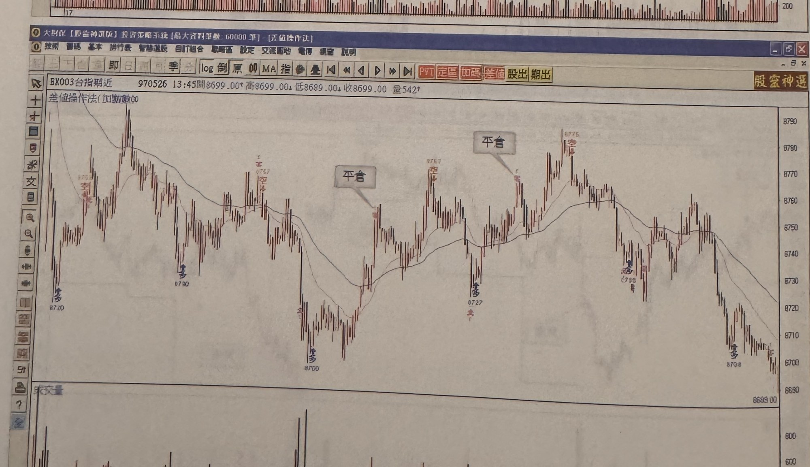

## p.210

**台指期一分鐘差值操作法**：市場走勢 80%屬於震盪格局，因此運用 DMI 趨向指標石筍現象偵測當天走勢的各波極端位置，提供操作訊號，屬於逆勢操作系統。

> 圖說（figure notes）：（無圖號）台指期近 K 線圖，左上角報價列標示「BX003台指期近 980217 13:42開4490.00 高4492.00 低4490.00↓收4491.00↑1.00(0.02%)量233」，標題「差值操作法(加點數)」。K 線圖疊加一條均線。價格自左側高點下跌，標示「多」（4551附近），續漲至高點（4550，標示「空」），文字方塊「平倉」以箭頭指向下跌段一點；價格跌至低點（4437.00），標示「空」（4061附近）、「多」（4451附近）；其後於中段區間小幅震盪，分別標示「空」（4471、4494附近）及「多」（4458附近）；圖右側價格急漲至高點，標示「空」。下方為成交量柱狀圖，紅黑柱交錯。K 線圖右側股價收在 4491 附近。

> 圖說（figure notes）：（無圖號）台指期近 K 線圖，左上角報價列標示「BX003台指期近 970526 13:45開8699.00↑高8699.00↓低8699.00↓收8699.00 量542」，標題「差值操作法(加點數)」。K 線圖疊加均線，價格自左側標示「空」（8757附近）「多」（8720），續漲標示「空」（8757附近），文字方塊「平倉」標示於其後一段回檔低點（8700，標示「空」「多」），續漲標示「空」（8767附近），文字方塊「平倉」再次標示於一小段回檔（8727附近，標示「多」），其後再漲，中段標示「多」（8758附近），續漲至高點（8775，標示「空」）。下方為成交量柱狀圖，紅黑柱交錯。K 線圖右側股價自高點回落持續下跌，收在 8699 附近（8708附近，標示「多」）。
