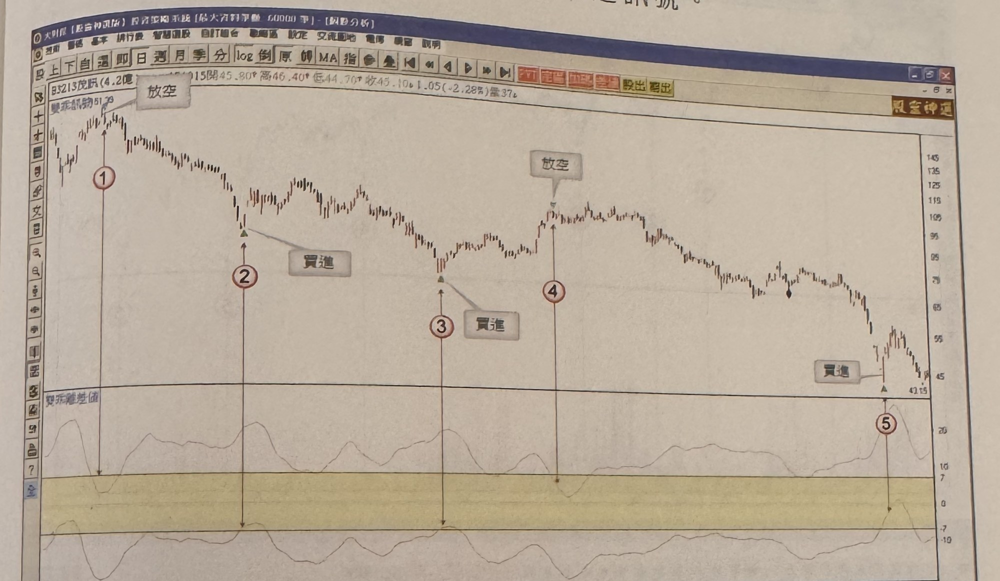
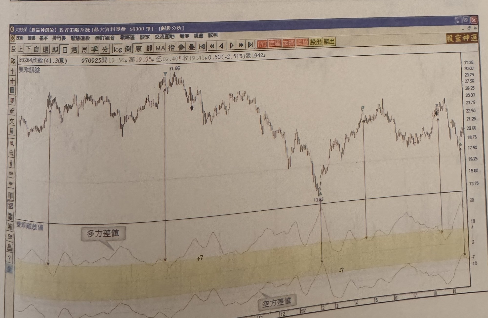

## p.211

**雙乖離差值指標及買賣訊號**：運用兩條均線軌道的乖離值，區分為多方差值及空差值，當多方差值低於+7 顯示價格進入高檔區，可以透過跌破濾網產生放空訊號，而當空方差值回升至-7 之上，顯示價格進入低檔區，若符合突破濾網，產生買進訊號。

> 圖說（figure notes）：（無圖號）茂訊(3213) K 線圖，左上角報價列標示「B3213茂訊(4.2億) ...915開45.80↑高46.40↓低44.70↓收45.10↓1.05(-2.28%)量37」，標題「雙乖訊號51.29」。K 線圖中，標示紅色圓圈數字「①」於高點，文字方塊「放空」標示。價格下跌，標示紅色圓圈數字「②」，文字方塊「買進」標示於止跌反彈處；續跌，標示紅色圓圈數字「③」，文字方塊「買進」再次標示；價格反彈後再跌，標示紅色圓圈數字「④」，文字方塊「放空」標示於反彈高點。下方為「雙乖離差值」指標圖，以黃色帶狀區標示 -7～+7 濾網區間，各標示點對應處指標觸及或穿越帶狀區邊界。價格持續下跌至末端低點（43.15附近），文字方塊「買進」標示，標示紅色圓圈數字「⑤」。K 線圖右側股價低檔震盪。

> 圖說（figure notes）：（無圖號）欣銓(3264) K 線圖，左上角報價列標示「B3264欣銓(41.3億) 970925開19.50↑高19.95↑低19.40↓收19.40↓0.50(-2.51%)量1942」，標題「雙乖訊號」。K 線圖中價格於左側高點（31.86）後下跌，中段回落至低點（13.[?]0附近），其後反彈震盪走高。下方為「雙乖離差值」指標圖，標示文字「多方差值」與「空方差值」分別標示上、下兩條差值曲線，以黃色帶狀區標示 -7～+7 濾網區間，並標示水平參考線「+7」「-7」。多條箭頭連接 K 線圖高低點與下方指標對應的濾網穿越位置。K 線圖右側股價自高點回落後低檔震盪。
