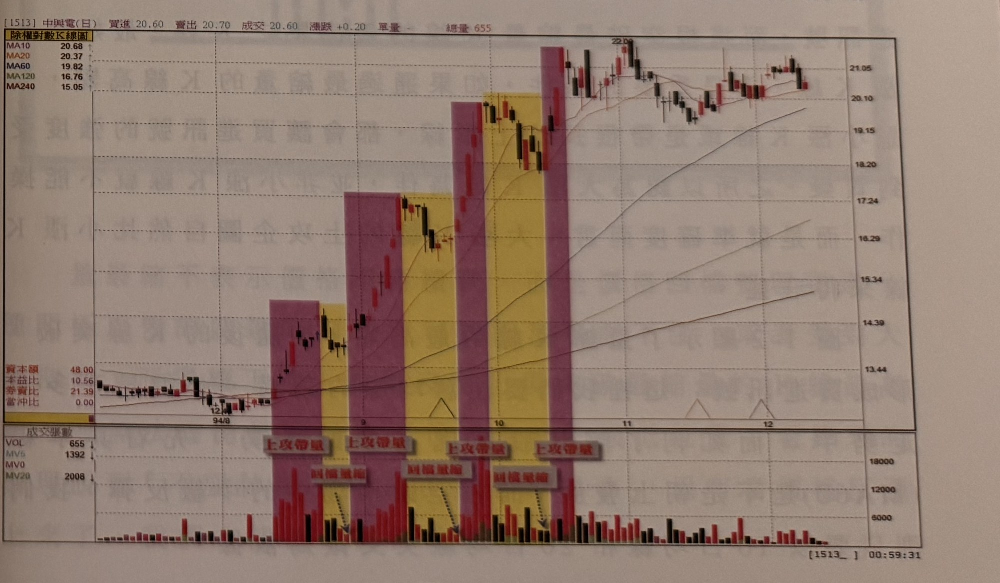

## p.[null]

[空白頁；僅背面透印之目錄文字鏡像，非本頁內容，未轉錄]

## p.1

# 第一章　量的買賣進行曲

成交量的分析一直是存在著爭議，是量先價行呢？還是價先行量再跟上？還是量價同時到頂，各有支持的論調，這裡我們不去作學理的探討，只純粹用量來找可靠的買賣訊號。成交量就宛如股價的動力來源；股價若開始上漲，量群通常會隨著價格的推升，一步步的放大，表示市場籌碼熱絡換手；而波段回檔整理時，量能也隨著價格的回跌而逐步縮小，量的縮小，在均線都朝上發展時，我們視為籌碼安定；而當價格止穩之後，開始整軍再漲時，市場另一批買盤又進場推升，這是價量的良性互動，請參考圖 1-1 的價量上升模式；量溫和放大不會令人不安，但任何拉抬到最後，總是要獲利出場，大量資金投入的主力，為了要迅速調節，必定是用滾大量方式來掩飾出貨；但是，大量一定是危險的出貨訊號嗎？

**圖 1-1**

> 圖說（figure notes）: 一張中興電（代號1513）日線K線圖（頁首標示「[1513] 中興電(日) 買進20.60 賣出20.70 成交20.60 漲跌+0.20 單量- 總量655」），左上角標示「除權指數K線圖」，其下均線圖例：MA10 20.68（黑）、MA20 20.37（紅）、MA60 19.82（黃）、MA120 16.76（綠）、MA240 15.05（藍）。走勢圖時間軸標示「94/8」「9」「10」「11」「12」。圖中以紫紅色與黃色矩形色塊交替標出四段「上攻帶量」（紫紅色塊，標示於各段上漲K線區間上方）與其後的「回檔量縮」（黃色塊，標示於各段拉回整理區間，並附黑色虛線箭頭指向量縮處），顯示股價每次上攻時成交量放大、拉回時成交量縮小的價量良性互動模式；股價自94年8月起穩步墊高，至94/12前後大幅上攻觸及高點22.09，其後於20~21元區間高檔震盪。下方成交張數面板列出VOL 655、MV5 1392、MV0、MV20 2008，量柱走勢對應呈現「放量上攻、縮量拉回」反覆出現的型態。此圖對應本文說明：量隨價漲逐步放大，回檔時量能同步縮小，屬價量良性互動，量溫和放大不致令人不安。
