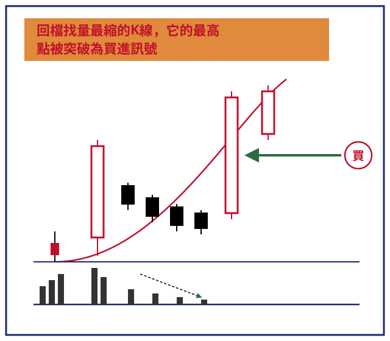

## p.2

什麼是拉回找買點呢？

當股價拉升至某一個滿足價位後，主力便開始作籌碼的調節，但是他的用意只不過讓價格冷卻一下，讓籌碼重新再換手一次，也可能是測試市場籌碼的穩定度；當他放任股價自由漂浮時，看看價格會不會被追殺，如果狀況顯示量縮得很快，殺出意願很低，那麼主力就能重新將價格推升到更高的水準。既然如此，在價格回檔的時候，我們如何掌握股價重新啟航北行呢？

我們可以在行情回檔過程中，找出量最縮的 K 線，而量最縮是一種每天比對的動作，即當今天的成交量比昨日的成交量小，那麼今天就是縮量，若明天的成交量比今天更小，那麼明天就是更縮量，如此一天接一天的觀察，當量最縮的 K 線的最高點，被後來的 K 線收盤價突破站上，視為一個買進訊號，而這根突破最縮量 K 線的最高點之 K 棒，最好是大漲 K 線，這是重要的條件，如果通過最縮量的 K 線高點，只是小漲 K 線或是帶很長的上影線，都會讓買進訊號的強度受到質疑。之所以認為大漲 K 線為佳，並非小漲 K 線就不能操作，而是就準確度而言，大漲 K 線的上攻企圖自然比小漲 K 線來得旺盛。

圖 1-2 顯示了量縮 K 線的最高點，被隨後的 K 線突破，形成買進訊號；這裡我們要注意均線的架構，必須是在多頭走勢中，而如何了解其股價處在多頭走勢，先看其季線 (MA60) 是不是朝上發展，而在空頭市場中的中級反彈，我們則只要以 10 日均線和 20 日均線交叉做為依據。

## p.3

**圖 1-2**

> 圖說（figure notes）: 示意圖（概念圖，已重繪為 SVG，原圖見 操作進行曲-fig-1-2.orig.jpg）。頂端橘底紫黑字橫幅標題：「回檔找量最縮的K線，它的最高點被突破為買進訊號」。下方為理想化 K 線示意：左側先有數根小紅K線，接著一根較高紅K線，隨後出現一串逐漸縮小的黑K線（由左至右實體依序縮短，代表回檔量縮、K棒愈縮愈小），至最低一根黑K線後，出現一根帶下影線的紅K線（其最高點即「量最縮K線的最高點」被突破處），有綠色箭頭由右側指向這根紅K線，箭頭起點處以深藍圓圈標示紅字「買」，表示此為買進訊號位置。一條紅色曲線由左下方緩升至右上方，貼著各K棒下緣呈托浮上揚之勢，代表價格墊高的支撐曲線。圖下方另有一組深藍色直條（示意成交量柱），量柱高度由左至右先高後逐漸縮短、中段最低，其上有黑色點狀向下箭頭標示「量縮至最低點」，底部以深藍色橫線做為量能軸線。整體對應本文說明：找出回檔過程中量最縮的K線，其最高點被後續K線（尤以大漲K線為佳）收盤突破時，即為買進訊號。

量最縮不表示價格不再續跌，而是價格回檔整理到達一種悶極思變的關鍵時刻，它可能因消息面不佳，或者受到大盤拖累，而繼續下跌，如果沒有出現突破最縮量的 K 線最高點，並無法確認最縮量是否代表價格的最低位置；老掉牙的真理說到『不要伸手去接正在墜落的刀子』，只有當價格反漲上來了，我們才能確定底部的產生。
