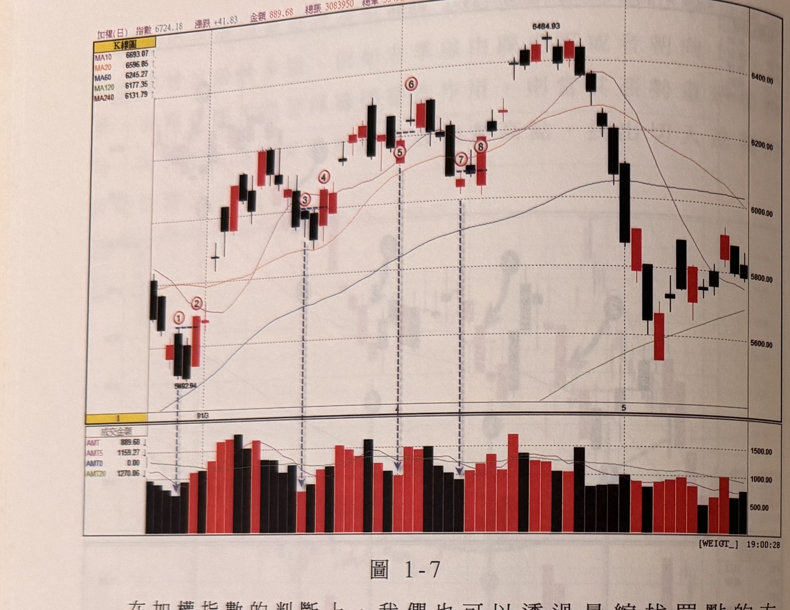
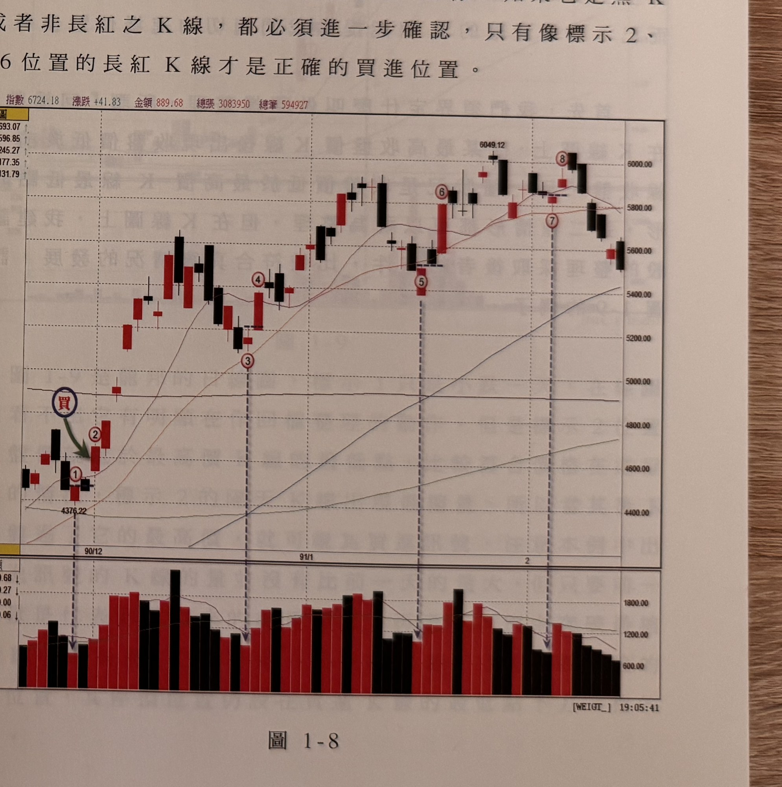

## p.8

**圖 1-7**

> 圖說（figure notes）: 一張加權指數日線圖（頁首標示「加權(日) 指數6724.18 漲跌+41.83 金額889.68 總張3083950 總筆594927」），左上角「K線圖」，均線圖例：MA10 6693.07、MA20 6596.85、MA60 6245.27、MA120 6177.35、MA240 6131.79。時間軸標示「91/3」「4」「5」，指數自5492.94起漲。圖中標示1（底部區K線）、標示2（墨綠色箭頭指向標示1右側之K線，為突破買點）、標示3、標示4（紅圈數字，均線附近整理K線）、標示5（十字線K線）、標示6（十字線K線，突破標示5高點但非長紅K線）、標示7、標示8（紅圈數字，指數上攻至6484.93高點附近），其後指數自高點回落至5600~6000區間整理。下方成交金額面板列出AMT 889.68、AMT5 1159.27、AMT0 0.00、AMT20 1270.06，各標示位置下方以垂直虛線對應箭頭指向量柱。此圖對應本文：加權指數在91年2-5月均線朝上發展屬多頭市場，標示1指數回探靠近季線附近、成交量萎縮至687.5億（每日比對下最縮量），隔日量增收黑後，以標示1縮量K線最高點被突破（即標示2的K線收盤價突破標示1最高點）作為買進策略的重要判斷。

在加權指數的判斷上，我們也可以透過量縮找買點的方式，找到多頭市場合適的切入位置，如圖 1-7 是大盤在 91 年 2-5 月的日線圖，均線朝上發展，是多頭市場。在標示 1 的位置是指數回探靠近季線附近，成交量萎縮至 687.5 億，是每日比對下的最縮量，隔日量增收黑，所以我們就以標示 1 縮量的 K 線最高點被突破，作為買進策略的重要判斷，當標示 2 的 K 線收盤價突破了標示 1 的 K 線最高點，就形成一個買點訊號，這裡要特別注意一點，突破量縮 K 線的最高點，必須是一根長紅 K 線，漲幅不能太小，如標示 5 的量縮 K 線，雖然標示 6 的 K 線突破了標示 5 的 K 線最高點，但標示 6 的 K 線是一根十字線而非長紅 K 線，不是正確的買點訊號，通常需要次一根 K 線進一步作確認，標示 6 的隔一根 K

## p.9

線雖是一根紅 K 線，但我們要求它的收盤必須越過標示 6 的 K 線最高點，才算是真正的買進位置，而這種再確認的動作，是非常重要的細節；再如圖 1-8 標示 7 的量縮 K 線最高點，被隔根標示 8 的 K 線突破，但是標示 8 的 K 線不是一根長紅 K 線，上影線與實體相當，這也不是一個好的進場點。所以，進場的訊號除了收盤突破量縮的 K 線最高點外，尚須進一步考慮，突破時的 K 線是否為長紅 K 線，如果它是黑 K 線或者非長紅之 K 線，都必須進一步確認，只有像標示 2、4、6 位置的長紅 K 線才是正確的買進位置。

**圖 1-8**

> 圖說（figure notes）: 承圖1-7同一加權指數日線圖（頁首標示「指數6724.18 漲跌+41.83 金額889.68 總張3083950 總筆594927」），均線圖例：MA10 6693.07、MA20 6596.85、MA60 6245.27、MA120 6177.35、MA240 6131.79。指數自4376.22起漲，深藍圓圈紅字「買」與墨綠色箭頭指向標示1右側之K線（即買進位置）。標示1、標示2（買進點）、標示3、標示4、標示5、標示6（紅圈數字，其中標示5為量縮K線，標示6為突破標示5但實體與上影線相當、非長紅K線）、標示7（量縮K線）、標示8（突破標示7但上影線與實體相當之K線，非理想長紅K線，指數觸及6049.12高點）。下方成交金額面板列出889.68/1159.27/0.00/1270.06（AMT/AMT5/AMT0/AMT20），對應垂直虛線指向各標示位置。此圖對應本文：標示7量縮K線最高點被隔根標示8的K線突破，但標示8非長紅K線（上影線與實體相當），非理想的進場點；唯有像標示2、4、6這類長紅K線的突破才是正確買進位置。
