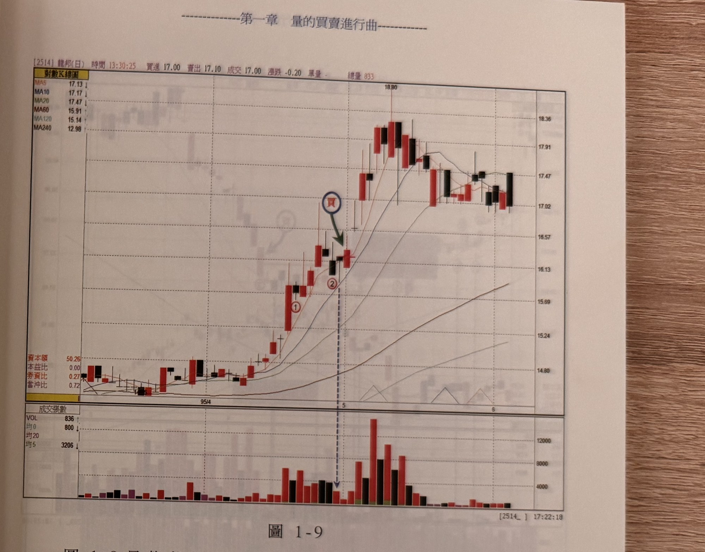

## p.10

某一檔個股作回檔動作，它是屬於強勢整理或是弱勢整理？這也是我們要注意的情節；當季線朝上發展時，MA10 及 MA20 全朝上發展，這是全多排列，如果價格的回檔並沒有導致 MA10 彎頭，這是最好的狀況，也表示回檔的時間很短，此時看到量能快速縮減，表示籌碼是相當安定的狀況，這是強勢股最常見的整理模式；當然，價格回檔不見得會回探至主要的均線位置，它有可能甚至只回檔至 5 日均線位置而已，但是量縮的 K 線能提供我們適切的進場位置參考。

首先，我們須界定什麼叫做回檔整理，所謂『回檔整理』在 K 線圖上，從某最高收盤價 K 線後出現收盤價低於前一 K 線收盤，另一種狀況是收盤價低於最高價 K 線最低點的情形，這二種情形都可以視為整理，但在 K 線圖上，我建議一般的整理採取後者的條件，比較符合真實情況的發展，請看圖 1-9 的例子。

## p.11

**圖 1-9**

> 圖說（figure notes）: 一張龍邦（代號2514）對數K線圖（頁首標示「[2514] 龍邦(日) 時間13:30:25 買進17.00 賣出17.10 成交17.00 漲跌-0.20 單量- 總量833」），均線圖例：MA5 17.13、MA10 17.17、MA20 17.47、MA60 15.91、MA120 15.14、MA240 12.98。時間軸標示「95/4」「5」「6」。圖中標示1（紅圈數字，回檔K線，僅小跌一天）、標示2（紅圈數字，其後一日下方有垂直虛線箭頭指向對應量柱，此為最縮量之K線），深藍圓圈紅字「買」與墨綠色箭頭指向標示2隔日突破其最高點的K線，股價隨後急漲觸及18.80高點，其後回落至17.02~17.91區間整理。下方成交張數面板列出VOL 836、均0 800、均20 3206。此圖對應本文：標示1僅小跌一天，線圖上看不出明顯回檔整理動作；標示2位置收盤價低於最高價K線的最低點，符合價格整理的定義，標示2隔天K線出現最縮量，其後K線收盤價突破標示2最高價即為買進訊號；注意買進訊號K線的量並未比前一天大，只要前一天的量是回檔以來縮量即可；本例突破最縮量K線最高價的K線並非長紅K線，屬於較冒險的買進位置，停損位置仍設在買進K線最低點下方一檔。

圖 1-9 是龍邦的日線圖，標示 1 只是小跌一天，在線圖上並看不出它有明顯在作回檔整理的動作，但是標示 2 位置的收盤價就低於最高價 K 線的最低點，比較符合價格在進行整理的情況，標示 2 的隔天 K 線出現最縮量，所以當其後 K 線收盤過了它的最高價，就可視為買進訊號，注意本例中出現買進訊號的 K 線的量並沒有比前一天的量大，但只要前一天的量是代表回檔以來的縮量即可，再者，本例中突破最縮量 K 線的最高價，它並不是一根長紅 K 線，這是比較冒險的買進位置，其停損位置仍設在買進 K 線的最低點下方一檔的位置。
