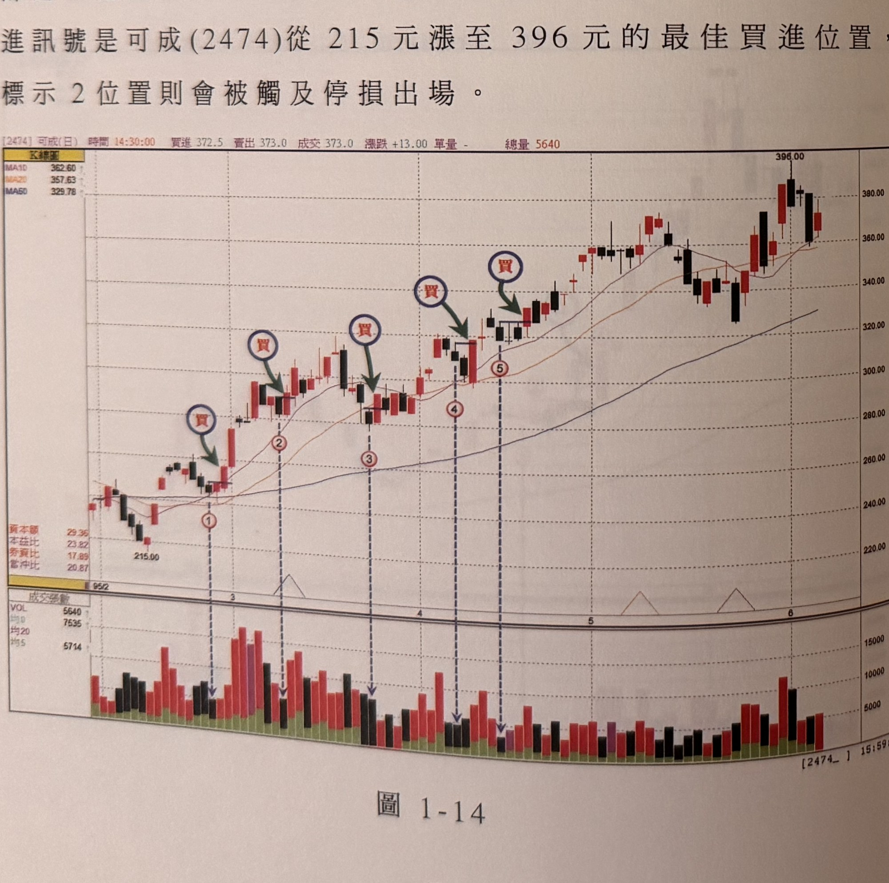
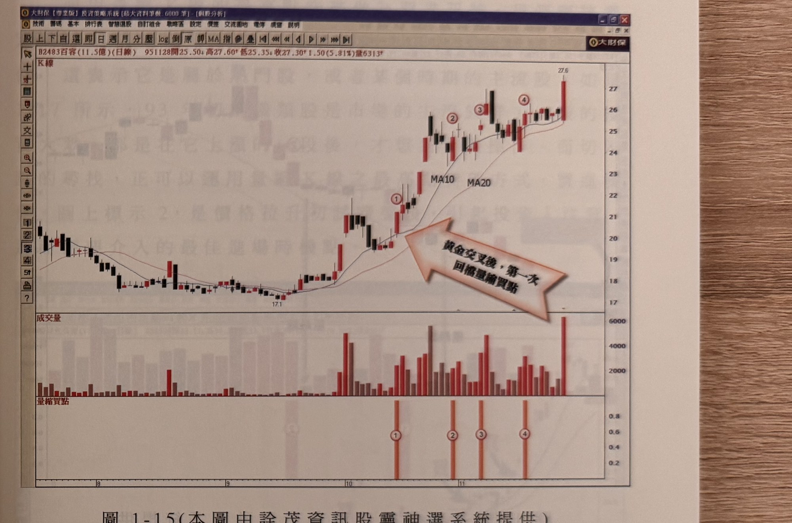

## p.18

當個股價格呈現黃金交叉，價格站上季線開始，其行進模式，將呈現上漲、拉回整理、再漲的節奏，每一個拉回走勢將引出一個買進訊號，在使用量縮找其買進位置時，第一次價格拉回走勢，其量縮 K 線所產生的買點，極可能是整段上漲行情中，最佳的切入位置，亦即第一個買進訊號是整波段中長線多頭的最佳操作時機，而行情的發展愈走愈高，在接近頂點位置附近的量縮 K 線所帶出的買進 K 線，它被停損的可能性相對提高。因此，在價格呈現多頭走勢，第一次回檔的買進點，如果沒被觸及停損，應該耐心的持有到頭部區，對於潛在的頭部區，我們可以用 RSI 背離向下的方式，加以篩選，請見 RSI 背離的用法。圖 1-14 中，標示 1 位置的買進訊號是可成 (2474) 從 215 元漲至 396 元的最佳買進位置，標示 2 位置則會被觸及停損出場。

**圖 1-14**

> 圖說（figure notes）: 一張可成（代號2474）日線K線圖（頁首標示「[2474] 可成(日) 時間14:30:00 買進372.5 賣出373.0 成交373.0 漲跌+13.00 單量- 總量5640」），均線圖例：MA10 362.60、MA20 357.63、MA60 329.78。時間軸標示「95/2」「3」「4」「5」「6」，股價自215.00起漲。圖中依序標示1、2、3、4、5（紅圈數字），各標示上方均有深藍圓圈紅字「買」與墨綠色箭頭指向對應K線（除標示5上方僅有紅圈數字5，未見額外買字標示，但整體五個買點依序沿波段上攻路徑排列），股價自215元一路墊高至396.00高點，其後回落整理。下方成交張數面板列出VOL 5640、均0 7535、均20、均5 5714，各標示位置下方以垂直虛線對應箭頭指向量柱。此圖對應本文：標示1位置的買進訊號為整波段最佳買點，標示2位置則會觸及停損出場，其餘標示3、4、5為後續多次拉回量縮後再度出現的買進訊號，股價最終從215元漲至396元。

## p.19

**圖 1-15（本圖由詮茂資訊股靈神選系統提供）**

> 圖說（figure notes）: 一張股票交易軟體「大財保【專業版】投資策略系統」視窗截圖，內容為百容（代號2483，成交金額11.5億，日線）K線圖（頁首標示「B2483百容(11.5億)(日線) 951128開25.50 高27.60 低25.35 收27.30 1.50(5.81%)量6313」），左側均線標示MA10、MA20；股價自17.1低點起漲，圖中標示1、2、3、4（紅圈數字），並有橘紅色箭頭形說明框「黃金交叉後，第一次回檔量縮買點」指向標示1位置；下方成交量面板柱狀圖對應顯示，再下方另有一列「量縮買點」指標列，以橘色直條標示對應標示1、2、3、4之位置。股價末端急漲觸及27.6高點。此圖對應本文：圖1-15是百容在95年10月出現的突破量縮最高點買進訊號，MA10及MA20黃金交叉後呈現最佳操作區域，標示1代表行情在黃金交叉後第一次價格拉回整理、再根據量縮找買點方式所出現的買進訊號，也是最佳切入點；文中並提及可將量縮買點加以指標化（如圖中「量縮買點」列所示），以程式語言編繹，增加操作上的便利性。

圖 1-15 是百容 (2483) 在 95 年 10 月所出現的突破量縮最高點的買進訊號，MA10 及 MA20 黃金交叉後，呈現出最佳操作區域，標示 1 位置代表行情在黃金交叉後，第一次價格拉回整理，再根據量縮找買點的方式，所出現的買進訊號，這也是最佳的切入點，我們可以把量縮買點加以指標化，方便我們參考，只要把我們所介紹的重點，加以程式語言編繹，可增加我們操作上的便利性。
