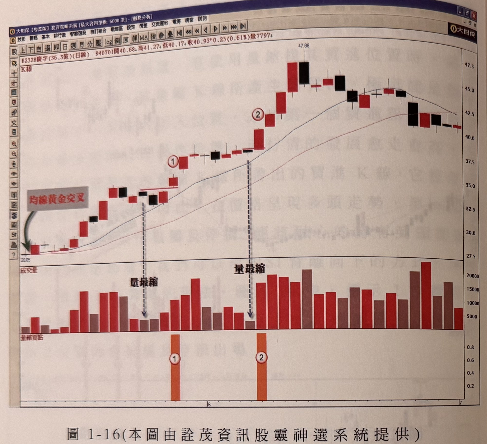
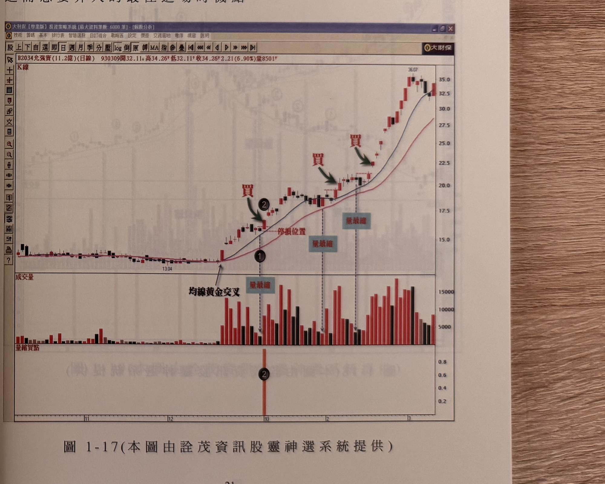

## p.20

**圖 1-16（本圖由詮茂資訊股靈神選系統提供）**

> 圖說（figure notes）: 交易軟體視窗截圖，內容為廣宇（代號2328，成交金額36.3億，日線）K線圖（頁首標示「B2328廣宇(36.3億)(日線) 940701開40.68 高41.27 低40.17 收40.93 0.25(0.61%)量7797」）。左下角有深綠色箭頭與紅字「均線黃金交叉」指向股價起漲點28.05附近；圖中標示1（紅圈數字，下方成交量面板有黑色虛線箭頭指向量柱並標註「量最縮」）、標示2（同樣下方有虛線箭頭與「量最縮」標註），股價自28.05一路墊高至47.88高點後回落至41~43元區間整理。下方另有「量縮買點」指標列，以橘色直條對應標示1、2位置。此圖對應本文：圖1-16是廣宇在95年6月的走勢圖，均線於5月初出現黃金交叉，價格拉升一波後，由於漲幅大引起操作者注意，透過觀察拉回過程的量縮情況並鎖定量縮K線最高點，標示1位置即收盤突破量縮K線最高點的買點訊號，同時也是均線黃金交叉後第一次拉回走勢的最佳操作切入點。

圖 1-16 是廣宇在 95 年 6 月的走勢圖，當均線在 5 月初開始出現黃金交叉，價格拉升一波後，由於漲幅大，引起操作者的注意，我們可以觀察其拉回過程的量縮情況，並鎖定住量縮 K 線的最高點位置，如果出現突破此位置，就準備在其收盤位置買進，如標示 1 位置，收盤突破了量縮 K 線的最高點，便是買點訊號，同時，標示 1 也是均線黃金交叉後，第一次拉回走勢，因此買點的位置，是最佳的操作切入點，透過量縮買點指標，清楚標示出正確的切入買進點。

## p.21

而用量縮 K 線的最高點突破做為買進訊號，我們應該選定均線的排列明顯朝上，即價格的上升角度較大的個股操作，這表示它是屬於熱門股，或者某個時期的主流股，如圖 1-17 所示，93 年初鋼鐵類股是市場的主流族群，一般的投資大眾，都是在它上漲的一段後，才想到介入操作，而切入點的尋找，正可以運用量縮 K 線之最高點突破方式，買進操作。圖上標示 2，是價格拉升初試啼聲後，引起投資人注意，進而想要介入的最佳進場時機點。

**圖 1-17（本圖由詮茂資訊股靈神選系統提供）**

> 圖說（figure notes）: 交易軟體視窗截圖，內容為允強資（代號2034，成交金額11.2億，日線）K線圖（頁首標示「B2034允強資(11.2億)(日線) 930309開32.11 高34.26 低32.11 收34.26 2.21(6.90%)量8501」）。圖中「均線黃金交叉」以黑色箭頭標示股價起漲點（約13.04附近），標示1（黑圓圈數字，位於黃金交叉後的第一個回檔低點，下方紅字「停損位置」以虛線標示水平參考線）、深綠色箭頭與紅字「買」指向標示1右側的突破K線；其後標示2（黑圓圈數字，深綠色箭頭與紅字「買」指向對應K線，上方灰底紅字「量最縮」）、再其後另一深綠色箭頭與紅字「買」指向更右側K線（上方灰底紅字「量最縮」）。股價自13.04起漲，持續墊高至36.07高點，其後於32.5~35元區間整理。下方成交量面板柱狀圖對應顯示放量上攻過程，下方另有「量縮買點」指標列，以橘色直條標示對應標示2位置。此圖對應本文：93年初鋼鐵類股為市場主流族群，標示1為均線黃金交叉後第一次拉回量縮的買點（其後K線收盤突破即為買進訊號，停損設於標示1最低點下方），標示2則是價格拉升初試啼聲、引起投資人注意後最佳的進場切入時機點。
