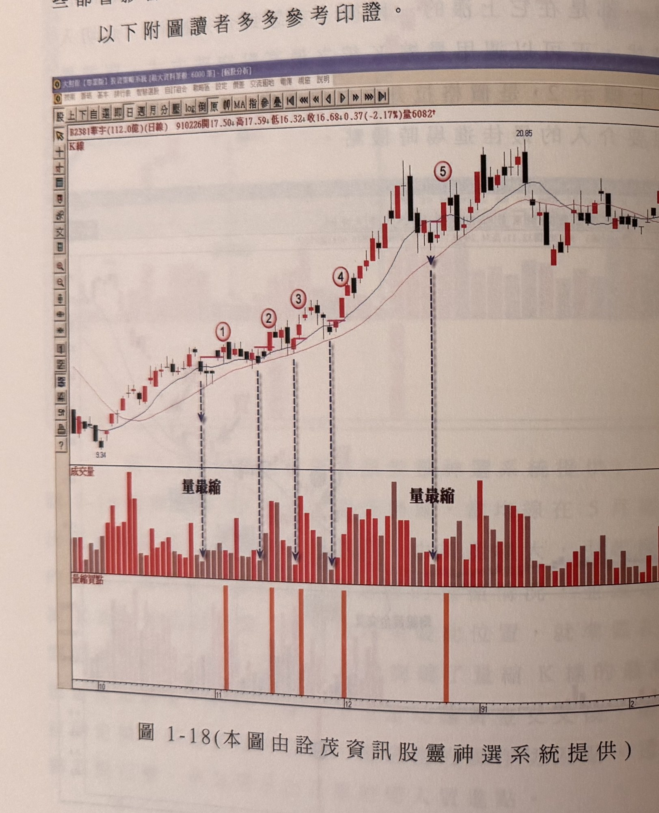
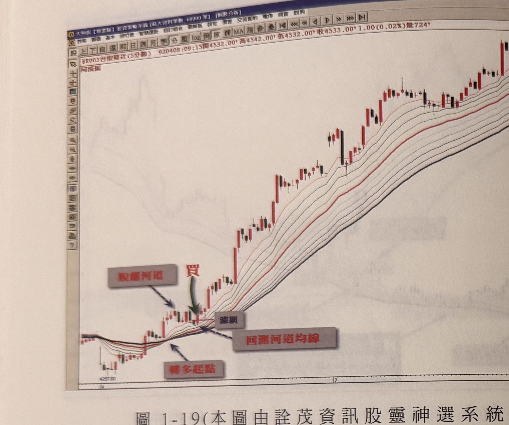

## p.22

從量最縮的 K 線出現到其最高點被突破，最好在四天內完成，時間拖太久，訊號的勝率將隨之降低，而突破量縮 K 線最高點的買進訊號以大漲 K 線為佳，上影線不能太長，這些都會影響買進訊號的品質，讀者應特別留意。

以下附圖讀者多多參考印證。

**圖 1-18（本圖由詮茂資訊股靈神選系統提供）**

> 圖說（figure notes）: 交易軟體視窗截圖，內容為華宇（代號2381，成交金額112.0億，日線）K線圖（頁首標示「B2381華宇(112.0億)(日線) 910226開17.50 高17.59 低16.32 收16.68 0.37(-2.17%)量6082」）。股價自9.34起漲，圖中依序標示1、2、3、4、5（紅圈數字），標示1～4下方以垂直虛線箭頭指向成交量面板並標註「量最縮」，標示5下方亦有虛線箭頭指向另一處「量最縮」標註（該處為股價觸及20.85高點後之整理區）。下方另有「量縮買點」指標列，以橘色直條對應標示1、2、3、4之位置。股價自9.34一路墊高至20.85高點，其後回落至16~18元區間震盪。此圖為前文所述「量縮K線最高點於四天內被突破」的多次示例，讀者可自行參考印證。

## p.23

**圖 1-19（本圖由詮茂資訊股靈神選系統提供）**

> 圖說（figure notes）: 交易軟體視窗截圖，內容為億光（代號2393，成交金額28.8億，日線）K線圖（頁首標示「B2393億光(28.8億)(日線) 950109開76.80 高78.47 低75.87 收77.54 0.74(0.96%)量7532」）。股價自33.05起漲，圖中依序標示1～9（紅圈數字），各標示下方以垂直虛線箭頭指向成交量面板，中段標註「量最縮」文字。下方另有「量縮買點」指標列，以橘色直條對應各標示位置。股價自33.05持續墊高，末端急漲觸及82.85高點後小幅拉回。此圖同樣為量縮K線最高點被突破形成買點的連續示例（本頁未見額外body文字，頁面僅圖與圖說標題）。
