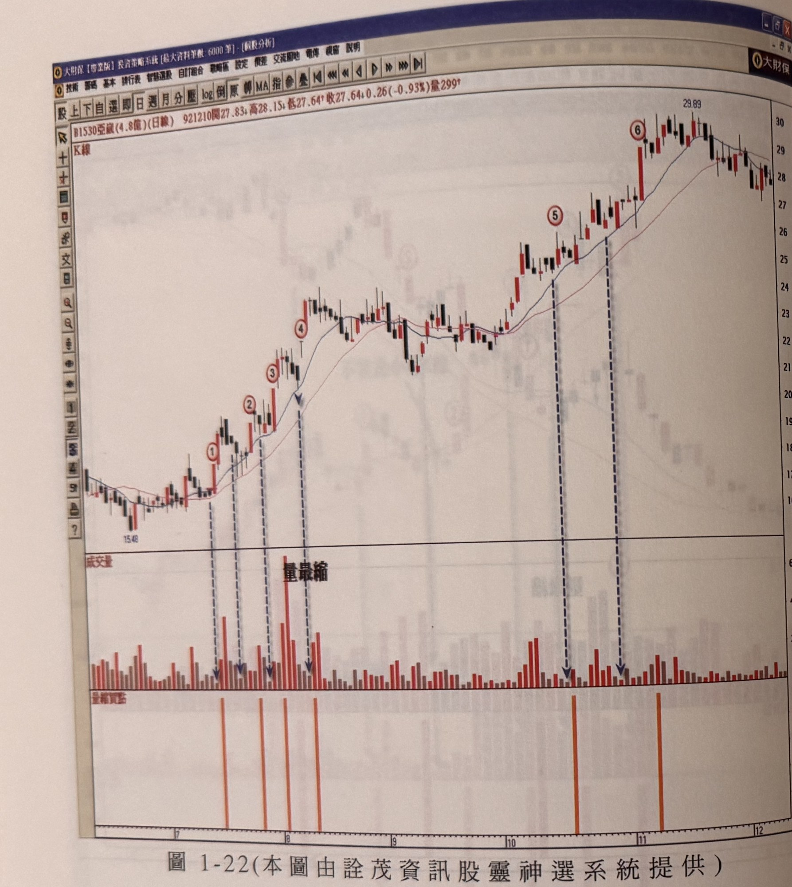

## p.26

**圖 1-22（本圖由詮茂資訊股靈神選系統提供）**

> 圖說（figure notes）: 交易軟體視窗截圖，內容為亞崴（代號1530，成交金額4.8億，日線）K線圖（頁首標示「B1530亞崴(4.8億)(日線) 921210開27.83 高28.15 低27.64 收27.64 0.26(-0.93%)量299」）。股價自15.48起漲，圖中標示1、2、3、4（紅圈數字）下方以垂直虛線箭頭指向成交量面板同一處「量最縮」標註，標示5、6（紅圈數字，位於股價急漲至29.89高點附近）下方亦各有虛線箭頭指向對應量柱。下方「量縮買點」指標列以橘色直條對應標示1、2、3、4、5、6位置。股價自15.48持續墊高至29.89後小幅回落至27~29元區間整理。

## p.27

# 多頭市場見到大量是危險訊號嗎？

大成交量所代表的意義，有認為是人氣鼎沸的好現象，有認為是籌碼凌亂的偷跑訊號，面對多頭市場的大量，到底該用何種面象看待呢？

這裡所指的狀況都是以行情在季線 (MA60) 上所發生的現象來討論大成交量。當突破型態或頸線，不是都必須帶量，才能確認突破的走勢嗎？的確如此，突破要有量，且突破 K 線要屬於大漲 K 線或是跳空大漲 K 線，才能引起投資人的眼光焦點；因此，大成交量對於漲勢的推升是不可或缺的，主力在推升股價過程中，量群都會控制到不使投資人驚嚇，然而，當進入急攻階段，就會出現不斷地爆出大量，盤中一陣上下刷洗震盪，讓人搞不清楚主力的意向，甩轎還是誘空軋空呢？還是掩護出貨呢？各種情況均有可能性。

唯一不變的是，只要是大量出現時，我們要特別留意帶大量收漲的 K 線最低點，不能被跌破，這個大量收漲 K 線的最低點，代表多頭的防守線，如果主力沒有要棄守或出貨，通常不會隨意去作出跌破大量 K 線的最低點；所以，有時當天爆大量作成帶長上影的紡綞線，只要主力還要繼續推升價格，隔天必定守住大量 K 線的最低點，甚至直接開高走高，越過上影線的制壓，帶大量的 K 線有時呈現大吞噬線，狀況看似危急，但隔天往往沒有任何低點，一路續漲。

如果帶大量的 K 線最低點，被隨後的行情收盤跌破了，這可能暗示主力調節出貨開始進行，或者準備壓回整理，發覺出現這種狀況，投資人必須隨之減碼出脫，如果季線已經走平的狀況，那更表示大量 K 線的最高點，極有可能形成波
