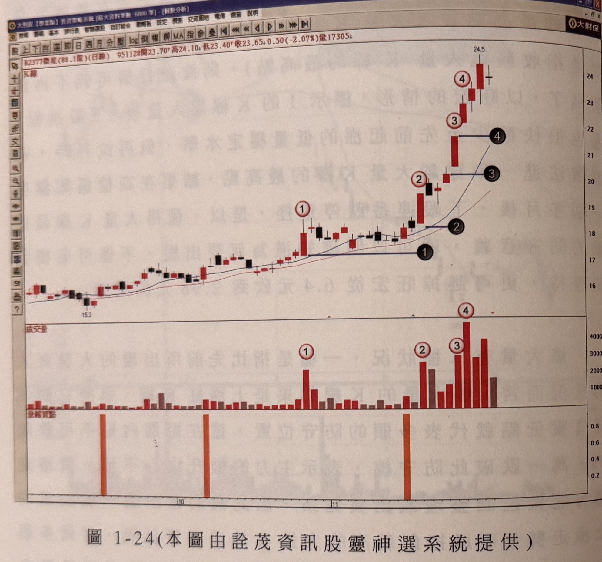
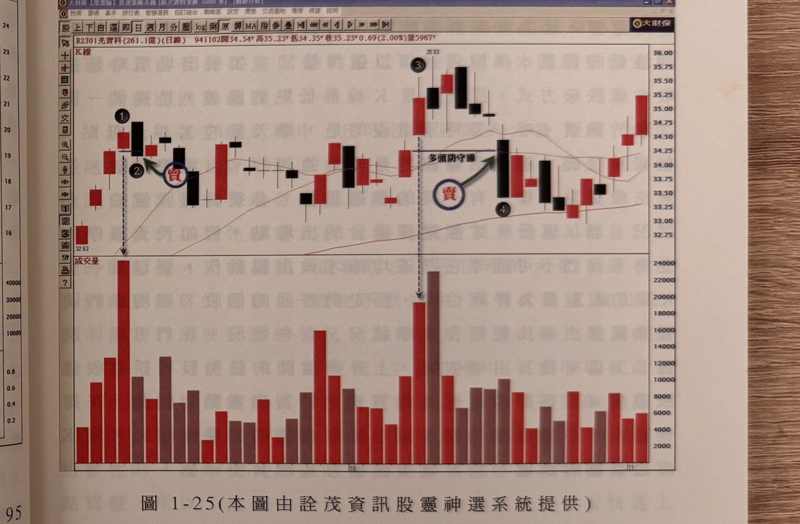

## p.30

線超過一檔的意思，但在實務操作上，我們建議採取見價就算跌破。

**圖 1-24（本圖由詮茂資訊股靈神選系統提供）**

> 圖說（figure notes）: 交易軟體視窗截圖，內容為微星（代號2377，成交金額88.1億，日線）K線圖（頁首標示「B2377微星(88.1億)(日線) 951128開23.70 高24.10 低23.40 收23.65 0.50(-2.07%)量17305」）。股價自15.3起漲，圖中標示1（黑圓圈數字，K線最低點以深藍色水平線向右延伸至標示1黑圓圈，即「多頭防守線」概念的最低點基準）、標示2（紅圈數字為K線位置，黑圓圈2為其對應最低點水平線延伸）、標示3（紅圈與黑圓圈同前）、標示4（紅圈與黑圓圈同前，股價此時已上攻至24.5高點附近）。下方成交量面板對應標示1、2、3、4處均有明顯放大的量柱（其中標示4量柱達4000以上為圖中最大量），「量縮買點」列以橘色直條標示三處對應位置。股價自15.3持續墊高至24.5高點。此圖為圖1-24例子：微星95年10月底逐漸放出大量（標示1），加上出現兩個月內難得一見的實體紅K線帶上影線，隨後行情陷入拉回整理，但大量K線最低點（水平線）在13天整理過程中並未被跌破，標示2再出一根比標示1更大量的長紅K線，微星從此跟牛皮走勢說再見，成為市場注意的熱門股，繼續走漲，標示3、4不斷出現新高量，這些大量K線的最低點（圖上黑色號碼球）可作為進場風險位置，或最大停損停利點位置。

圖 1-24 是一個說明大量持續出現的例子，以微星在 95 年 10 月底逐漸放出大量，如標示 1 的位置，大量加上出現一根兩個月內難得一見的實體紅 K 線，帶有上影線，意味著它的突然上漲，令市場害怕大量一日後就不漲了，而隨後行情也陷入拉回整理，但是大量 K 線的最低點所表示的多頭防守位置，在 13 天的整理過程，並沒有被跌破過，當標示 2 再出一根比標示 1 更大量的長紅 K 線，也表示微星跟過去的牛皮走勢說再見，它變成市場注意的熱門股，繼續走漲，標

## p.31

示 3 及標示 4 位置，不斷地有新高量出現，而這些大量 K 線的最低點，如圖上黑色號碼球所代表的多頭防守，一則可以當成進場的風險位置，二則可以做為最大停損停利點的位置。

**圖 1-25（本圖由詮茂資訊股靈神選系統提供）**

> 圖說（figure notes）: 交易軟體視窗截圖，內容為光寶科（代號2301，成交金額261.1億，日線）K線圖（頁首標示「B2301光寶科(261.1億)(日線) 941102開34.54 高35.23 低34.35 收35.23 0.69(2.00%)量5967」）。股價自32.63起漲，圖中標示1（黑圓圈數字，位於一根爆量長紅K線，下方垂直虛線箭頭指向成交量面板最高量柱）、深藍圓圈紅字「賣」與綠色箭頭指向標示1右側隔天開高走低的黑K線（標示2，黑圓圈數字）；其後股價在34~35元區間震盪整理，出現標示3（黑圓圈數字，另一根爆量長紅K線，成交量面板對應柱狀為次高量）、灰底黑字「多頭防守線」以水平線與綠色箭頭指向標示3K線的最低點延伸處，深藍圓圈紅字「賣」指向標示4（黑圓圈數字，跌破多頭防守線之K線）。股價其後在33~35元區間持續整理震盪，末端回升觸及35.25附近。此圖對應圖1-25說明：大量K線的真實低點被跌破是回檔訊號，標示1出現大量K線，隔天標示2位置開高走低跌破了大量K線的真實低點，此為出場訊號，表示行情將轉成拉回整理或橫向整理走勢；本例行情在季線上方，大量K線最低點被跌破後，成交量迅速萎縮。
