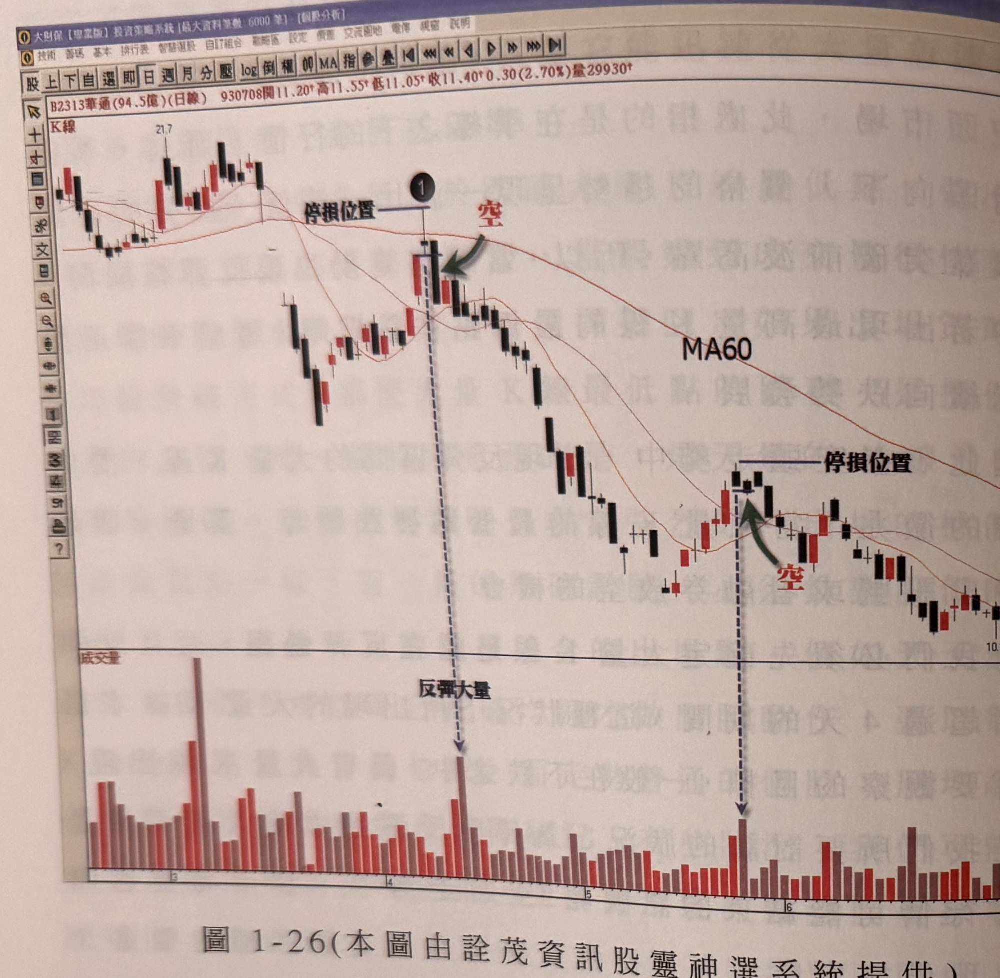
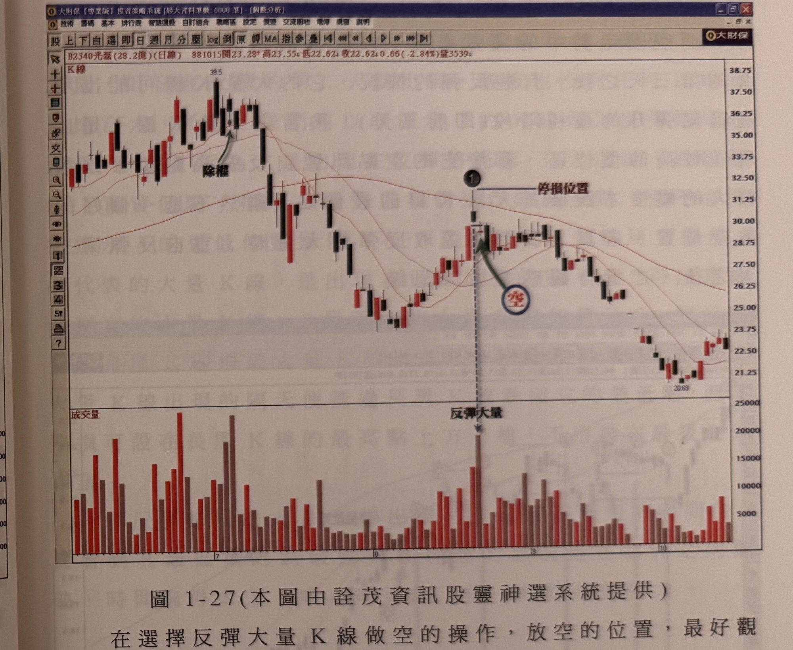

## p.34

**圖 1-26（本圖由詮茂資訊股靈神選系統提供）**

> 圖說（figure notes）: 交易軟體視窗截圖，內容為華通（代號2313，成交金額94.5億，日線）K線圖（頁首標示「B2313華通(94.5億)(日線) 930708開11.20 高11.55 低11.05 收11.40 0.30(2.70%)量29930」）。股價自21.7高點下跌，圖中標示「MA60」季線持續向下發展。標示1（黑圓圈數字，位於一根帶上影線的紡綞線，上方「停損位置」水平線標示於該K線最高點，紅字「空」與綠色箭頭指向此處）為放空位置，其下方成交量面板對應處標註「反彈大量」；股價其後持續下跌，於下方再度出現一組「停損位置」水平線與紅字「空」、綠色箭頭指向的整理區K線（同樣下方對應「反彈大量」量柱），股價持續破底下探至10.1附近。此圖對應本文：華通93年4月起價格走勢跌落季線之下，季線向下發展屬空頭市場，3月底行情反彈初期成交量未見明顯放大，但標示1位置出現帶大量的K線（一根帶上影線且實體相當小的紡綞線），此大量K線最低點於隔天被跌破時即為可放空時機，若放空的K線是長黑線，停損可設在長黑K線最高點上方一檔；若放空K線不是長黑K線，最好以最接近的峰頂上方一檔做為停損（如圖上所示2）。

圖 1-26 是華通 (2313) 在 93 年 4 月開始，價格走勢跌落季線之下，季線也呈現向下發展的空頭市場，自 3 月底行情出現反彈，反彈的初期成交量並沒有明顯出現大量，但在標示 1 的位置，出現帶大量的 K 線，這是一根帶上影線且實體相當小的紡綞線，大量 K 線的最低點在隔天被跌破時，就是一個可放空的時機，如果我們進行放空的操作時，假如放空的 K 線是長黑線，其停損可以設在長黑 K 線的位置（如標示 1），若放空的 K 線不是長黑 K 線，最好以最接近的峰頂上方一檔做為停損（如圖上所示 2）。

## p.35

**圖 1-27（本圖由詮茂資訊股靈神選系統提供）**

> 圖說（figure notes）: 交易軟體視窗截圖，內容為光磊（代號2340，成交金額28.2億，日線）K線圖（頁首標示「B2340光磊(28.2億)(日線) 881015開23.28 高23.55 低22.62 收22.62 0.66(-2.84%)量3539」）。股價自高點38.5下跌，圖中綠色箭頭標示「除權」處。標示1（黑圓圈數字，上方「停損位置」水平線標示於該K線最高點，紅字「空」以深藍圓圈圈起並以綠色箭頭指向此處）為放空位置，下方成交量面板對應處標註「反彈大量」（該量柱為全圖最高量）。股價其後持續下跌至20.69低點，再小幅回升至22~23元區間。此圖為圖1-27例子，說明選擇反彈大量K線做空的操作，應觀察MA10及MA20有無呈現黃金交叉；本例中標示1放空位置，MA10及MA20剛好交叉，仍可考慮操作，但若行情已出現黃金交叉一段時間，則放空動作要特別小心。

在選擇反彈大量 K 線做空的操作，放空的位置，最好觀察 MA10 及 MA20 有無呈現黃金交叉，因為一旦走勢出現黃金交叉，行情有可能出現較長時間的反彈，這種狀況放空操作，比較無法收到快速下滑的效果，像圖 1-27 標示 1 放空的位置，MA10 及 MA20 剛好交叉，還可以考慮操作，但如果行情已經出現黃金交叉一段時間了，那麼我們的放空動作要特別小心，價格可能在 MA10 或 MA20 尋得支撐而呈現橫盤走勢，甚至又再度彈升創另一個反彈高點，那麼停損位置被穿價的可能性就大增。在圖 1-27 的例子，放空訊號的標示 1 之前，均線已呈現黃金交叉，因此操作之後，行情進行
