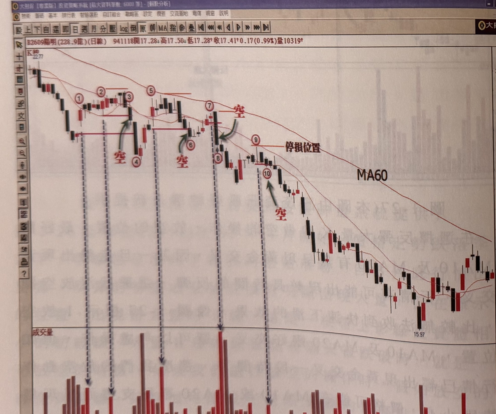

## p.36

盤整一段時間，才繼續跌勢。

而空頭走勢中的反彈過程，大量 K 線宜出現在自低點反彈的第三天之後，有些反彈的情況，它的大量 K 線可能出現在較高的價位區，那麼它的空點訊號自反彈高點須下跌須較大的幅度才跌破其大量 K 線的最低點，顯然不是一個好的放空位置，所以，我們在選取反彈的大量時，宜自反彈第三天之後，才進行觀察並加以記錄。

**圖 1-28（本圖由詮茂資訊股靈神選系統提供）**

> 圖說（figure notes）: 交易軟體視窗截圖，內容為陽明（代號2609，成交金額228.9億，日線）K線圖（頁首標示「B2609陽明(228.9億)(日線) 941118開17.28 高17.50 低17.28 收17.41 0.17(0.99%)量10319」）。股價自22.77高點持續下跌，均線MA60向下發展。圖中依序標示1、2、3（紅圈數字，標示2、3之間有紅色水平線標示前波高點，綠色箭頭與紅字「空」指向標示3、4之間的長黑K線）、標示4、5、6（紅字「空」與綠色箭頭指向標示6附近的長黑K線）、標示7、8（紅字「空」與綠色箭頭指向標示7、8之間的長黑K線）、標示9（上方「停損位置」水平線）、標示10（紅字「空」與綠色箭頭指向）。下方成交量面板對應標示1、2、7、10位置有明顯放大量柱。股價持續下跌至15.97低點後小幅回升。此圖為說明反彈過程中大量K線宜出現在自低點反彈第三天之後（如標示5、7、9等均在反彈第3天後出現），才是較佳的放空觀察與記錄位置。

## p.37

如圖 1-28 陽明 (2609) 在 94 年 7 月以後的走勢處於季線 (MA60) 之下的空頭趨勢，7 月初的反彈格局中，標示 1 出現大量，但它在反彈的第二天就出現，隨後也沒有任何 K 線的量比它大，所以，我們可以取標示 2 的 K 線做為反彈格局的大量 K 線，因為它是出現在反彈格局第 3 天之後，跌破標示 1 真實低點，標示 3 位置是我們操作的放空點，而不必選擇標示 4 的更低位置操作；在 8 月初出現反彈格局，標示 5 所代表的大量 K 線，是出現在低點反彈的第 4 天，可以當做觀察中的大量 K 線，8 月下旬的大量 K 線如標示 7，隔天即一根長黑 K 線攙破大量 K 線最低點，這是最理想的狀況，即大量 K 線出現的隔天便透過長黑 K 線跌破它的最低點，而其停損可設在長黑 K 線的最高點上方一檔，不用設在最接近的峰頂。

當反彈格局的大量 K 線出現時，最好在很短的時間內，就看到其最低點的跌破動作，理想的狀況是在四天之內跌破，時間拖得太久，成功率可能下降，風險相對較大。

另外，空頭市場的大量 K 線的最低點，正常狀況下，我們採取真實低點的跌破為準，但是如果大量 K 線是一根有缺口的 K 線，而價格出現跌破大量 K 線的最低點，卻還沒有跌破其真實低點，但有一種狀況，我們可以採取跌破 K 線的最低點即可，如果當價格跌破大量 K 線最低點的同時，在線圖上它也是跌破前 2 天 K 線的最低點，就可以採取放空動作，而不必等到價格跌破大量 K 線的真實低點。
