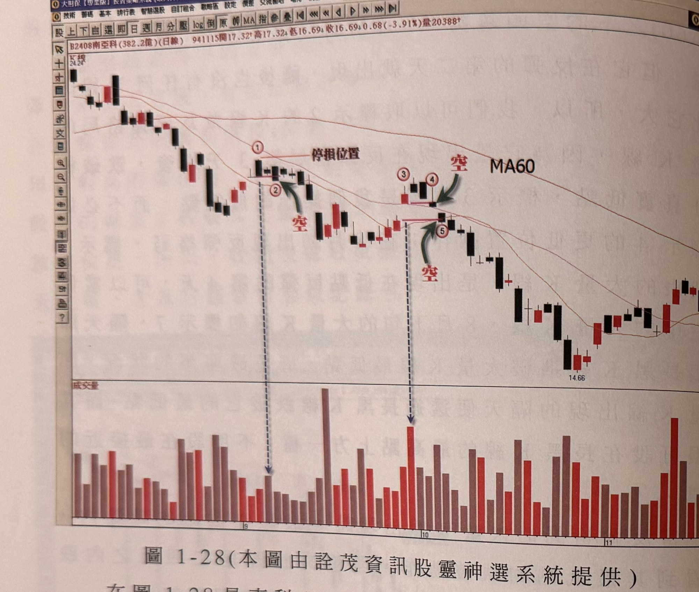
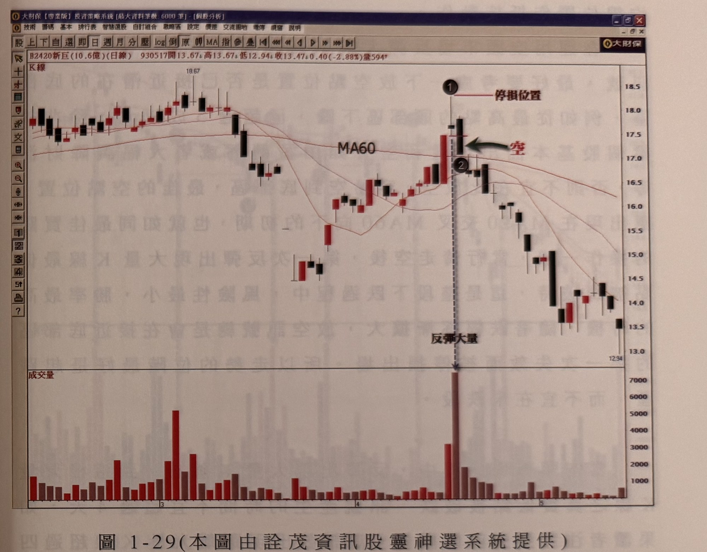

## p.38

**圖 1-28（本圖由詮茂資訊股靈神選系統提供）**

> 圖說（figure notes）: 交易軟體視窗截圖，內容為南亞科（代號2408，成交金額382.2億，日線）K線圖（頁首標示「B2408南亞科(382.2億)(日線) 941115開17.32 高17.32 低16.69 收16.69 0.68(-3.91%)量20388」）。股價自24.24高點持續下跌，均線MA60向下發展。圖中標示1（紅圈數字，上方「停損位置」水平線）、標示2（紅字「空」與綠色箭頭指向）、標示3、4（紅字「空」與綠色箭頭指向兩者之間帶缺口的K線）、標示5（紅字「空」與綠色箭頭指向）。下方成交量面板對應標示2、4位置有明顯放大量柱。股價持續下跌至14.66低點後小幅盤整回升。此圖對應本文說明：南亞科94年8月開始的空頭走勢，10月出現反彈格局的大量K線（標示3位置）是一根帶缺口（跳空）的K線，一般狀況下採取跌破大量K線真實低點作為放空濾網，但標示4位置的K線同時跌破了標示3大量K線最低點與前2根K線最低點，因此可以在標示4位置即進行放空，不必等到標示5的更低位置，這是反彈結束的第一個徵兆，也是空頭市場慣性判斷的簡單依據。

在圖 1-28 是南科 (2408) 在 94 年 8 月開始的空頭走勢，10 月出現反彈格局的大量 K 線，它是一根帶有缺口，即它是屬於跳空的 K 線，如標示 3 位置；一般狀況下，採取跌破大量 K 線的真實低點作為放空的濾網，如標示 5 的位置，但我們可以在標示 4 的位置就進行放空的動作，這是因為在標示時它也跌破了前 2 根 K 線的最低點，同時它也跌破了標示 3 大量 K 線的最低點，一般空頭市場的慣性，這個動作就是慣性，也是可以做為觀察空頭走勢持續行進的簡單判斷。

## p.39

**圖 1-29（本圖由詮茂資訊股靈神選系統提供）**

> 圖說（figure notes）: 交易軟體視窗截圖，內容為新巨（代號2420，成交金額10.6億，日線）K線圖（頁首標示「B2420新巨(10.6億)(日線) 930517開13.67 高13.67 低12.94 收13.47 0.40(-2.88%)量594」）。股價在16~18元區間震盪後下跌，均線MA60。圖中標示1（黑圓圈數字，上方「停損位置」水平線，右側紅字「空」與黑色箭頭指向）、標示2（黑圓圈數字，位於標示1隔天的黑K線）。下方成交量面板對應標示1、2位置標註「反彈大量」（該量柱為全圖最高量）。股價其後持續下跌至13元附近。此圖對應本文：新巨的情況是反彈一路推升到爆出大量，形成一根帶上影線的紡綞線（標示1），當標示1的大量K線最低點被隔日標示2的黑K線攙破時，不用眷戀，先出脫了結，再觀察後續量能表現；結果新巨並不像旺宏在高檔盤整，而是一路跌個沒完沒了，高點一天內出現，就此展開無情的空頭走勢。

圖 1-29 的新巨 (2420) 的情況是反彈一路推升到爆出大量，形成一根帶上影線的紡綞線，當標示 1 的大量 K 線最低點被隔日標示 2 的黑 K 線攙破時，不用眷戀，先出脫了結，再觀察後續量能的表現，結果新巨並不像旺宏在高檔整整，而是一路跌個沒完沒了，高點一天內出現，就此展開無情的空頭走勢，當然新巨的例子可以看出季線壓在上頭，表示它這波上漲，只是空頭裡的反彈而已，而放空訊號出現之前，MA10 及 MA20 呈現黃金交叉，表示它的反彈時間較長，這種空點，要特別注意下方均線的支撐作用，在本例中極可能是標示 1 爆的量相當大，造成它籌碼砍殺的力道猛而沒有在
