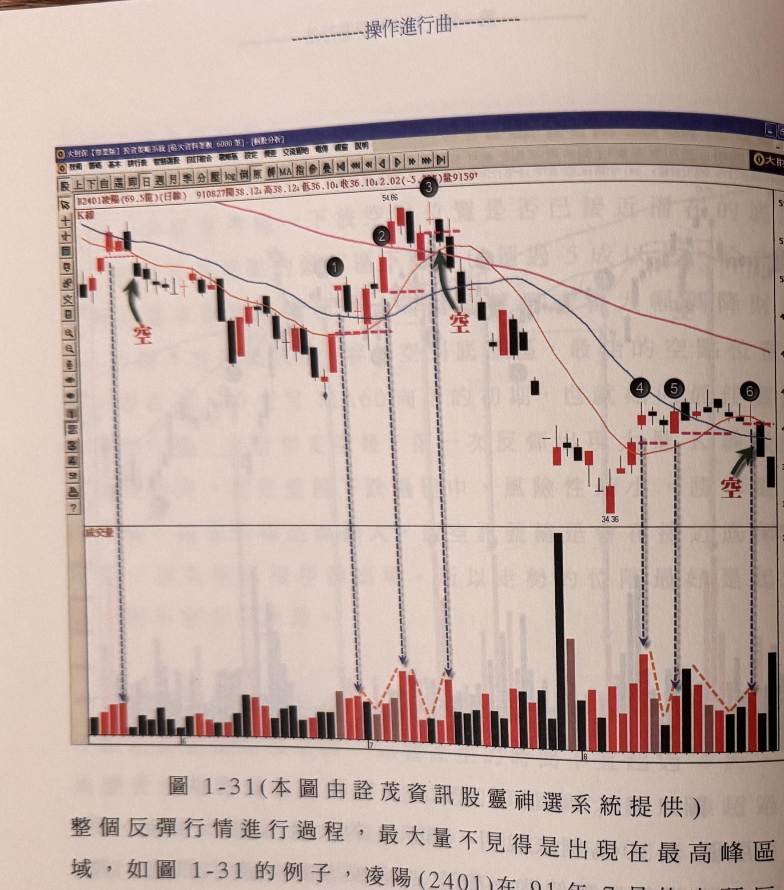
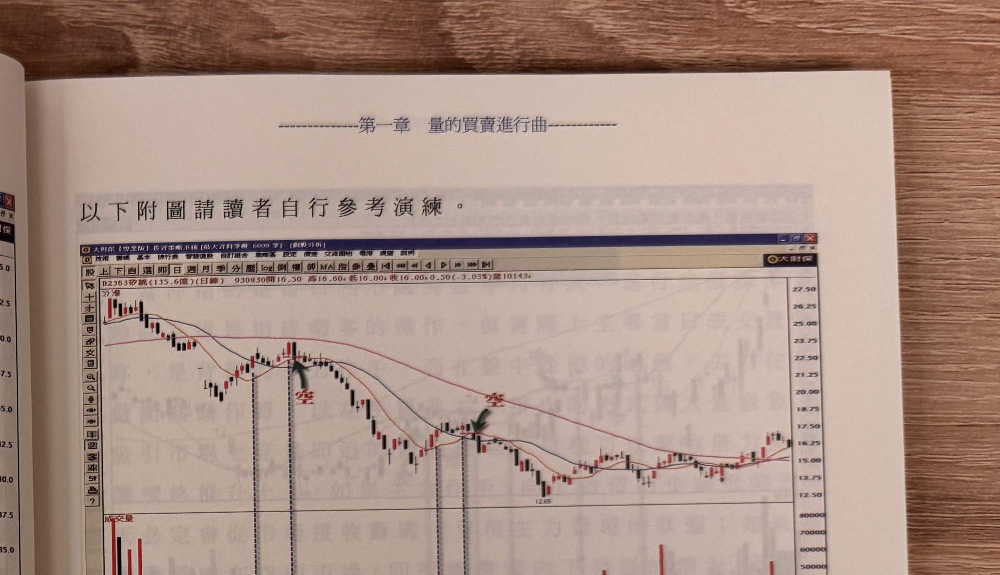
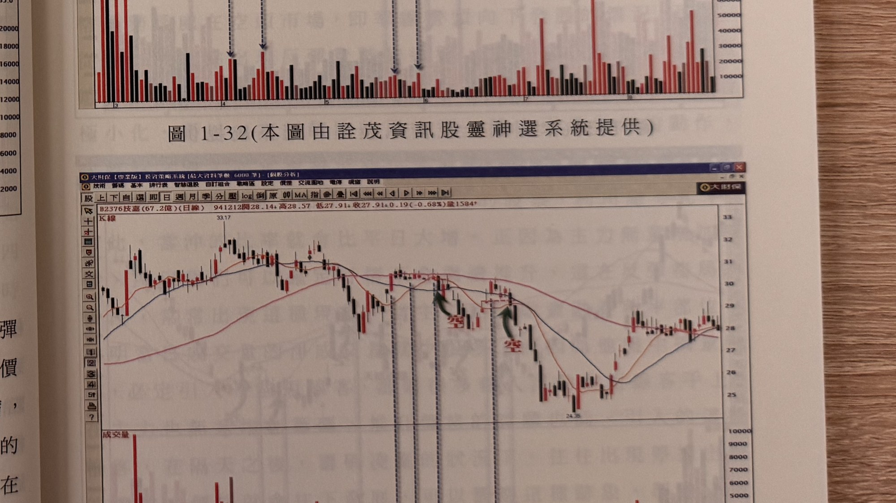

## p.42

**圖 1-31（本圖由詮茂資訊股靈神選系統提供）**

> 圖說（figure notes）: 交易軟體視窗截圖，內容為凌陽（代號2401，成交金額69.5億，日線）K線圖（頁首標示「R2401凌陽(69.5億)(日線) 910827開38.12 高38.12 低36.10 收36.10 2.02(-5.30%)量9159」）。股價自高點反覆震盪下跌，圖中綠色箭頭與紅字「空」指向左側第一根K線；其後標示1、2（上方54.86高點標示）、3（另一組綠色箭頭與紅字「空」指向）；股價其後下探至34.36低點，再反彈整理，標示4、5、6（綠色箭頭與紅字「空」指向標示6附近K線）。下方成交量面板以橘色虛線連接各波峰量柱，呈現波浪起伏。此圖為圖1-31例子：整個反彈行情進行過程，最大量不見得出現在最高峰區域，標示2出現反彈的最大量K線，但之後量能呈現價漲量縮，在標示3重新出現量增，那麼只要量能曾出現萎縮，尋找大量K線可以重新起算，即標示3視為自標示2的大量K線後，經過量縮後，另一個新大量的K線，隔天行情跌破標示3大量K線的真實低點，形成一個放空的訊號；所以大量K線的意義是相對區間而言，只要大量K線之後發生量快速萎縮，那麼尋找大量K線可以重新開始，如圖上八月的反彈行情也出現相同的狀況。

整個反彈行情進行過程，最大量不見得是出現在最高峰區域，如圖 1-31 的例子，凌陽 (2401) 在 91 年 7 月的空頭反彈波中，標示 2 出現反彈的最大量 K 線，但之後量能呈現在價漲量縮，在標示 3 重新出現量增，那麼只要量能曾出現萎縮，那麼尋找大量 K 線可以重新起算，即標示 3 視為自標示 2 的大量 K 線後，經過量縮後，另一個新大量的 K 線，隔天行情跌破標示 3 大量 K 線的真實低點，形成一個放空的訊號；所以大量 K 線的意義是相對區間而言，只要大量 K 線之後發生量快速萎縮，那麼尋找大量 K 線可以重新開始，如圖上八月的反彈行情也出現相同的狀況。

## p.43

以下附圖請讀者自行參考演練。

**圖 1-32（本圖由詮茂資訊股靈神選系統提供）**

> 圖說（figure notes）: 交易軟體視窗截圖，內容為矽統（代號2363，成交金額135.6億，日線）K線圖（頁首標示「B2363矽統(135.6億)(日線) 930830開16.50 高16.60 低16.00 收16.00 0.50(-3.03%)量10143」）。股價自27高點下跌，圖中綠色箭頭與紅字「空」兩處標示（分別指向左段與中段的K線），股價持續下跌至12.65附近後盤整回升。下方成交量面板柱狀圖。本頁無額外說明文字，供讀者自行參考演練。

**圖 1-33（本圖由詮茂資訊股靈神選系統提供）**

> 圖說（figure notes）: 交易軟體視窗截圖，內容為技嘉（代號2376，成交金額67.2億，日線）K線圖（頁首標示「B2376技嘉(67.2億)(日線) 941212開28.14 高28.57 低27.91 收27.91 0.19(-0.68%)量1584」）。股價自33.17高點反覆震盪下跌，圖中綠色箭頭與紅字「空」兩處標示，股價下探至24.35低點後回升至27~28元區間整理。下方成交量面板柱狀圖。本頁無額外說明文字，供讀者自行參考演練。
