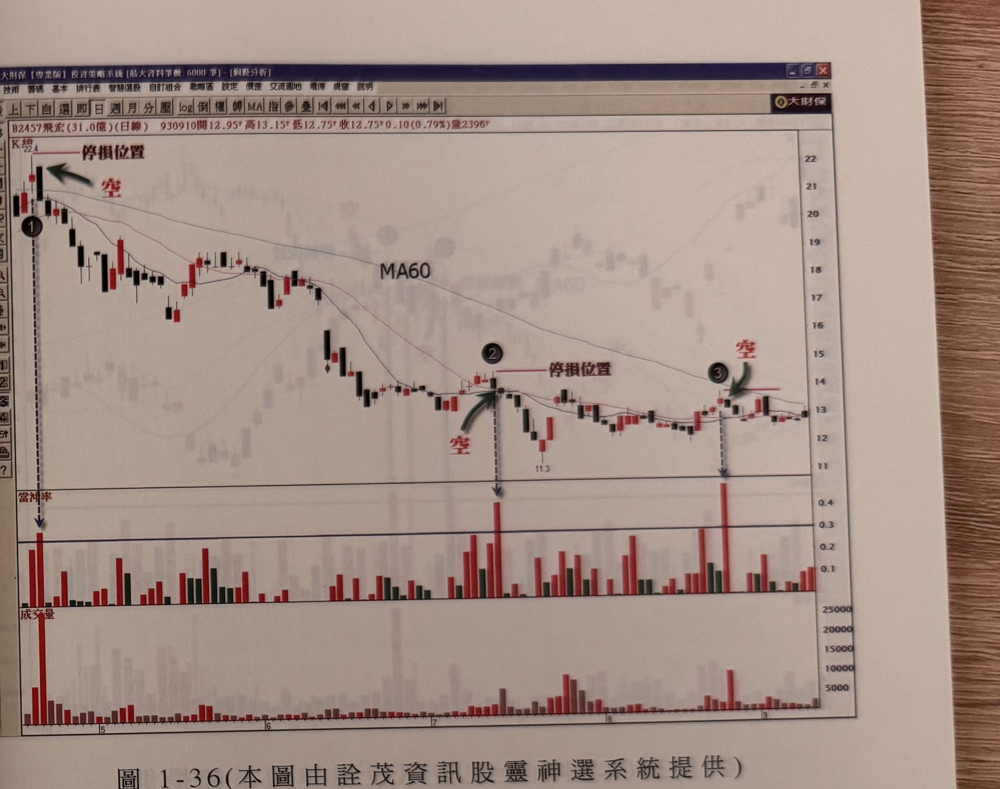

## p.46

當然，目前台灣股市規定除了相關成份股外，平盤下無法融券放空，以免股性冷的股票在空頭市場被空頭部隊無情地轟炸，立意雖好，卻造成操作的不合理，由於有放空的限制，所以我們在介紹利用當沖比率高放空的策略，都是以隔日平盤定價放空為原則。

什麼是當沖比例過高？如果當沖張數佔當日總成交量的百分之三十以上，表示當沖比例過高，也就是當日實際成交量（淨成交量）只有百分之七十，而當沖資訊的報導，往往要從專業股票分析軟體上，才能得到，或在券商網站上查詢，當我們發現個股的當沖比例超過 30% 時，可以在隔天開盤前，掛平盤價位進行融券放空的動作，也就是空隔日的開盤價，或者觀察個股盤上的價格變化，進行放空動作，個人建議以開盤價做為操作依據。

一般投資人對放空的操作，總是深怕被軋空，所以，利用當沖比例放空時，先做好風險規劃，停損的設定，可以採取放空價位的 7% 為最大停損，或以當沖比超過 30% 的 K 線最高點上方一檔位置做為停損，另一種是取最近的反彈最高點上方一檔作為停損位置，不管採取上述三種方式的任一種，一定都要事先訂好規範，才能安心做放空的操作。

價格在多頭市場中，也有交易日的當沖比例超過 30% 以上，但是我們並不建議在多頭市場，以這個模式去逆勢放空失敗率會升高，因此，我們所介紹的方式，只適合在空頭市場操作，以免遭受不必要的損失。

## p.47

**圖 1-36（本圖由詮茂資訊股靈神選系統提供）**

> 圖說（figure notes）: 交易軟體視窗截圖，內容為飛宏（代號2457，成交金額31.0億，日線）K線圖與當沖率副圖（頁首標示「B2457飛宏(31.0億)(日線) 930910開12.95 高13.15 低12.75 收12.75 0.10(0.79%)量2396」）。股價自22.4高點下跌，圖中標示1（左上角，上方「停損位置」水平線，綠色箭頭與紅字「空」指向該K線）、標示2（中段整理區，上方「停損位置」水平線，綠色箭頭與紅字「空」指向）、標示3（右側整理區，紅字「空」與綠色箭頭指向）。K線圖下方為「當沖率」副圖（柱狀圖，紅／綠色區分），標示1、2、3對應位置下方以虛線箭頭指向當沖率明顯超過0.3（30%）的紅色柱。最下方為成交量面板。股價持續下跌至11.3附近後於12~13元區間整理。此圖對應本文：飛宏在93年4月至9月的日線圖，季線（MA60）已經彎頭向下，形成空頭走勢，標示1、2、3位置均出現當沖率超過當日成交量30%以上，當日成交張數也是爆出大量，但主力並沒有想從市場吸納籌碼的企圖，可在隔天掛開盤價進行放空，停損設在標示點最高點上方一檔的位置。

例如在圖 1-36 是飛宏 (2457) 在 93 年 4 月至 9 月的日線圖，季線 (MA60) 已經彎頭向下，形成空頭走勢，在標示 1 位置，出現當沖率超過當日成交量的 30% 以上，而當日的成交張數也是爆出大量，換言之，當日的籌碼出現大換手，但是從當沖比率超過 30% 以上，可以了解到，主力並沒有想從市場吸納籌碼的企圖，也表示當天盤中雖漲高，但卻沒有讓進場者願意持股較長期間的打算，看到這種狀況，可以在隔天掛開盤價進行放空的動作，並把停損設好，本例設在標示 1 的最高點上方一檔的位置，標示 2 及 3 也同樣的操作模式，請參考。
