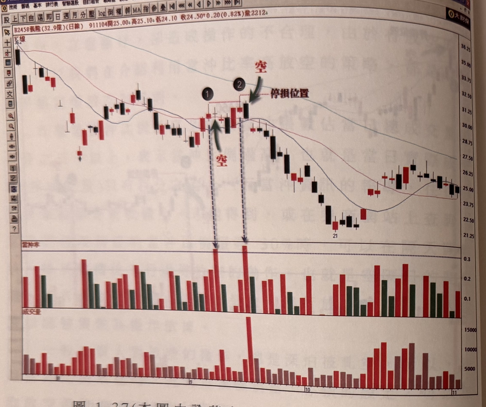
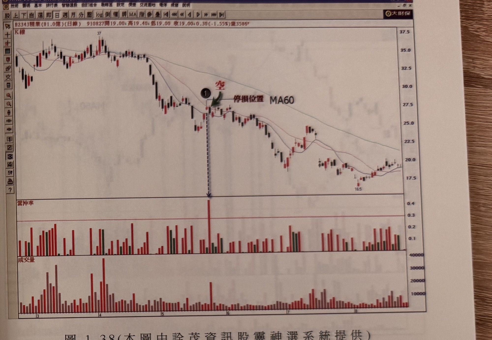

## p.48

**圖 1-37（本圖由詮茂資訊股靈神選系統提供）**

> 圖說（figure notes）: 交易軟體視窗截圖，內容為義隆（代號2458，成交金額32.9億，日線）K線圖與當沖率副圖（頁首標示「B2458義隆(32.9億)(日線) 911104開25.00 高25.10 低24.10 收24.50 0.20(0.82%)量2212」）。股價自36.2高點持續下跌，圖中標示1（整理區K線，上方虛線延伸出「停損位置」水平線）、標示2（緊鄰標示1右側，紅字「空」與綠色箭頭指向，該K線最高點即停損位置）。當沖率副圖中標示1、2對應位置下方以虛線箭頭指向明顯超過0.3的紅色柱（其中標示2對應柱為全圖最高，接近0.35）。股價其後持續下跌至21附近的整理區（標示「21」），再小幅回升至25~27元區間。此圖對應本文：在標示1位置出現當沖比率超過30%，隔日開盤放空義隆(2458)，如果把停損設在標示1最高點上方一檔的位置時，在隨後的標示2位置會觸及停損出場；如果把停損是設放空點上方7%的位置，則不會被觸及停損價格。

在圖 1-37 的例子中，在標示 1 位置出現當沖比率超過 30%，隔日開盤放空義隆 (2458)，如果我們把停損設在標示 1 最高點上方一檔的位置時，在隨後的標示 2 位置會觸及停損出場，如果把停損是設放空點上方 7% 的位置，則不會被觸及停損價格，因此，在設停損位置時，如果資金允許的情況，設在波峰及 7% 取其大者，被停損的機率可以進一步降低，當然在本例中，標示 2 位置的當沖比率也超過 30% 以上，同樣地，我們選擇在隔天的開盤價進行放空操作，往往可以提供不錯的波段空點，如果跟空頭大量 K 線低點跌破放空互相配合，可以組成不錯的操作策略。

## p.49

**圖 1-38（本圖由詮茂資訊股靈神選系統提供）**

> 圖說（figure notes）: 交易軟體視窗截圖，內容為精業（代號2343，成交金額81.0億，日線）K線圖與當沖率副圖（頁首標示「B2343精業(81.0億)(日線) 910827開19.00 高19.40 低19.00 收19.00 0.30(-1.55%)量3586」）。股價自37高點反覆下跌，圖中標示1（紅字「空」與綠色箭頭指向，上方「停損位置」水平線與「MA60」標示於同一水平）。當沖率副圖中標示1對應位置下方虛線箭頭指向全圖最高的紅色柱（接近0.4，遠高於其他日期）。股價其後持續下跌至18.5附近後小幅回升至20元附近整理。此圖對應本文：標示1位置出現當沖比率超過30%以上，雖然提供了一個放空操作的機會，但是價格實際快速下跌卻要等將近17個交易日才出現急速下殺的行情。

空頭市場放空操作，並不像多頭市場買進操作，可以根據主力介入與否，加以跟進，因為很少主力是專做空的，所以，放空往往無法看到立即崩跌的走勢出現，而是要有耐性觀看價格緩步下壓走跌，像在圖 1-38 例子裡，當標示 1 位置出現當沖比率超過 30% 以上，雖然提供了一個放空操作的機會，但是價格實際快速下跌，卻要等將近 17 個交易日，才出現急速下殺的行情，同樣要賺三成的利潤，多頭市場裡，可以在一個星期內買到飆股就可以達成；空頭市場中，卻很難可以準確地空到地雷股，享受崩跌的利潤，因此，做空是比做多須要更多的修為及耐性的。
