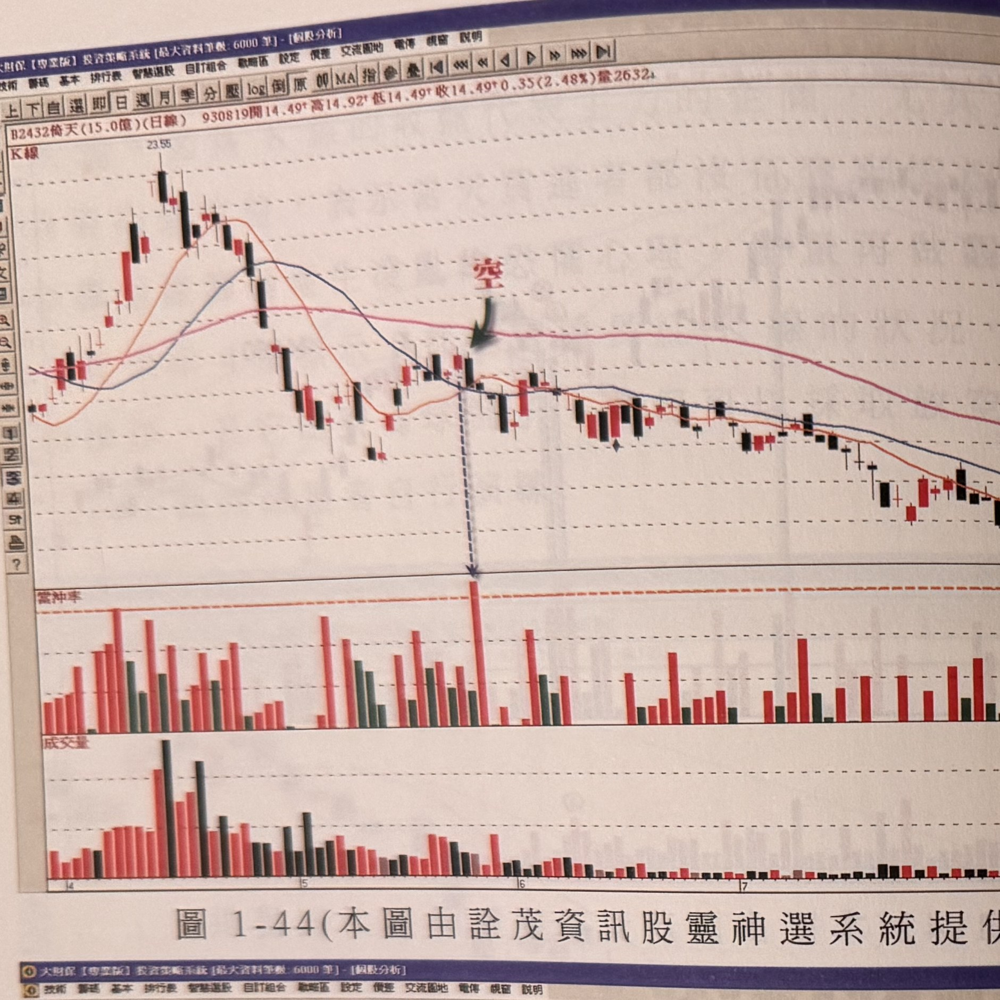
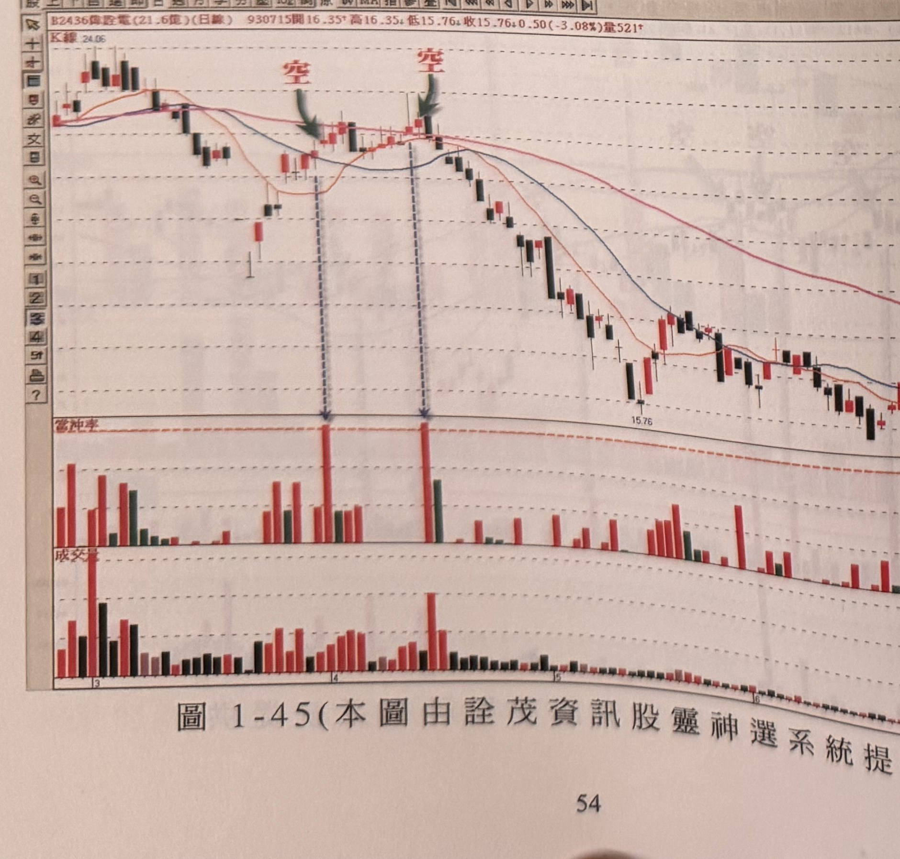
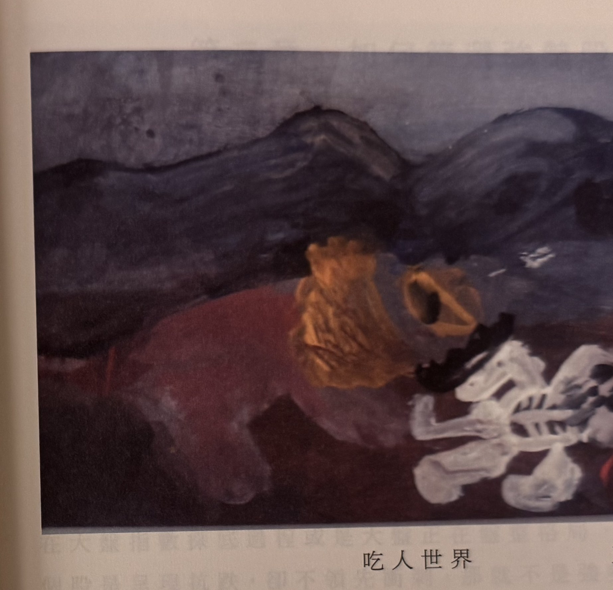

## p.54

**圖 1-44（本圖由詮茂資訊股靈神選系統提供）**

> 圖說（figure notes）: 交易軟體視窗截圖，內容為倚天（代號2432，成交金額15.0億，日線）K線圖與當沖率副圖（頁首標示「B2432倚天(15.0億)(日線) 930819開14.49 高14.92 低14.49 收14.49 0.35(2.48%)量2632」）。股價自23.55高點下跌，圖中綠色箭頭與紅字「空」指向中段整理區K線，當沖率副圖對應位置下方虛線箭頭指向全圖最高的紅色柱（超過0.3）。股價其後持續下跌至12.4附近後小幅震盪回升。此圖為圖1-44例子，供讀者參考「量最縮K線最高點被突破」與「當沖比率」交叉驗證的放空操作。

**圖 1-45（本圖由詮茂資訊股靈神選系統提供）**

> 圖說（figure notes）: 交易軟體視窗截圖，內容為偉詮電（代號2436，成交金額21.6億，日線）K線圖與當沖率副圖（頁首標示「B2436偉詮電(21.6億)(日線) 930715開16.35 高16.35 低15.76 收15.76 0.50(-3.08%)量521」）。股價自24.06高點下跌，圖中依序以綠色箭頭與紅字「空」標示兩處放空訊號位置，當沖率副圖對應位置下方虛線箭頭指向兩處超過0.3的紅色柱。股價下探至15.76附近後持續破底下探。此圖為圖1-45例子，供讀者參考當沖比率放空訊號的另一應用範例。

## p.55

**吃人世界　王奕荏畫（6歲）**

> 圖說（figure notes）: 章節插圖，非交易圖表，為一幅兒童畫作照片。畫面背景為深藍紫色群山剪影，前景為一隻趴伏的暗紅色四足動物（軀幹橢圓形，深紅偏紫色），其頭部以土黃色不規則塊狀塗繪（似獅子鬃毛或猛獸頭部），口部另有一橢圓黑色開口（似張口狀），動物前方地面上散落一具白色骨骼（肋骨與四肢骨頭形狀，以黑色線條勾勒骨節），暗示「吃人世界」的主題——猛獸吞噬後留下的白骨。畫作下方印有標題「吃人世界」及作者署名「王奕荏畫（6歲）」。此為書中穿插的兒童畫作頁，與交易內容無直接關聯，屬於作者引用的插畫。

[本頁圖片下方原判讀為淡灰色內文，經與下一張照片（IMG_8746）p.56/p.57 比對後確認：那其實是後方頁面（第二章開頭「改變共同的遺憾」「比對篩選的運用」內容）透印/重影，並非第55頁本身的文字內容，故不轉錄。第55頁除「吃人世界」插畫外應無其他正文。]
