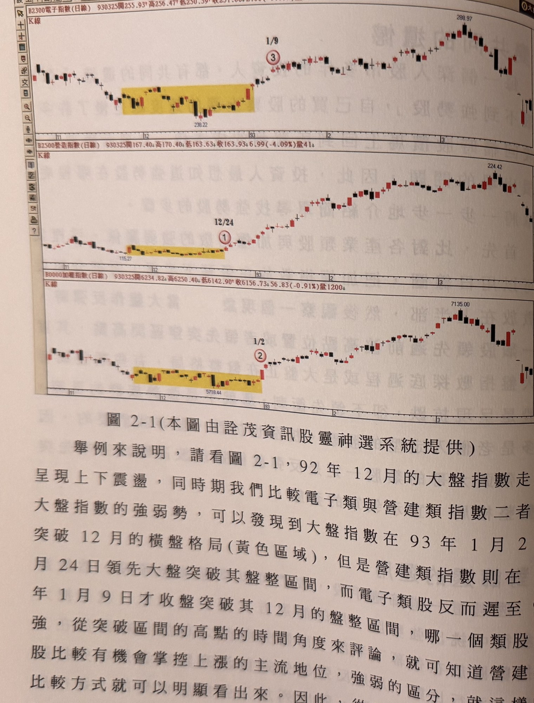
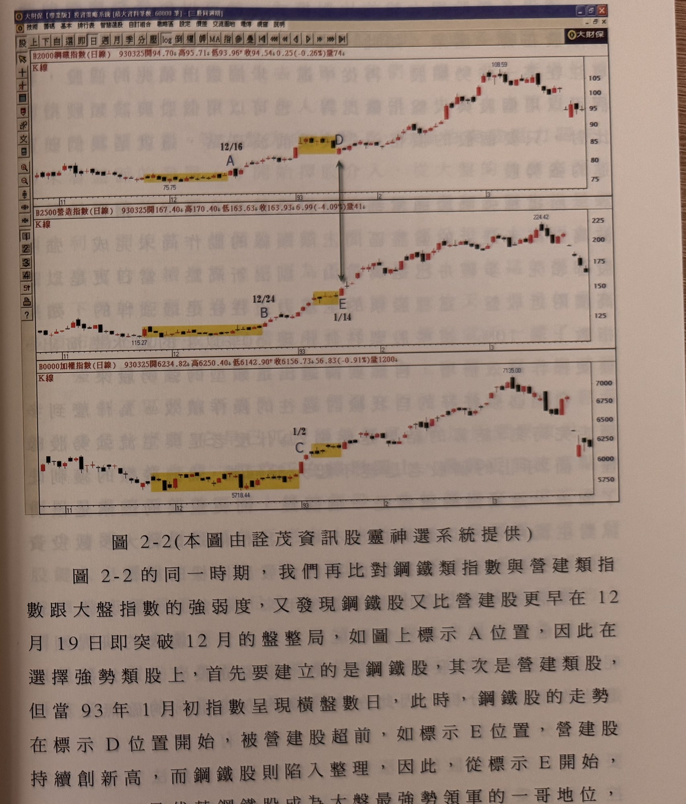

## p.58

**圖 2-1（本圖由詮茂資訊股靈神選系統提供）**

> 圖說（figure notes）: 三格並列的日線K線圖比對（頁首各標示代碼），由上至下分別為：電子指數（B2300電子指數(日線) 930325開255.93 高256.47 低250.59 收251.08 2.88(-1.13%)量541）、營造指數（B2500營造指數(日線) 930325開167.40 高170.40 低163.63 收163.93 6.99(-4.09%)量41）、加權指數（B0000加權指數(日線) 930325開6234.82 高6250.40 低6142.90 收6156.73 56.83(-0.91%)量1200）。三圖時間軸相同（11、12、93、2、3月）。電子指數圖中黃色矩形標示92年12月盤整區間（低點238.22），標示3（紅圈數字，日期1/9）為突破盤整區間位置，其後指數上攻至288.97高點。營造指數圖中黃色矩形標示同期盤整區間（低點115.27），標示1（紅圈數字，日期12/24）為突破位置，其後指數上攻至224.42高點。加權指數圖中黃色矩形標示同期盤整區間（低點5718.44），標示2（紅圈數字，日期1/2）為突破位置，其後指數上攻至7135.00高點。此圖對應本文：92年12月大盤指數呈上下震盪，比較電子類與營造類指數二者跟大盤指數的強弱勢，可發現大盤指數在93年1月2日（標示2）領先突破12月的橫盤格局，營造類指數則在12月24日（標示1）即領先大盤突破其盤整區間，而電子類股反而遲至93年1月9日（標示3）才收盤突破其12月的盤整區間，從突破區間高點的時間角度評論，營建類股比較有機會掌控上漲的主流地位。

舉例來說明，請看圖 2-1，92 年 12 月的大盤指數走勢呈現上下震盪，同時期我們比較電子類與營建類指數二者跟大盤指數的強弱勢，可以發現到大盤指數在 93 年 1 月 2 日突破 12 月的橫盤格局 (黃色區域)，但是營建類指數則在 12 月 24 日領先大盤突破其盤整區間，而電子類股反而遲至 93 年 1 月 9 日才收盤突破其 12 月的盤整區間，哪一個類股比較有機會掌控上漲的主流地位，就可知道營建類強，從突破區間的高點的時間角度來評論，強弱的區分，就這樣的比較方式就可以明顯看出來。因此，從三者的比對過程，我們篩選出營建類股是上攻的領軍部隊，操作上自然以營建股為主要的買進對象。

## p.59

**圖 2-2（本圖由詮茂資訊股靈神選系統提供）**

> 圖說（figure notes）: 三格並列的日線K線圖比對，由上至下分別為：鋼鐵指數（B2000鋼鐵指數(日線) 930325開94.70 高95.71 低93.96 收94.54 0.25(-0.26%)量74）、營造指數（B2500營造指數(日線) 930325開167.40 高170.40 低163.63 收163.93 6.99(-4.09%)量41）、加權指數（B0000加權指數(日線) 930325開6234.82 高6250.40 低6142.90 收6156.73 56.83(-0.91%)量1200）。鋼鐵指數圖中黃色矩形標示92年12月盤整區間（低點75.75），標示A（日期12/16）為突破位置，指數其後上攻至108.59高點，並標示D（黃色矩形另一段，位於高點附近整理區）。營造指數圖中黃色矩形標示同期盤整區間（低點115.27），標示B（日期12/24）為突破位置，指數上攻至224.42高點，並標示E（日期1/14，黃色矩形，位於高點附近整理區）。加權指數圖中標示C（日期1/2，黃色矩形，突破位置），指數上攻至7135.00高點。圖中另有雙向箭頭連接鋼鐵指數之D與營造指數之E，標示兩者於同一時間點的相對強弱轉折。此圖對應本文：比對鋼鐵類指數與營建類指數跟大盤指數的強弱度，發現鋼鐵股又比營建股更早在12月19日（標示A）即突破12月的盤整局，因此在選擇強勢類股上首先建立的是鋼鐵股，其次是營建類股，但當93年1月初指數呈現橫盤數日，此時鋼鐵股的走勢在標示D位置開始被營建股超前（如標示E位置），營建股持續創新高，而鋼鐵股則陷入整理，因此從標示E開始，營建類股是代替鋼鐵股成為大盤最強勢領軍的一哥地位，在部位的建構上要在營建股加重部位。

圖 2-2 的同一時期，我們再比對鋼鐵類指數與營建類指數跟大盤指數的強弱度，又發現鋼鐵股又比營建股更早在 12 月 19 日即突破 12 月的盤整局，如圖上標示 A 位置，因此在選擇強勢類股上，首先要建立的是鋼鐵股，其次是營建類股，但當 93 年 1 月初指數呈現橫盤數日，此時，鋼鐵股的走勢在標示 D 位置開始，被營建股超前，如標示 E 位置，營建股持續創新高，而鋼鐵股則陷入整理，因此，從標示 E 開始，營建類股，是代替鋼鐵股成為大盤最強勢領軍的一哥地位，在部位的建構上，要在營建股加重部位。
