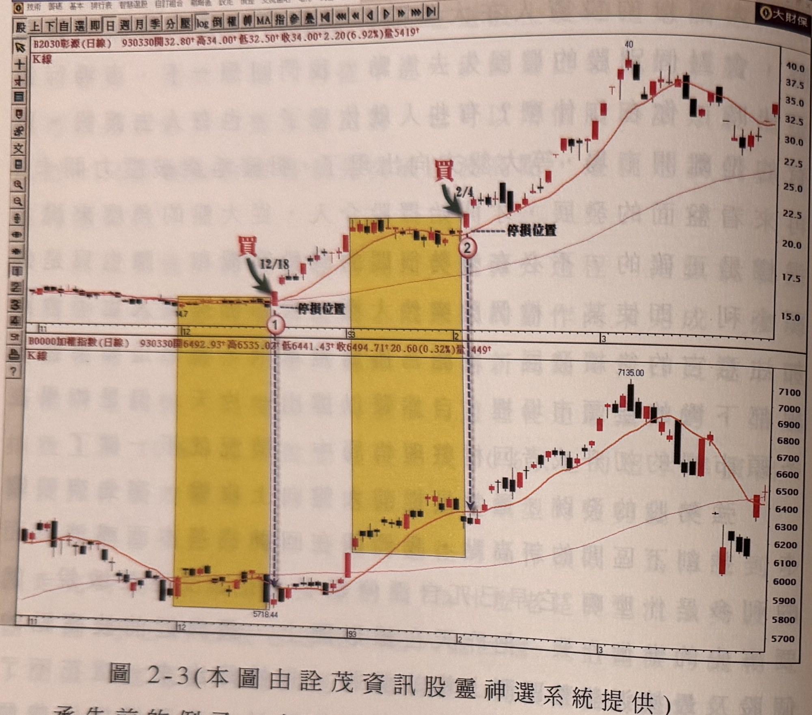

## p.62

**圖 2-3（本圖由詮茂資訊股靈神選系統提供）**

> 圖說（figure notes）: 上下兩格並列的日線K線圖，上為彰源（代號2030）K線圖（頁首標示「B2030彰源(日線) 930330開32.80 高34.00 低32.50 收34.00 2.20(6.92%)量5419」），下為加權指數K線圖（頁首標示「B0000加權指數(日線) 930330開6492.93 高6535.02 低6441.43 收6494.71 20.60(0.32%)量449」）。彰源圖中標示兩處黃色矩形橫向整理區間：第一處（低點14.7）右緣有紅字「買」與綠色箭頭指向突破K線（日期12/18，標示①），並有「停損位置」水平虛線標示於區間下緣；第二處黃色矩形（位於較高價位區）右緣同樣有紅字「買」與綠色箭頭指向突破K線（日期2/4，標示②），亦有「停損位置」水平虛線標示於區間上緣。彰源股價其後持續上攻至40元附近高點，再回落至30~35元區間。加權指數圖中以垂直虛線對應標示①、②之時間點（分別對應大盤低點5718.44附近與其後盤整區間），大盤同期則仍在盤整區間內，直到93年1月第一個交易日才正式突破盤整區間，其後上攻至7135.00高點，再回落至6100~6500區間。此圖對應本文：大盤在92年12月回檔到5700~5950之間呈現橫向整理格局，鋼鐵股彰源(2030)率先在標示①位置的時點向上突破了橫向整理區間的上限壓力，同一時間點大盤卻仍在盤整區間內；當彰源不斷地向上攻堅，大盤卻遲至93年1月第一個交易日才正式突破盤整區間，但此時彰源則進行橫向整理達一個月之久，當大盤指數在一月下旬亦呈現拉回整理時，彰源再度來到整理區間上緣，蓄勢待發，在標示②位置，大盤仍在10日均線下方力抗空頭施壓之際，彰源率先向上突破區間格局，再次創下新高價。

承先前的例子，大盤在 92 年 12 月回檔到 5700~5950 之間，呈現橫向整理格局，鋼鐵股的彰源 (2030) 率先在標示 1 位置的時點，向上突破了橫向整理區間的上限壓力，同一時間點大盤卻仍在盤整區間內，如圖上從標示 1 位置向下延伸的箭頭指示，當出現領先突破區間上緣關卡的長紅 K 線攻堅，大盤卻遲至 93 年 1 月第一個交易日才正式突破盤整區間，但此時，彰源則進行橫向整理，達一個月之久，當大盤指數在一月下旬亦呈現拉回整理時，彰源再度來到整理區間上緣，蓄勢待發，在標示 2 位置，大盤仍在 10 日均線下

## p.63

方力抗空頭施壓之際，彰源率先向上突破區間格局，再次創下新高價，我們卻還在斟酌指數能否克服跳空缺口，重新站回 10 日均線之上，在獲利佳的基本面支持下，像彰源這種強勢股，敢在大盤走勢未明之前，即先創新高，就是考驗投資人的介入勇氣，敢不敢追？人們都說富貴險中求，在季線仍朝上移動的多頭趨勢裡，在盤整期追創新高的個股，實際上風險最小；當然，並不是沒有虎頭蛇尾的例子，只是就成功率及效率而言，這種選股方式，對於提升選股能力是相當實用的策略。從標示 2 位置買入一個月的時間，跑到 40 元的水準，漲幅近倍；同一期間指數上漲 900 點或漲幅 15%，再從另一個解讀角度來說，在標示 B 位置買進彰源及指數來比較，大盤從 7135 點在 2004 年總統大選前後，回檔的幅度破了標示 2 位置的進場點，但是對彰源來講，卻還有段距離，並未損及成本區。

因此，挑到強勢股不僅能有超越一般個股的漲幅，而且在大盤遭受利空打擊時，往往會有較強的抗跌能力，使得我們不致在利空消息的衝擊下，價格殺破我們的進場位置。
