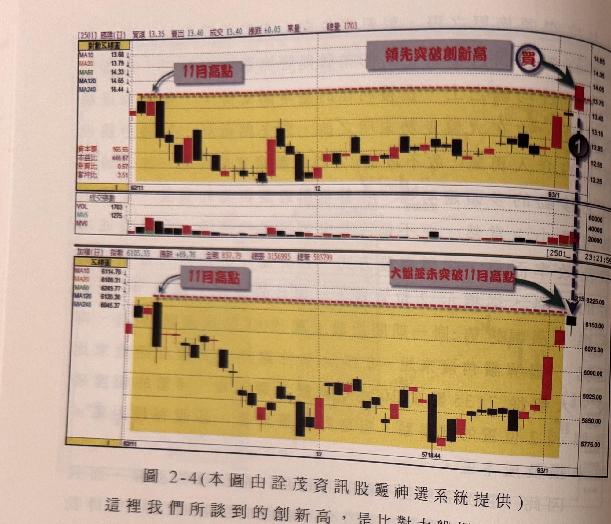
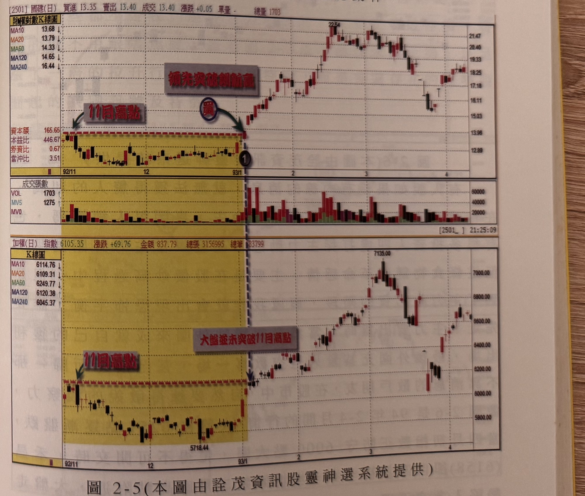

## p.64

**圖 2-4（本圖由詮茂資訊股靈神選系統提供）**

> 圖說（figure notes）: 上下兩格對數K線圖比對，上為國建（代號2501）K線圖（頁首標示「[2501]國建(日) 買進13.35 賣出13.40 成交13.40 漲跌+0.05 單量- 總量1703」，左側對數K線表列MA10 13.68、MA20 13.79、MA60 14.33、MA120 14.65、MA240 16.44，另有資本額165.65、本益比446.67、券資比0.67、當沖比3.51），下為加權指數K線圖（頁首標示「加權(日) 指數6105.35 漲跌+69.76 金額837.79 總張3156995 總筆583799」，MA10 6114.76、MA20 6109.31、MA60 6249.77、MA120 6120.38、MA240 6045.37）。國建圖中黃色矩形標示92年11月至93年1月的橫向整理區間，上緣紅色虛線標註「11月高點」（灰底文字方塊與箭頭指向左側11月高點），右側灰底紅字「領先突破創新高」與深藍圓圈「買」、綠色箭頭指向突破區間的紅K線（標示①），國建股價其後持續上攻至22.54高點。加權指數圖同一時間區間對應同樣的黃色矩形整理區間，惟上緣紅色虛線標註「11月高點」處右側灰底紅字為「大盤並未突破11月高點」，顯示大盤在同一時點尚未創新高，指數其後方於93年1月至7135.00高點。下方另有國建成交張數面板（VOL 1703、MV5 1275、MV0）。此圖對應本文：以國建(2501)跟大盤比對為例，在標示1位置，國建的股價領先突破了11月的高點，同一時間，大盤指數卻在11月的高點反壓，呈現關前整理，國建在越過高點的動作行雲流水，毫無拖泥帶水，沒有任何近關情怯的狀況出現，因此，在標示1就是我們要的第一買點位置。

這裡我們所談到的創新高，是比對大盤相對的區間，即個股的價格突破了特定區間的最高點位置。例如圖 2-4 是前述在 92 年 12 月大盤回檔整理過程，已經篩選出鋼鐵、營建

## p.65

比對為例，如圖上黃色區域，可以看出，在標示 1 位置，國建的股價領先突破 11 月的高點，同一時間，大盤指數卻在 11 月的高點反壓，呈現關前整理，國建在越過高點的動作如行雲流水，毫無拖泥帶水，沒有任何近關情怯的狀況出現，因此，在標示 1 就是我們要的第一買點位置，而我們在當下看到國建的日線領先創新高點時，並無法知道它未來會漲到哪裡，但是我們只要記住國建是篩選出來的強勢股，就值得買進，從圖 2-5 是國建第一買點建立持股之後的走勢圖，在一個半月的時間，國建股價漲了近 60%，同一時間，大盤漲 15%；透過個股與大盤的比對相對位置，就可以很清楚地看出強勢股的發動訊號——**領先大盤突破區間，創新高點**，而**第一買點請注意，不宜是短小的 K 線，必須是大漲 K 線，尤其帶跳空缺口更具威力**，第一買點的 K 線，若有上影線都不宜過長，過長的上影線表示買盤力道不足，這種情形就不能在第一時間切入持有，而要在隔日再做確認動作。

**圖 2-5（本圖由詮茂資訊股靈神選系統提供）**

> 圖說（figure notes）: 上下兩格日線K線圖比對，上為國建（代號2501）延續圖2-4之後走勢（同一標示①位置起），股價其後自13.96附近急漲至22.54高點，再回落至17~19元區間整理。下為加權指數同期走勢，自6105.35起漲至7135.00高點，再回落至8000~8600點區間震盪（原文頁面此處數值單位可能為對照顯示，圖上實際標示6400~7135區間）。國建成交張數面板顯示標示①之後成交量明顯放大（VOL/MV5/MV0面板中紅綠色量柱增多）。此圖為圖2-4的延續：說明國建第一買點建立持股之後一個半月的時間，國建股價漲了近60%，同一時間大盤漲15%，凸顯強勢股跑贏大盤的幅度。
